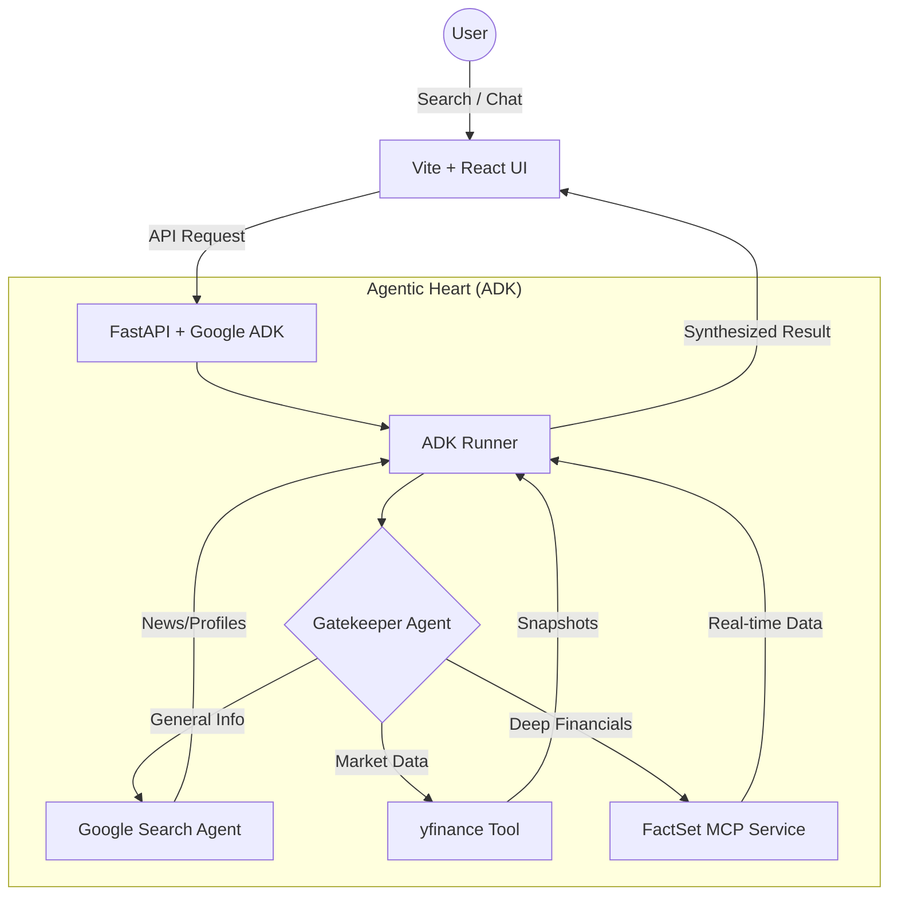
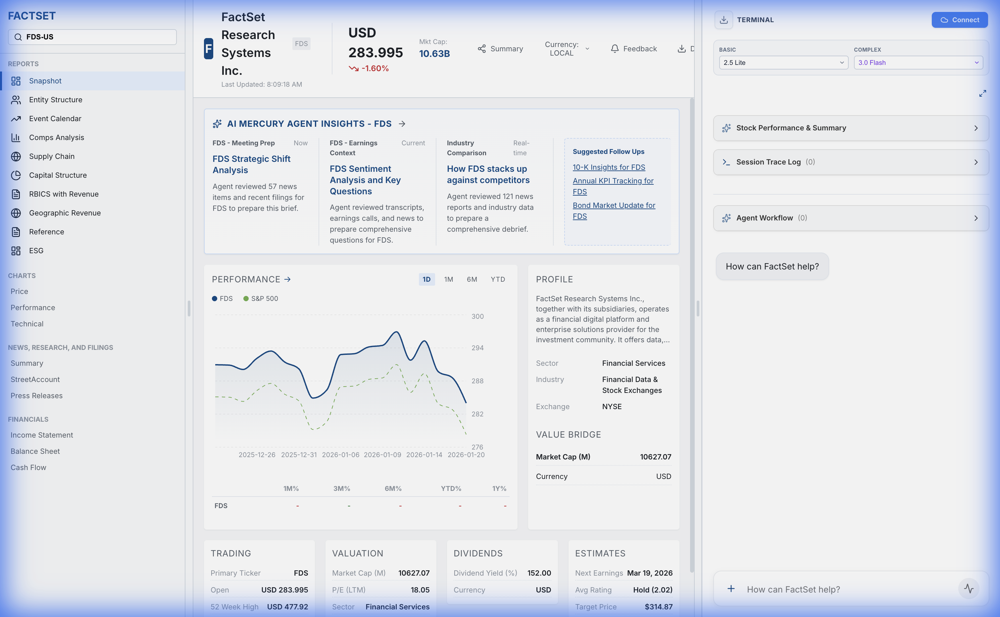

# 🚀 Stock Terminal Next-Gen

> **Empowering Financial Intelligence with Google ADK & Gemini.**

A professional-grade financial stock terminal that bridges the gap between raw market data and actionable AI insights. Featuring a glassmorphic React interface and a high-performance Agentic backend, this terminal provides real-time snapshots, deep-dive analyst workflows, and an intelligent chat assistant.

---

## ✨ Key Features
- **🧠 Agentic Orchestration**: Uses the "Gatekeeper Pattern" to route requests between real-time data providers and general knowledge tools.
- **⚡ Automatic OAuth**: Seamless FactSet authentication with a self-closing handshake window. No manual URL pasting required.
- **📊 Interactive Visualization**: Dynamic charts curate data on-the-fly using LLM-driven curation.
- **🔌 FactSet Integration**: Professional MCP toolset integration for high-fidelity financial data.
- **💬 Conversational Analyst**: A chat assistant that doesn't just talk—it executes complex workflows.

---

## 🗺 System Architecture



---

## 🚀 Quick Start

### 📦 Prerequisites
- **Python 3.13+** with `uv`
- **Node.js 20+**

### 🛠 Replication Steps

1. **Clone & Environment Setup**
   ```bash
   git clone <repo-url>
   cd stock-terminal
   ```

2. **Backend Services**
   ```bash
   cd backend
   # Configure your .env with GOOGLE_CLOUD_PROJECT and FactSet keys
   uv sync
   uv run uvicorn main:app --port 8001
   ```

3. **Frontend Application**
   ```bash
   cd frontend
   npm install
   npm run dev
   ```

---

## 📸 Gallery

### 🏛 Main Dashboard


### 📈 Deep Analysis (AAPL)


### 💬 Intelligent Assistant


---

## 🛠 Tech Stack

| Layer | Technologies |
| :--- | :--- |
| **Frontend** | React 19, Vite, Tailwind CSS, Recharts, Lucide |
| **Backend** | FastAPI, Python 3.13, Uvicorn |
| **AI Engine** | Google Agent Development Kit (ADK), Gemini 2.0/3.0 |
| **Data** | FactSet MCP, yfinance, Google Search |

---

Built with ❤️ by the Antigravity Team.
