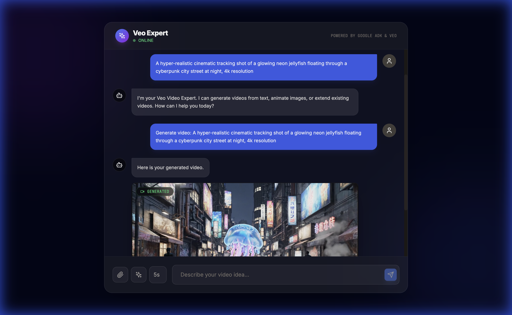
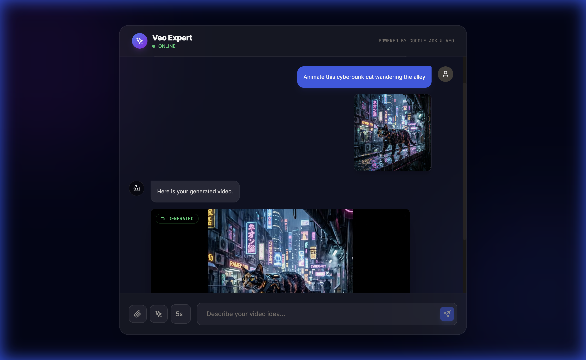

# Veo Generator
> **Google ADK & Veo**
> *Text-to-Video and Image-to-Video Engine*

A futuristic React + FastAPI application acting as an AI Expert capable of utilizing Google's newly launched Veo models (via `veo-3.1-fast-generate-preview`) to generate high-fidelity 720p videos. 

Built using the **Agent Development Kit (ADK)**, the intelligent router decides when to converse and when to trigger the heavy-compute generation tools based on user intent.

## 🚀 Capabilities

### Text-to-Video Generation
Describe a scene vividly, and the agent will synthesize a 4-second, 720p 16:9 MP4 file natively.

> **Note on Prompting:** Because the ADK agent is a conversational entity with explicit routing rules, use direct action verbs like "Generate video:" or "Create an animation:" to ensure it triggers the generator tool. A purely descriptive noun phrase (e.g., "A hyper-realistic city...") may be interpreted as conversational chat rather than a strict command.



### Image-to-Video Generation
Upload an image (or simulate an upload) and provide animation instructions (e.g., "Animate this cyberpunk cat wandering the alley"). The agent will use the image as the base frame for the generative extension.



## 🛠️ Architecture

*   **Backend (FastAPI & Google ADK)**: Serves the `LlmAgent` powered by `gemini-2.5-flash`. The agent uses `FunctionTool` wrappers around the Vertex AI Generation SDK (`client.models.generate_videos`).
*   **Video Delivery**: Generated MP4 binaries are securely encoded, cached to disk with an ephemeral file descriptor, and served via a dedicated `/api/file/{filename}` streaming endpoint to keep the LLM context lightweight and fast.
*   **Frontend (React & Framer Motion)**: A polished Dark Mode / Neofuturistic chat UI. It smoothly parses inline video payload strings (`VIDEO_BASE64_FILE:`) and replaces them with an inline `<video>` element featuring a glowing "GENERATED" status badge.

## ⚙️ Build & Run

### Backend
Use `uv` to manage Python configurations and avoid dependency conflicts.
```bash
# 1. Provide your environment parameters
cp .env.example .env
# Set PROJECT_ID and LOCATION

# 2. Sync and run
uv sync
uv run main.py
```
*The backend starts on port `8001`.*

### Frontend
```bash
cd ui
npm install
npm run dev
```
*The UI will start on port `5174` by default.*
