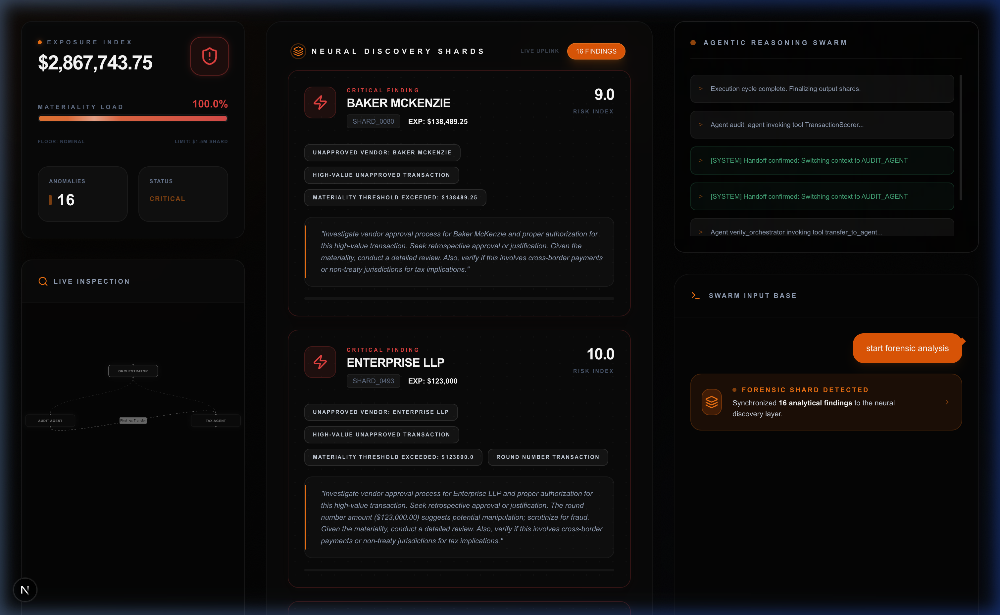
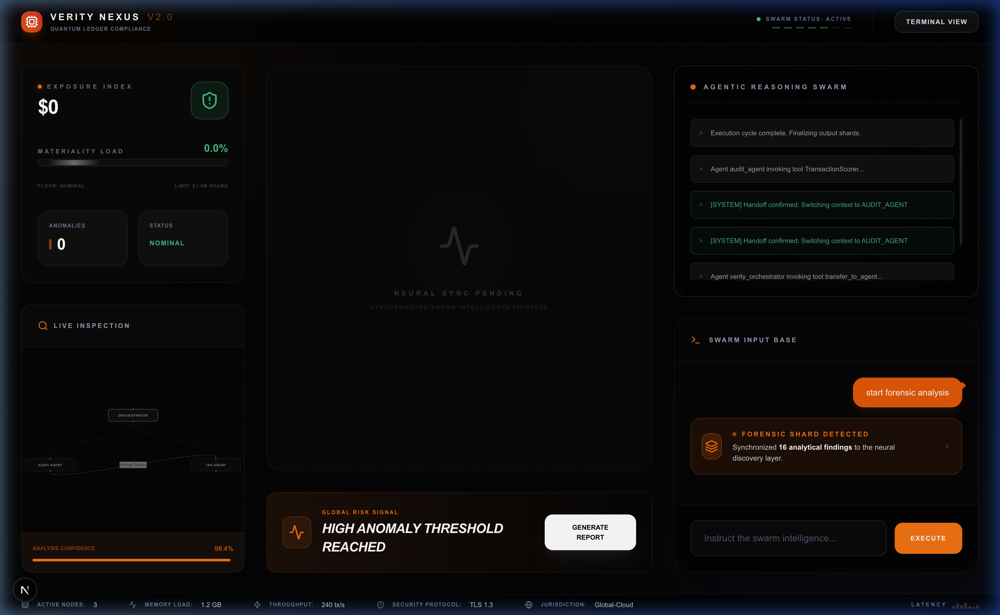
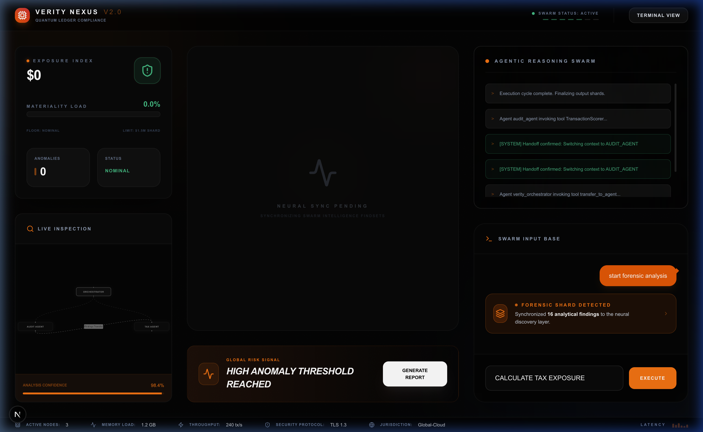
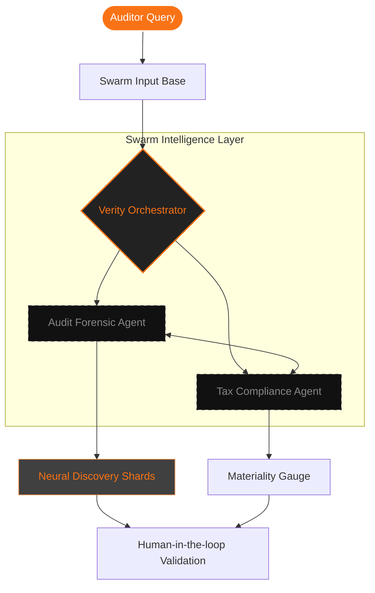
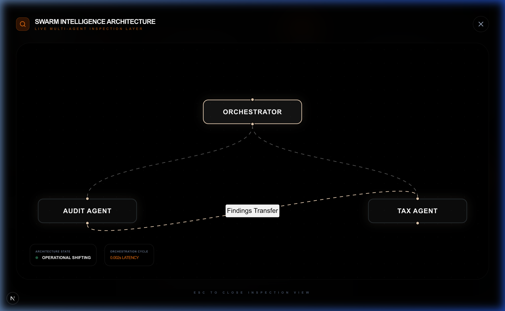
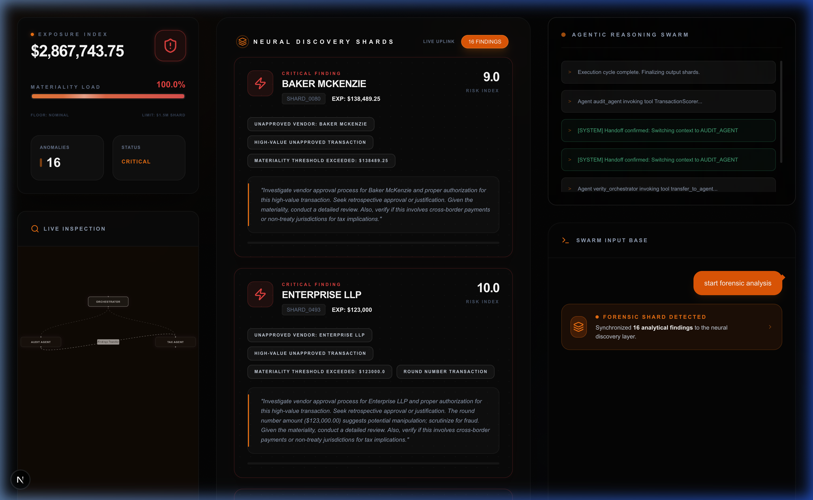

# Verity Nexus V2.0 

> **Cinematic AI-to-Agent Forensic Swarm**

Verity Nexus is a next-generation forensic auditing and financial risk platform. It transforms raw analytical telemetry from an agentic swarm into a cinematic, executive-grade narrative, allowing institutions to identify, visualize, and mitigate financial anomalies with zero technical debris.

---

## ⚡ The Vision: Zero-Parsing Intelligence
Traditional audit tools drown users in spreadsheets and static logs. **Verity Nexus** pioneered the **Zero-Parsing Architecture**, where technical payloads are intercepted by a **Narrative Filtration Engine** and rendered as interactive **Neural Discovery Shards**.

### 🧩 Core Achievements
- **Neural Synchronization**: Real-time handoffs between specialized agents (Audit, Tax, Orchestrator).
- **Cinematic Discovery Layer**: Smooth transitions between high-level risk metrics and deep-level forensic evidence.
- **Materiality Mapping**: Precision dollar-value impact assessment using a dynamic $1.5M Shard threshold.

---

## 🖼️ Investigative Query Showcases

### 🔍 Principal Forensic Analysis
Scanning the entire ledger for material anomalies and internal control violations.


### 🏢 Vendor Nexus Audit
Identifying high-risk vendors and cross-referencing with approved entity lists.


### 📊 Tax Exposure Calculation
Real-time calculation of tax liabilities and regulatory exposure across jurisdictions.


---

## 🧬 System Architecture & Workflow

The platform leverages a **Swarm Intelligence** model where specialized agents collaborate in a decentralized manner to minimize investigation latency.



---

## 🕹️ Interactive Elements

### 🛠️ Live Inspection (High-Fidelity Mode)
 аудиторы can maximize the system diagram to inspect agentic handoffs in real-time. This provides an immersive view of the swarm's neural architecture.


### 🚀 Cinematic Data Jump
When a **Forensic Shard** is detected in the swarm feed, clicking the badge triggers a cinematic smooth-scroll that locks focus onto the specific finding in the central panel.


### 📋 Precision Copy Logic
Shard IDs in the discovery cards are interactive. A single click copies the unique `SHARD_ID` to the clipboard, optimized for rapid documentation and case management.

---

## 🚀 Deployment Guide

### Prerequisites
- **Python 3.12+** (Managed via `uv`)
- **Node.js 18+**
- **Google ADK (Agent Development Kit)**

### 1. Backend Orchestration
```bash
cd backend
uv run server.py
```

### 2. Frontend Cinematic UI
```bash
cd frontend
npm install
npm run dev -- -p 5174
```

---

**Secure Development Protocol**: This repository strictly enforces a **Zero-Leak** policy. 
- **Fingerprint**: `VERITY_NEXUS_V2_SYNC_SUCCESSFUL_20240523`
- Credentials and `.env` files are never committed to version control.
