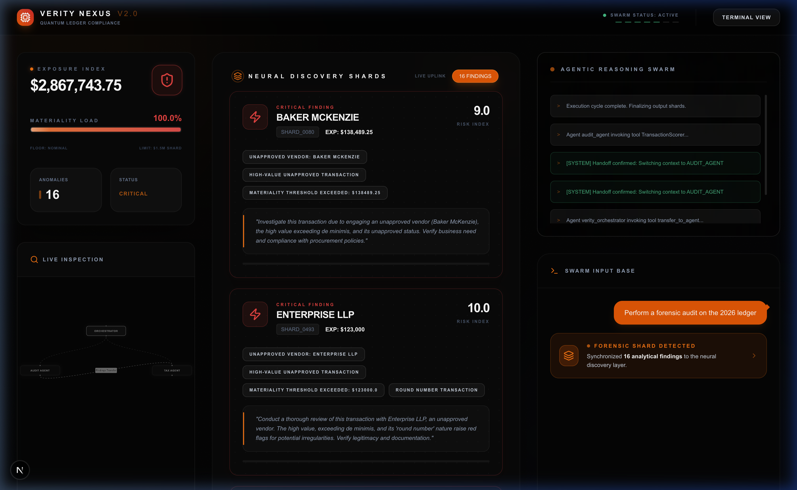
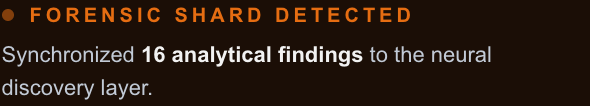
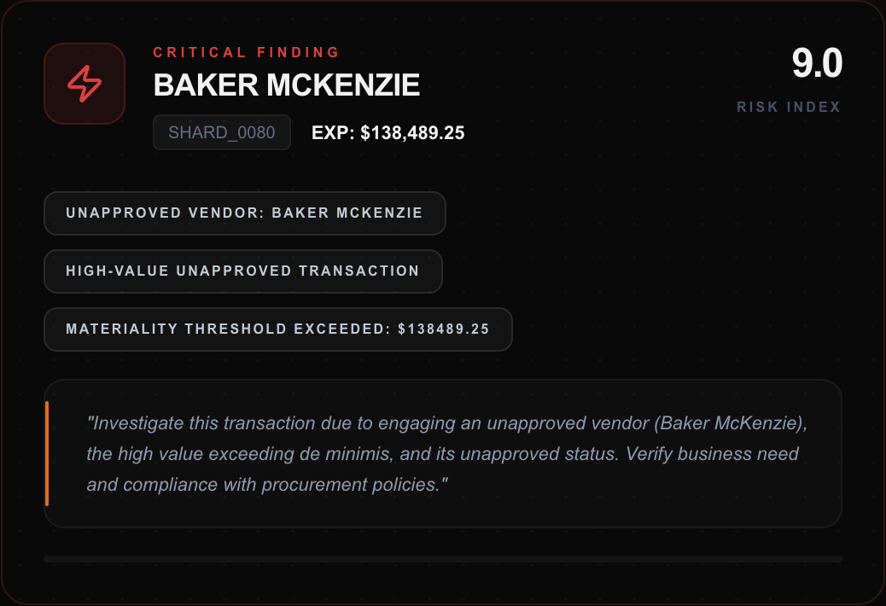

# Verity Nexus V2.0 

> **Cinematic AI-to-Agent Forensic Swarm**

Verity Nexus is a high-fidelity internal audit and forensic accounting platform that leverages a "Swarm Intelligence" architecture. It transforms raw analytical telemetry into a cinematic, executive-grade narrative, allowing auditors to visualize complex risk signals with zero technical debris.



## ⚡ Core Architecture: Neural Discovery Sync

The platform implements a **Zero-Parsing Architecture**. Instead of presenting raw data, the **Agentic Reasoning Swarm** synchronizes analytical findings directly into the UI's neural layer.

### 🧩 Analytical Synchronization
Technical payloads (JSON/Telemetry) are intercepted by the **Narrative Filtration Engine** and replaced with high-fidelity "Forensic Shards."



### 📊 Real-Time Exposure Metrics
The **Materiality Gauge** (Exposure Index) calculates institutional risk in real-time, providing a dynamic "Materiality Load" visualization.

- **Exposure Index**: Real-time dollar-value impact assessment.
- **Materiality Load**: Percentage-based visual of the floor-to-limit risk threshold ($1.5M Shard).
- **Anomaly Counter**: Real-time synchronization of forensic discoveries.

## ✨ Key Features (V2.0)

- **Neural Discovery Sync**: Aggressive chat filtering replaces technical payloads with interactive "Forensic Shard" badges.
- **Cinematic Data Jump**: Click any shard badge to smoothly scroll and highlight synchronized findings in the central discovery layer.
- **Materiality Gauge (Exposure Index)**: Real-time visualization of financial risk, materiality load, and anomaly density.
- **Swarm Intelligence Architecture**: Multi-agent orchestration (Verity Orchestrator, Audit Agent, Tax Agent) visualizing real-time handoffs.
- **Premium Forensic Aesthetic**: Neofuturistic dark-mode UI with glassmorphism, pulse animations, and brutalist typography.

## 🛡️ Forensic Discoveries (Interactive)
Individual audit findings are rendered as **Neural Discovery Shards**. Click a "Forensic Shard" in the chat to jump directly to its entry in the central panel.
- **Risk Indexing**: Precision-weighted severity scores (1.0 - 10.0).
- **Tactical Insights**: AI-generated investigative starting points.
- **Expedience Mapping**: High-value transaction highlights.



## 🚀 Getting Started

### Prerequisites
- **Python 3.12+** (Managed via `uv`)
- **Node.js 18+**
- **Google ADK**

### Backend Setup
```bash
cd backend
uv run server.py
```

### Frontend Setup
```bash
cd frontend
npm install
npm run dev -- -p 5174
```

---
**Secure Development Protocol**: This repository strictly enforces a Zero-Leak policy. Credentials and `.env` files are never committed.
