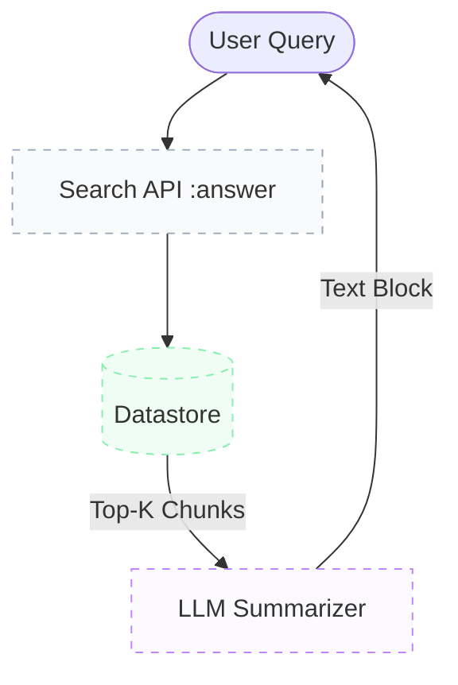
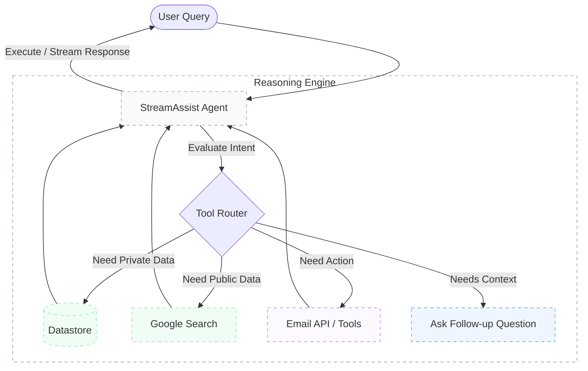

# Gemini Enterprise API Lab: RAG Search vs. Agentic Assist

This repository contains demonstrations of two different paradigms in Vertex AI Agent Builder (formerly Discovery Engine). 

The goal is to highlight the massive architectural shift between traditional, linear **Retrieval-Augmented Generation (RAG)** vs. modern, autonomous **Agentic Assistants**.

## 🚀 The Paradigms

### Method 1: Legacy RAG Search (`method1_rag_answer.py`)
This method uses the legacy `servingConfigs/default_search:answer` API.
It is a passive, linear search-and-summarize function. You send a query, it blindly queries the database, retrieves snippets, and forces the LLM to summarize them into a single blob of text.

### Method 2: Agentic Assistant (`method2_agentic_assist.py`)
This method uses the modern `assistants/default_assistant:streamAssist` API.
Instead of an endpoint, you are communicating with an autonomous **Agent** mapped to a `session`. The Agent evaluates your prompt, reads its system instructions, and dynamically routes your request. It can choose to:
1. Search your private datastore.
2. Search Google's public web (`googleSearchGroundingEnabled`).
3. Execute external tools (e.g., `send_email`).
4. Ask you for clarification if the prompt is vague.

---

## 📊 Comparison Table

| Feature | `Method 1: RAG Answer` (Legacy) | `Method 2: Agentic Assist` (Modern) |
| :--- | :--- | :--- |
| **Architecture** | Linear Pipeline (Search -> Summarize) | Autonomous Agentic Loop |
| **Tool Execution** | ❌ None (Text generation only) | ✅ Native (Datastores, Web, Extensions) |
| **Behavior / Persona** | ❌ Hardcoded system instructions | ✅ Granular System Instructions / Persona |
| **Statefulness** | ❌ Stateless (One-off searches) | ✅ Conversational Memory (Session IDs) |
| **Handling Vague Queries**| ⚠️ Guesses or outputs fallback summaries | 🧠 Pauses and asks user clarifying questions |
| **Routing** | ❌ Fixed (Internal Datastore only) | ✅ Dynamic (Web vs Docs vs Tools) |

---

## 📐 Architecture Diagrams

### 1. Legacy RAG Pipeline


### 2. Modern Agentic Loop


---

## 🛠️ How to Test

Activate your `uv` environment, log in to GCP, and execute the scripts directly from the CLI.

```bash
# Test the old linear Search & Summarize method
uv run ge_api_lab/method1_rag_answer.py

# Test the new autonomous Agent stream method
uv run ge_api_lab/method2_agentic_assist.py
```

### Observations to Look For
1. **Fallback vs Intelligence:** If you ask the old `RAG Answer` a vague question, it will return a hardcoded *"A summary could not be generated for your search query"* unless you forcefully disable relevance safeguards. If you ask the `Agentic Assist` the same question, it will reply: *"I can do that. Please upload the files you want me to analyze."*
2. **Speed & UX:** The old method waits for the full process to complete before returning text. The new method leverages Server-Sent Events (SSE) via `stream=True` to stream tokens to your terminal the moment the Agent formulates a thought.
