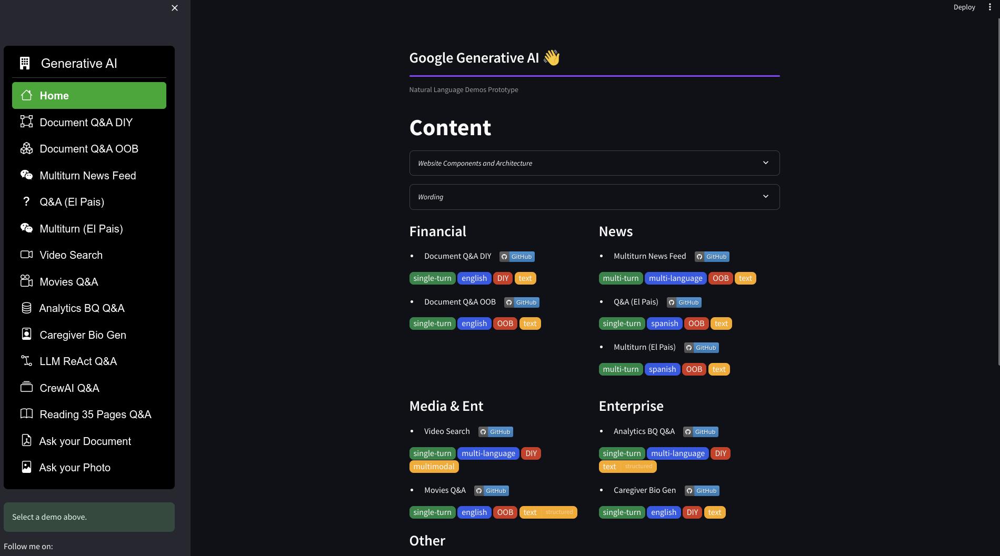
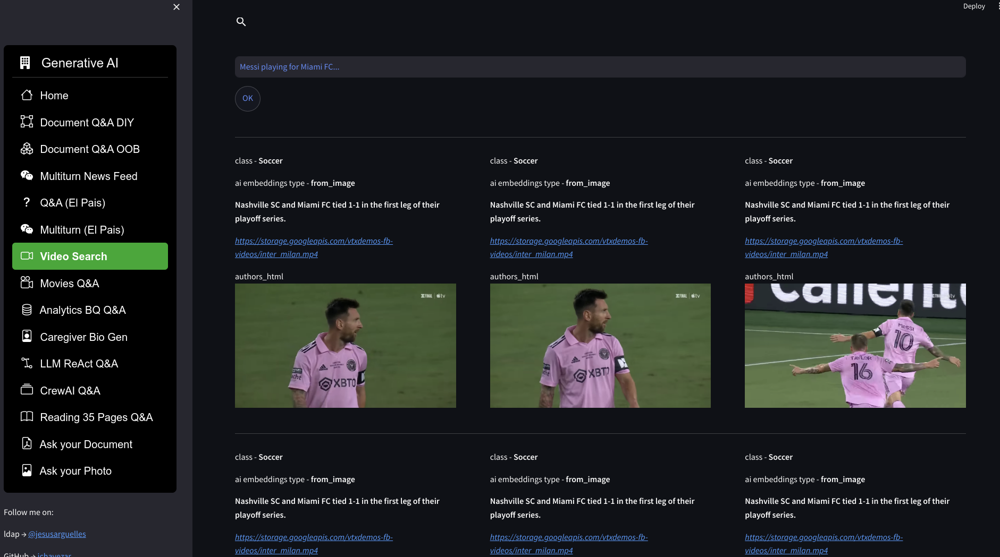

# Define

The repo has code snippets that are part of my experiments every day, but I have consolidated everything in a website of demos: [/streamlite_website](./streamlit_website/) and the following diagram 
represents all the components used, there is a dockerfile to replicate the website demos:

The website looks like this:

