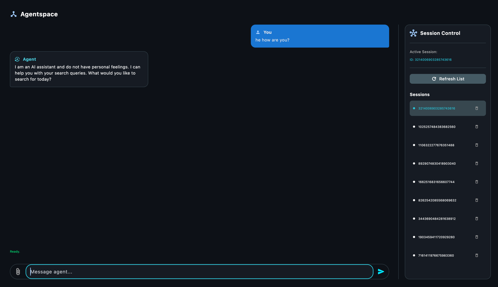

# Agent Builder

## Test locally

Adk comes with a prototype to test it 
```bash
adk web
```

## Test locally with Agent Engine Wrapper

- Use [deploy_agent_engine.py](./deploy_agent_engine.py)

Before develop is a good practice to test it with a
wrapper using methods like async_stream, etc...
```python
local_agent = AdkApp(
    agent=root_agent,
    enable_tracing=True
)
```

```python
async def send_message(prompt: str):
    sessions = await local_agent.async_create_session(user_id="jesus_c")
    async for event in local_agent.async_stream_query(
            user_id="jesus_c",
            session_id=sessions.id,
            message=prompt,
    ):
        if "text" in event["content"]["parts"][0]:
            print(event["content"]["parts"][0]["text"])


asyncio.run(send_message("how are you?"))
```

## Deploy it and Test it

Run deploy part inside of [deploy_agent_engine.py](./deploy_agent_engine.py)

Once the endpoint is deployed we can call the agent engine directly
or use the UI in the example to interact with AE and its sessions.

