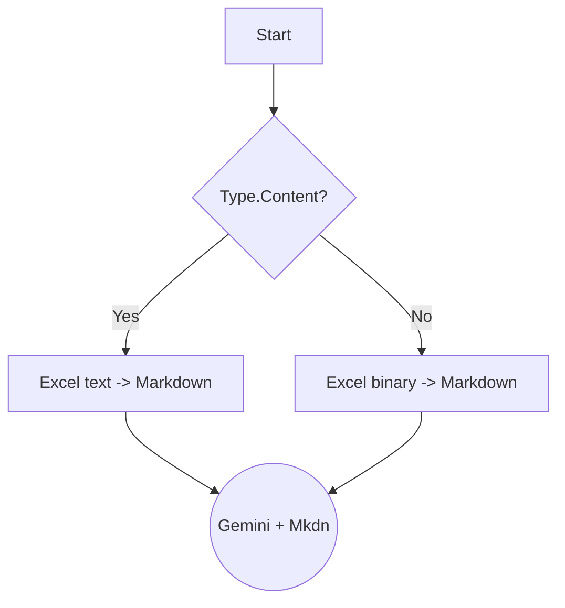
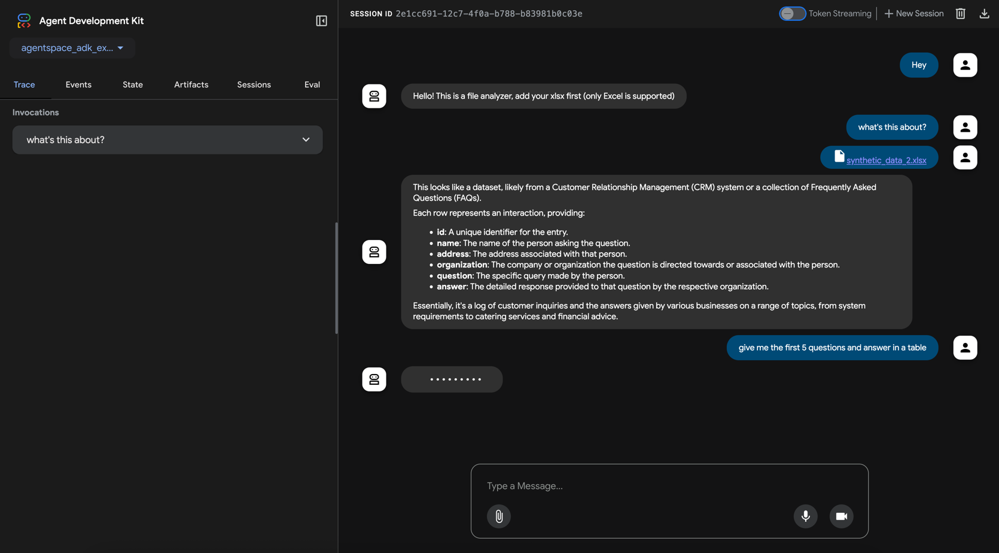
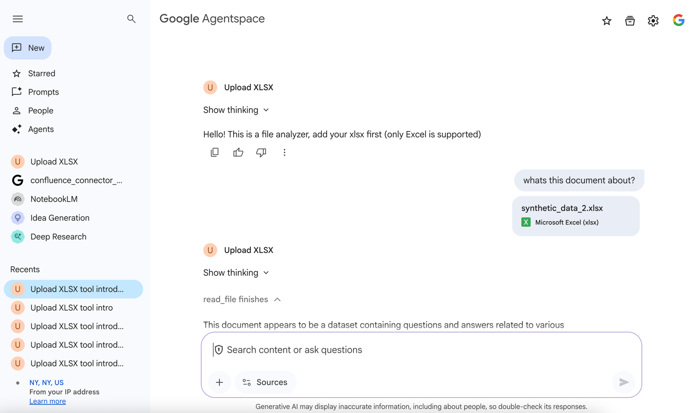
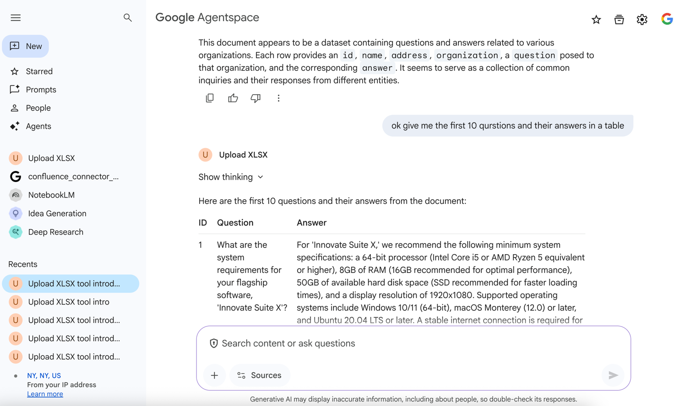

# Uploading Documents to ADK from Agentspace

This experiment clarifies how [ADK Web](https://google.github.io/adk-docs/evaluate/#how-to-run-evaluation-with-the-adk)
and Agentspace integrate to form a unified solution.

It highlights a key distinction: when you upload a document, 
[ADK Web](https://google.github.io/adk-docs/evaluate/#how-to-run-evaluation-with-the-adk) treats it as **Content**
_types.Content(role="", parts=[])_
within the context of the 
current session, offering comprehensive control over the entire operation. 

In contrast, 
[Agentspace](https://cloud.google.com/agentspace/docs/overview) handles uploaded 
files as **Artifacts**, a necessary mechanism to meticulously track all components and maintain a complete context 
across every stage of a process. This fundamental difference shapes how an Agent interacts with each application.

The following script describes the process of using both (from agentspace and locally for
prototyping.)



- When file is uploaded from Agentspace, the file is being stored as Artifact:

```python
    artifacts_in_context = await callback_context._invocation_context.artifact_service.list_artifact_keys(
        app_name=callback_context._invocation_context.app_name,
        user_id=callback_context._invocation_context.user_id,
        session_id=callback_context._invocation_context.session.id,
    )
```

- Whe file is uploaded locally is just another part inside of the user request.

```python
    artifacts_in_request = [True for content in llm_request.contents if content.role == 'user' for part in content.parts if not part.text]
    callback_context.state["artifacts_in_context_names"] = artifacts_in_context
```

Not all the files can be read directly by any Large Language Model, in this case
if we have excel we have to transform it to something readable for the Model itself.

So I added some logic:

```python
    _artifact = await callback_context.load_artifact(artifact)

    if _artifact["inlineData"]["mimeType"] == "application/vnd.openxmlformats-officedocument.spreadsheetml.sheet":
        decoded_data = base64.b64decode(_artifact["inlineData"]["data"])
        excel_file_object = io.BytesIO(decoded_data)
        try:
            df = pd.read_excel(excel_file_object)
            markdown_table = df.to_markdown(index=False)
```
_As we can see we're taking the bytest string decode it into binary, read it with pandas dataframe
and create a markdown (text)._

# Code

Libraries required:
- google-adk==1.5
- google-cloud-aiplatform[agent-engines]== 1.106.0

The entire Code is here:  
1. [agent.py](./agent.py), Agent with a callback function to intercept the message before calling LLM.
2. [to_agentspace.py](./to_agentspace.py), Deploy the Agent into serverless Agent Engine and integrate it with Agentspace.

# Screenshots

**_Adk Web:_**



**_Agentspace:_**





