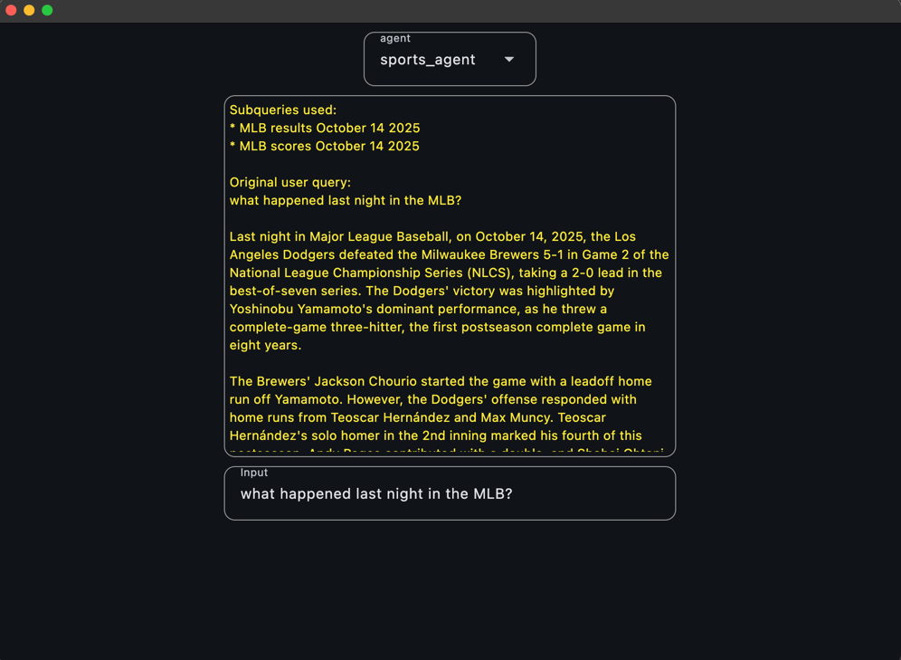
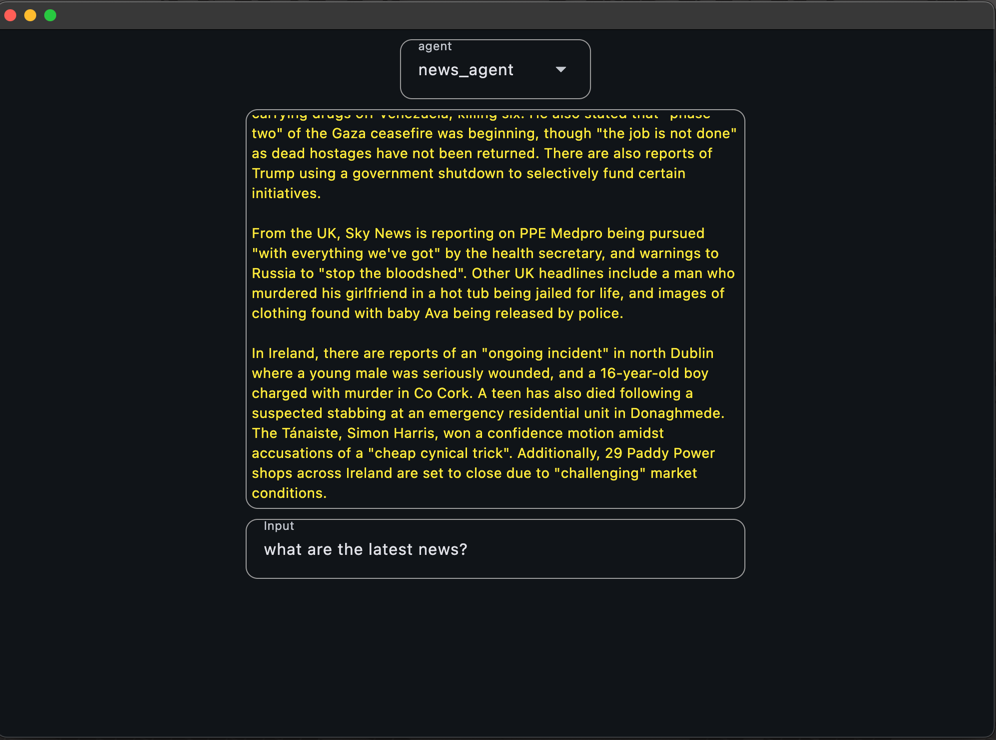

# Agent Engine
### Introduction
The following prototype will proof how to use the same UI with different Agent Engines from different projects.

### Components

- Flet Python (UI): [https://flet.dev/](https://flet.dev/)
- Google Agent Engine: [https://cloud.google.com/vertex-ai/generative-ai/docs/agent-engine/overview](https://cloud.google.com/vertex-ai/generative-ai/docs/agent-engine/overview)
- Google ADK: [https://google.github.io/adk-docs/](https://google.github.io/adk-docs/)

#### Step 1:

Create Agent Engines on different projects using the following snippet [deploy_agent_engine.py](./deploy_agent_engine.py)

_Remember to change your variables (project_name, location and staging_bucket)_

### Step 2:
Extract the name of the agent engines from the output of your last snippet run and
use them in the [ui.py](./ui.py) file:

e.g.
```python
agent_engine_1 = "projects/254356041555/locations/us-central1/reasoningEngines/3217879108360863744" # Output from deploy_agent_engine.py
agent_engine_2 = "projects/722330367743/locations/us-central1/reasoningEngines/613672623833874432" # Output from deploy_agent_engine.py
```

### Step 3:
Run the UI using flet:
```bash
flet run ui.py
```

You should see something like this:


