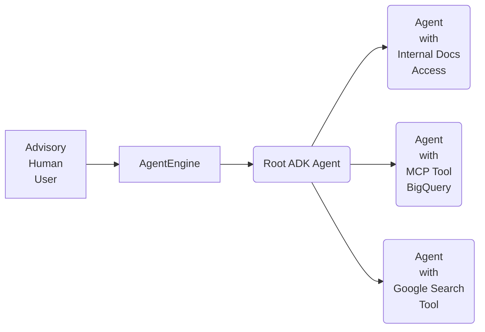
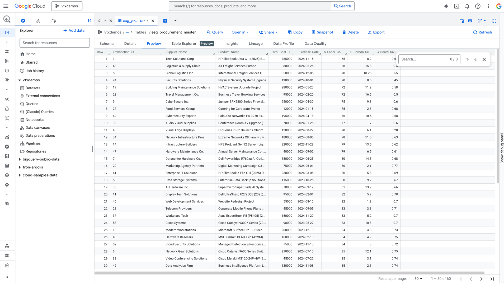
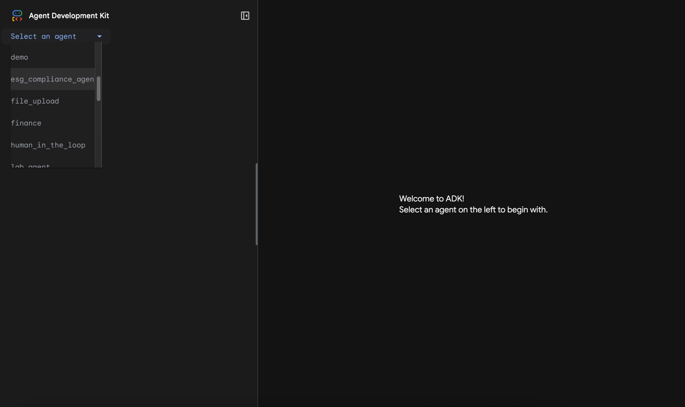
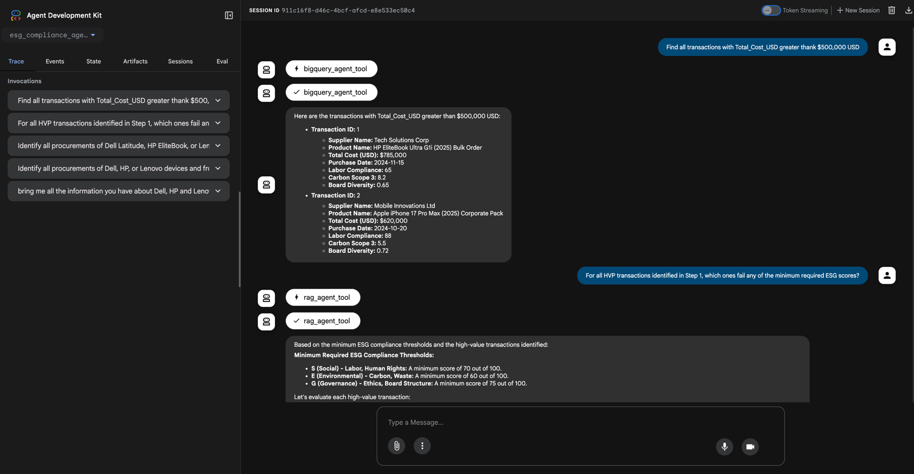

# ESG Compliance Agent

The following guide will help us to create an Agentic Framework for e
ing sustainable corporate practices.

## Agent Framework Diagram


## Prework
- Set enviromental variables in your system.

e.g.
```bash
export GOOGLE_GENAI_USE_VERTEXAI=TRUE
export GOOGLE_CLOUD_PROJECT=vtxdemos
export GOOGLE_CLOUD_LOCATION=us-central1
```

- Install the libraries required.
```bash
pip install google-adk # version currently used: 1.15.1
```

## Step 1: Generate Synthetic Data
Go to [generate_table.py](generate_table.py) and run the script, I used inline run from my IDE (ipython->IntelliJ)
Once the code finishes to run we should be able to see something like this in GCP Console:



## Step 2: Use ADK WEB (UI Prototype)
From our terminal on a folder above the current folder "/esg_compliance_agent" we have to run the
following command:

```bash
adk web
```

A window is open like this (select the folder):


And start interacting with the Agent:


Congratulations you have developed this agent framework.
