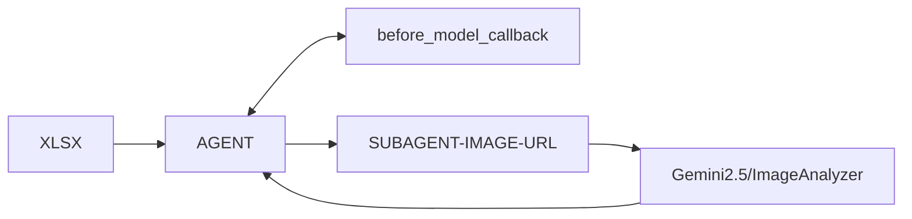
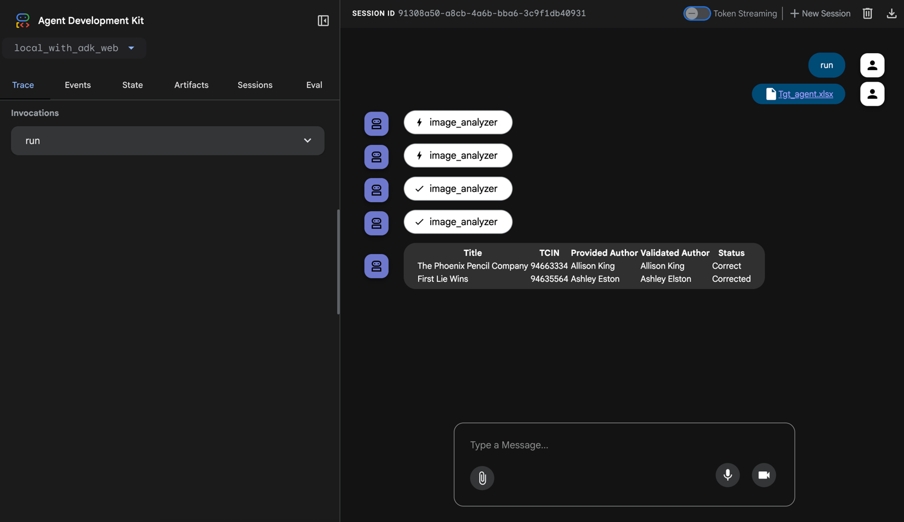

# Author Validator

This project parses an XLSX file to extract author IDs. These IDs are used to query a synthetic data **MCP table** for 
corresponding image URLs, which are then passed to the Gemini API to perform author validation.



## Demo



## Guide

### Install Packages

```bash
uv add openpyxl tabulate google-genai google-adk pandas
```

### Set your environment

Change [.env](.env) with your **project_id** and **location**.

## Run Prototype Environment (ADK Web)

```bash
adk web
```