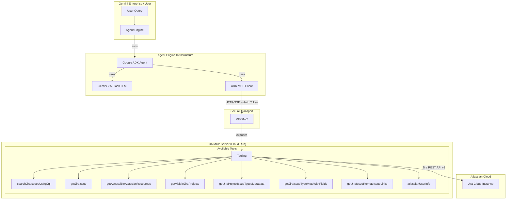

# Jira MCP Server & Google ADK Agent

This project provides a complete architecture for a **Jira Assistant Agent**. It consists of two main components:

1.  **Jira MCP Server (`jira_server/`)**: A backend service deployed on Google Cloud Run that implements the [Model Context Protocol (MCP)](https://modelcontextprotocol.io/). It securely connects to the Atlassian/Jira API.
2.  **Google ADK Agent (`adk_agent/`)**: An AI agent built with the Google Agent Development Kit (ADK) that consumes the MCP server tools to answer user queries.

## 🏗️ Project Structure

```text
├── jira_server/           # Cloud Run deployment files
│   ├── server.py          # MCP Server implementation (FastAPI)
│   ├── Dockerfile         # Container definition
│   ├── requirements.txt   # Server dependencies
│   └── start_server.sh    # Local startup script
│
├── adk_agent/             # Agent Engine deployment files
│   ├── agent.py           # ADK Agent definition & tool configuration
│   ├── deploy_agent_engine.py # Script to deploy Agent to Vertex AI
│   └── requirements.txt   # Agent dependencies
│
├── utils/                 # Helper utilities
│   ├── test_client.py     # Script to test MCP server connectivity
│   └── get_access_token.py # GUI tool to generate Atlassian OAuth tokens
│
└── .env                   # Environment variables (ATLASSIAN_OAUTH_TOKEN)
```

## 🏛️ Core Architecture

The diagram below illustrates how Gemini Enterprise interacts with Jira data through the Agent Engine and this MCP Server.



---

## 🛠️ Step 1: Setup Authentication

Before running anything, you need a valid Atlassian OAuth 2.0 Token.

1.  **Generate Token:**
    You can use the included helper script to generate a token (requires an Atlassian App configuration):
    ```bash
    python3 utils/get_access_token.py
    ```
    *Follow the GUI instructions to authorize and copy the token.*

2.  **Configure Environment:**
    Create a `.env` file in the root directory. 
    
    *To use the token generator script (`utils/get_access_token.py`), you must provide your Atlassian App credentials:*
    ```bash
    # Required for token generation
    ATLASSIAN_CLIENT_ID="your_client_id"
    ATLASSIAN_CLIENT_SECRET="your_client_secret"
    ATLASSIAN_REDIRECT_URI="your_callback_url"
    ```

    *Once you have generated the token, add it to the file:*
    ```bash
    # Required for Agent operation
    ATLASSIAN_OAUTH_TOKEN="your_generated_access_token"
    ```

---

## ☁️ Step 2: Deploy Jira MCP Server (Cloud Run)

The MCP Server must be deployed to Cloud Run to be accessible by the Agent.

1.  **Navigate to the server directory:**
    ```bash
    cd jira_server
    ```

2.  **Deploy to Cloud Run:**
    Run the following command. Replace `YOUR_PROJECT` and `YOUR_REGION` as needed.
    ```bash
    gcloud run deploy jira-mcp-server \
      --source . \
      --region us-central1 \
      --allow-unauthenticated \
      --project YOUR_PROJECT
    ```
    *Note: `--allow-unauthenticated` is safe because the server validates the `Authorization` header internally.*

3.  **Copy the Service URL:**
    Cloud Run will output a URL (e.g., `https://jira-mcp-server-xyz.a.run.app`). You will need this for the Agent.

### (Optional) Test Locally First
You can test the server locally before deploying.
1.  Run the server: `python3 jira_server/server.py` (runs on port 8080).
2.  Run the test client:
    ```bash
    # Ensure dependencies are installed: pip install mcp python-dotenv
    python3 utils/test_client.py
    ```
    *This verifies the server can talk to Jira using your .env token.*

---

## 🤖 Step 3: Deploy Agent (Vertex AI Agent Engine)

Now configure and deploy the Agent that uses the MCP server.

1.  **Configure the Agent:**
    Open `adk_agent/agent.py` and update the `McpToolset` URL to your **Cloud Run Service URL**:

    ```python
    McpToolset(
        connection_params=SseConnectionParams(
            url='https://jira-mcp-server-xyz.a.run.app/sse', # <--- UPDATE THIS
            timeout=120
        ),
        # ...
    )
    ```

2.  **Test Agent Locally:**
    You can run the agent locally to verify it answers Jira questions correctly. It will use the token from your local `.env` file.
    ```bash
    python3 adk_agent/agent.py
    ```

3.  **Deploy to Agent Engine:**
    Use the deployment script to push the agent to Vertex AI.
    
    *   Open `adk_agent/deploy_agent_engine.py`.
    *   Update `AGENT_ENGINE_NAME` if desired.
    *   Run the script:
        ```bash
        cd adk_agent
        python3 deploy_agent_engine.py
        ```


## 🔐 Security Notes

*   **Token Security:** The `.env` file is excluded from git (`.gitignore`) and Docker builds (`.dockerignore`). Never commit it.
*   **Token Passing:** The Agent reads the token dynamically from its environment (or session context) and passes it securely via HTTP Headers (`Authorization: Bearer ...`) to the Cloud Run server.
*   **Logs:** The Agent code strips sensitive token data from logs.

## 📝 Requirements

*   Python 3.12+
*   Google Cloud SDK (`gcloud`)
*   `mcp`, `fastapi`, `uvicorn`, `atlassian-python-api`, `google-genai`, `python-dotenv`