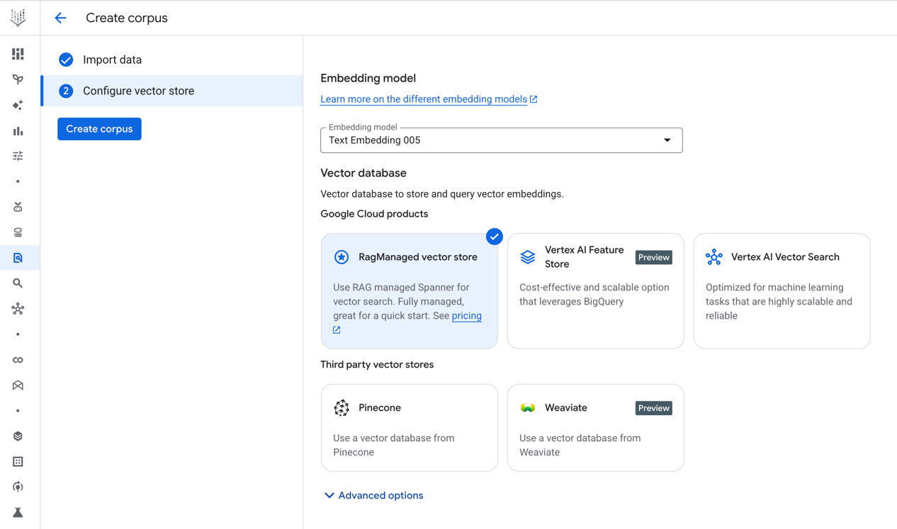

## Gemini Enterprise, Agent Engine and Rag Engine


### Create a Rag Corpus using Google Rag Engine

Following the next steps:

1. Specify a name and data source:


2. Select the parser that better suits your use case.


3. Select the latest embeddings model and the vector database.



4. Write down the name/id of the corpus, should be this format:

```python
"projects/vtxdemos/locations/us-east4/ragCorpora/6917529027641081856"
```
And use it in the [agent.py](agent.py) file:

```python
ask_vertex_retrieval = VertexAiRagRetrieval(
    name='retrieve_rag_documentation',
    description=(
        'Use this tool to retrieve documentation and reference materials for the question from the RAG corpus,'
    ),
    rag_resources=[
        rag.RagResource(
            rag_corpus="projects/vtxdemos/locations/us-east4/ragCorpora/6917529027641081856"
        )
    ],
    similarity_top_k=10,
    vector_distance_threshold=0.6,
)
```

5. Use the prototype UI:

```bash
adk web
```


### Deploying to Agent Engine

The `deploy_agent_engine.py` script is designed for deploying your agent to a Google Cloud Agent Engine. It's structured with `#%%` markers for interactive execution in IDEs like VS Code or IntelliJ.

1.  **Run `deploy_agent_engine.py`**: Execute the script section by section to deploy your agent.
2.  **Save `resource_name`**: After successful deployment, the script will output a `resource_name` (e.g., `"projects/254356041555/locations/us-central1/reasoningEngines/4066033581934247936"`). Copy this value.

### Publishing to Gemini Enterprise

Once your Agent Engine is deployed, use `publish_to_ge.py` to make it available in Gemini Enterprise.

1.  **Update `publish_to_ge.py`**: Paste the `resource_name` obtained from the deployment step into the `publish_to_ge.py` script.
2.  **Run `publish_to_ge.py`**: Execute this script to publish your agent.

After publishing, you can find and interact with your new agent in Gemini Enterprise.


## 💡 Key `uv` Commands

| Action | Command | Purpose |
| :--- | :--- | :--- |
| **Install** | `uv pip install <package>` | Install a new package. |
| **Sync** | `uv pip sync requirements.txt` | Ensure environment exactly matches the file. |
| **Upgrade** | `uv pip install --upgrade <package>` | Upgrade a specific package. |
| **Deactivate** | `deactivate` | Exit the virtual environment. |

---

## 🤝 Contributing

Contributions are welcome! Please see the [`CONTRIBUTING.md`](CONTRIBUTING.md) file for details.

## 📄 License

This project is licensed under the **[MIT License](LICENSE)** - see the `LICENSE` file for details.
