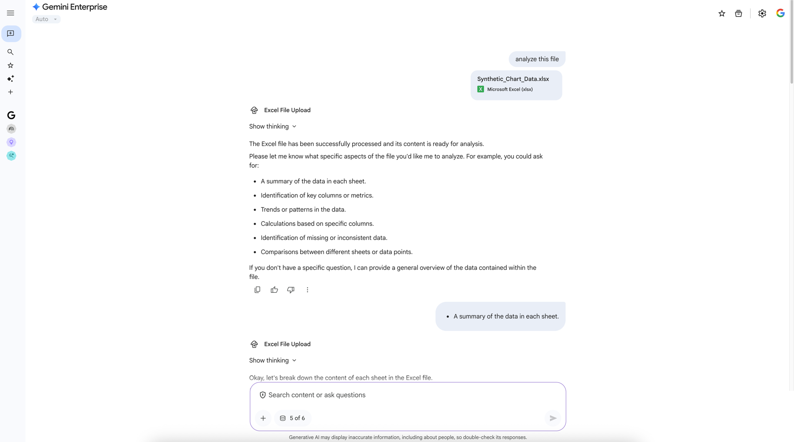

# 🚀 Excel Upload Agent with Google ADK

## ✨ Overview

This project demonstrates an intelligent agent built with the Google Agent Development Kit (ADK) that can process and analyze Excel files. It's designed to streamline data handling and provide insights from structured data efficiently.

## ⚡ Getting Started (Quick Setup)

This guide uses **uv** for fast and reproducible environment setup and dependency management.

### Prerequisites

You need **Git** and the **uv** tool installed on your system.

*   **Install uv:**
    ```bash
    curl -LsSf https://astral.sh/uv/install.sh | sh
    ```

### 1. Clone the Project

Get the latest version of the code from the repository:

```bash
git clone https://github.com/jchavezar/vertex-ai-samples.git
cd vertex-ai-samples/gen_ai/adk/ge_excel_upload_adk/
```

### 2. Setup the Environment

Use uv to create a dedicated virtual environment named `.venv` and then activate it.

```bash
# Create the virtual environment
uv venv

# Activate the environment
# On macOS/Linux:
source .venv/bin/activate
# On Windows (PowerShell):
# .venv\Scripts\Activate.ps1
```

### 3. Install Dependencies

Use the `uv pip sync` command to install all packages listed in `requirements.txt`. This step ensures your environment is an exact match for the defined dependencies by installing missing packages and uninstalling extras.

```bash
uv pip sync requirements.txt
```

## 📂 Project Structure

```
ge_excel_upload_adk/
├── agent.py                  # The core ADK agent definition
├── deploy_agent_engine.py    # Script to deploy the agent to an Agent Engine
├── publish_to_ge.py          # Script to publish the Agent Engine to Gemini Enterprise
├── requirements.txt          # Project dependencies
├── readme.md                 # This README file
└── Synthetic_Chart_Data.xlsx # Example Excel data for testing
```

## 🚀 Usage

### Local Development and Testing

For quick prototyping and local testing of the agent:

```bash
adk web
```

This command will start a local web server, and you can interact with your agent through the ADK developer UI.

### Deploying to Agent Engine

The `deploy_agent_engine.py` script is designed for deploying your agent to a Google Cloud Agent Engine. It's structured with `#%%` markers for interactive execution in IDEs like VS Code or IntelliJ.

1.  **Run `deploy_agent_engine.py`**: Execute the script section by section to deploy your agent.
2.  **Save `resource_name`**: After successful deployment, the script will output a `resource_name` (e.g., `"projects/254356041555/locations/us-central1/reasoningEngines/4066033581934247936"`). Copy this value.

### Publishing to Gemini Enterprise

Once your Agent Engine is deployed, use `publish_to_ge.py` to make it available in Gemini Enterprise.

1.  **Update `publish_to_ge.py`**: Paste the `resource_name` obtained from the deployment step into the `publish_to_ge.py` script.
2.  **Run `publish_to_ge.py`**: Execute this script to publish your agent.

After publishing, you can find and interact with your new agent in Gemini Enterprise.



## 💡 Key `uv` Commands

| Action | Command | Purpose |
| :--- | :--- | :--- |
| **Install** | `uv pip install <package>` | Install a new package. |
| **Sync** | `uv pip sync requirements.txt` | Ensure environment exactly matches the file. |
| **Upgrade** | `uv pip install --upgrade <package>` | Upgrade a specific package. |
| **Deactivate** | `deactivate` | Exit the virtual environment. |

---

## 🤝 Contributing

Contributions are welcome! Please see the [`CONTRIBUTING.md`](CONTRIBUTING.md) file for details.

## 📄 License

This project is licensed under the **[MIT License](LICENSE)** - see the `LICENSE` file for details.
