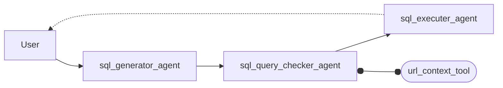

## Custom Workflows N2SQL for Tables > 14k rows

This document outlines a multi-agent system for converting natural language questions into SQL queries (N2SQL), specifically designed for large database tables.

The workflow is as follows:

    1. A user provides a question in natural language.
    2. A sql_generator_agent creates an initial SQL query.
    3. A sql_query_checker_agent validates the query's correctness, using a url_context_tool to get information about the database schema.
    4. An sql_executer_agent runs the validated query.
    5. The final result is returned to the user.

This multi-step process with specialized agents and a context tool allows for accurate and efficient handling of N2SQL tasks on large datasets.