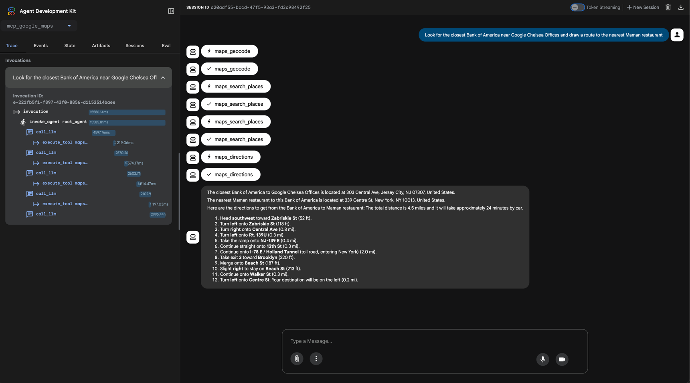

# Testing Google ADK with Google Maps as MCP Tool

This directory contains code and instructions for testing the Google ADK (Agent Development Kit) with Google Maps as the MCP (Multi-Channel Platform) tool. The purpose of this setup is to demonstrate how to integrate Google Maps functionalities into an agent using the ADK framework.

## Prerequisites

Install python libraries.
```bash
uv add --upgrade google-adk
```

Run the adk-ui prototype.
```bash
adk web
```

## Screenshot

