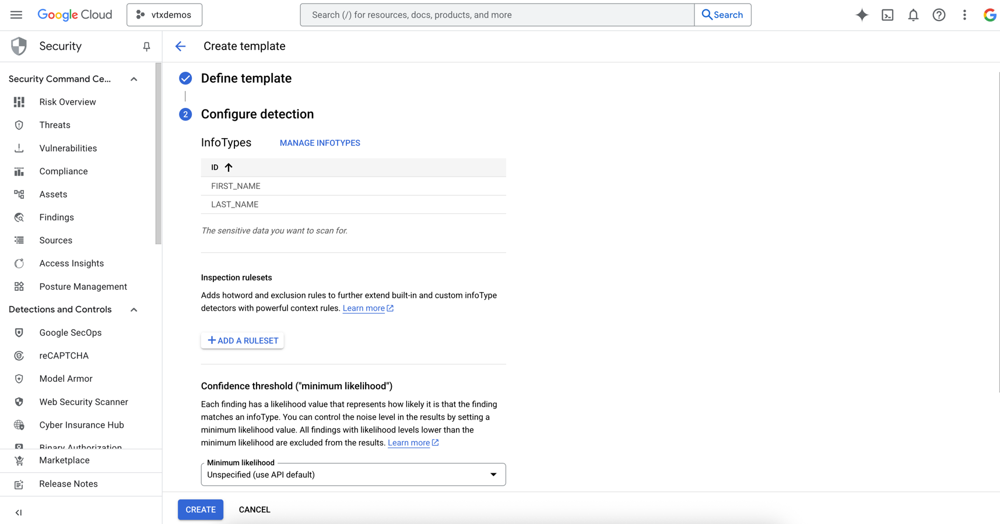
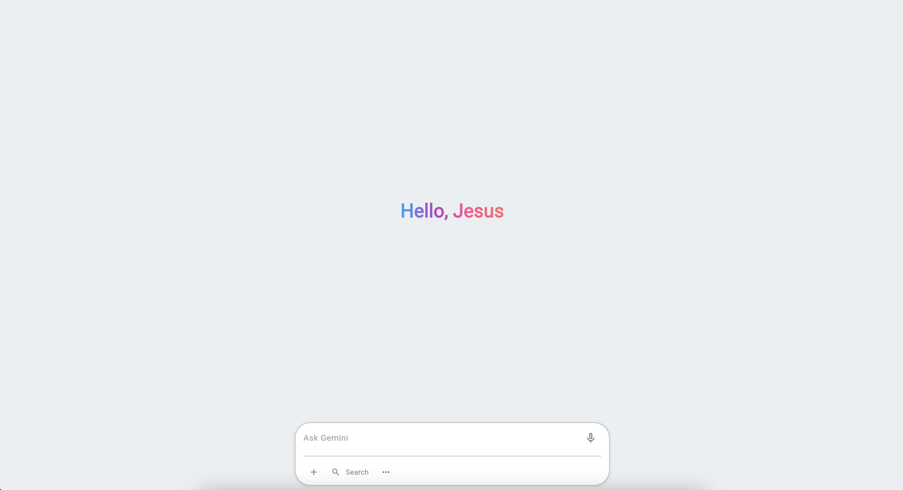

# Model Armor Guardrail Implementations for GenAI Agents

[//]: # (![cloud_armor.jpeg]&#40;readme_artifacts/cloud_armor.jpeg&#41;)

## Table of Contents

<!-- TOC -->
- [Why Model Armor?](#why-model-armor)
- [General Workflow](#general-workflow)
- [Getting Started](#getting-started)
  - [Model Armor and DLP](#model-armor-and-data-loss-prevention)
  - [Create Cloud Storage](#create-a-gcs-bucket-for-staging)
  - [Agent Builder](#agent-builder)
    - [Clone GitHub](#clone-github-repo)
    - [Install Packages](#install-packages)
    - [Authentication](#authentication)
    - [ADK Web](#adk-web)
    - [Flet (Your Own UI)](#flet-your-own-ui)
    - [Agentspace](#agentspace)

## Why Model Armor?

Generative AI is powerful, but it also carries risks. Model Armor is crucial for building trust and ensuring the safe deployment of GenAI systems. It helps mitigate vulnerabilities, prevent misuse, and maintain responsible AI practices.

This project demonstrates the integration of [Model Armor](https://cloud.google.com/security-command-center/docs/model-armor-overview) and ADK ([Agent Development Kit](https://google.github.io/adk-docs/))

- We will be using before_model_callback function to use model armor before hitting LLM.
- The code in this repo was programmed with 2 components.

## General Workflow

Component 1: **Detect Personal Information**.


Component 2: **Detect LLM Jailbreak**.


## Getting Started

### Model Armor and Data Loss Prevention:

Before creating the ADK Agent a Model Armor template and DLP is required.

**[Model Armor](https://cloud.google.com/security-command-center/docs/model-armor-overview)** is a Google Cloud service that enhances the security and safety of AI applications by screening LLM prompts and responses for various risks, including prompt injection, jailbreaking, harmful content, malicious URLs, and sensitive data loss. It offers centralized management, supports multi-cloud and multi-model scenarios, and integrates with Security Command Center.

- Malicious URL Detection
- Prompt Injection and Jailbreak Detection
- Sensitive Data Protection ([DLP](https://cloud.google.com/security/products/dlp?hl=en))
- Responsible AI (Hate Speech, Dangerous, Sexually Explicit, Harassment)

**[Data Loss Prevention (DLP) Helps discover](https://cloud.google.com/security/products/dlp?hl=en)**, classify, and protect sensitive data.

Steps to create a Data Loss Prevention template:
Go to [Google Cloud Console](https://console.cloud.google.com/) > Security > [Sensitive Data Protection](https://console.cloud.google.com/security/sensitive-data-protection) > [Configuration](https://console.cloud.google.com/security/sensitive-data-protection/landing/configuration)

Create 2 Templates (Inspect and De-Identify):

**Inspect Template:**


Add infotypes like FIRST_NAME LAST_NAME:



**De-Identify Template**:


De-Identify is a mechanism to obscure personal information detected. (For the demo I selected "Redact")


Steps to create a Model Armor:

Go to [Google Cloud Console](https://console.cloud.google.com/) > Security > [Model Armor](https://console.cloud.google.com/security/modelarmor) > Create Template
Select and fill the gaps.


Check Sensitive data protection box and paste the endpoint from dlp inspect template and de-identify template:

> [!NOTE]
> Don't forget to change the template IDs with your own information.


Save and Done.

Take a note of the template_model_id which has the following format and store it in .env:

```python
name=f"projects/{project}/locations/us/templates/{template_model_id}"
```

> [!NOTE]
> Pay attention to the region where DLP templates and Model Armor Template has been created under, that will define the
> location in the template_model_id format.

## Create a [GCS](https://cloud.google.com/storage?hl=en) Bucket for Staging

```bash
gsutil mb gs://[your-bucket-name(change me)]
```

## Agent Builder

A strong user interface (UI) is vital for any company. ADK offers "[adk web](https://google.github.io/adk-docs/evaluate/#1-adk-web-run-evaluations-via-the-web-ui)" for rapid UI prototyping. Our project utilizes three web interfaces:
1. [ADK Web](https://google.github.io/adk-docs/evaluate/#1-adk-web-run-evaluations-via-the-web-ui), for **pre-production** Agent testing.
2. [Flet](https://flet.dev/), for "simulating" **existing** frontends or specific preferences.
3. [AgentSpace](https://cloud.google.com/products/agentspace?hl=en) (an enterprise **search** solution with **advanced** features).

---

### Clone GitHub Repo

```bash
git clone https://github.com/jchavezar/vertex-ai-samples.git
```

If you don't want to clone the entire repo do as follows:

[optional]
```bash
mkdir video_app_clone && cd $_
git init
```

[optional]
```bash
git remote add -f origin https://github.com/jchavezar/vertex-ai-samples.git
git config core.sparseCheckout true
echo "gen_ai/adk/model_armor_google_search/" >> .git/info/sparse-checkout
git pull origin main
```

```bash
cd gen_ai/adk/
```

#### Install Packages
I highly recommend to use a new virtual environment in python, I am using [uv](https://docs.astral.sh/uv/getting-started/installation/)
because is really fast.

```bash
pip install google-genai #tested with 1.20.0
pip install google-adk #tested with 1.6
pip install google-cloud-aiplatform #tested with 1.97.0
pip install google-cloud-modelarmor #tested with 0.2.5
pip install flet #tested with 0.27.6
```

Change .env values with your own variables (we will add more later)

GOOGLE_CLOUD_PROJECT=vtxdemos  
GOOGLE_CLOUD_LOCATION=us-central1  
GOOGLE_GENAI_USE_VERTEXAI=True

#### Authentication
_Make sure you are authenticated somehow with your Google Cloud Project_

There are 2 options, either you create a service_account with **Vertex AI User** and **Model Armor User** Role and download the json key file
to later be used as follows.

_Run it from your terminal._
```bash
export GOOGLE_APPLICATION_CREDENTIALS=[Your json file location/path(Change Me)]
```

Or using [Google ADC](https://cloud.google.com/docs/authentication/provide-credentials-adc):

```bash
gcloud auth application-default login
```

#### ADK Web

_Run Adk Web_
```bash
adk web
```

- ADK Web comes with tracing, events and states logging and a conversational panel like this:


#### Flet (Your Own UI)

---

Want to use your own UI? I've made a simple one with [Flet](https://flet.dev/) (powered by [Flutter](https://flutter.dev/)) that looks like this:



I could've used the [agent.py](./agent.py) file as a backend to the [ui.py](./ui.py),
but I wanted to keep this guide simple, the only difference between [backend.py](./backend.py)
and [agent.py](./agent.py) is we are initializing the session with Runner and send the query asynchronously
to the Agent.

```text
async def setup_session_and_runner(agent):
    session = await global_session_service.get_session(
        app_name=APP_NAME,
        user_id=USER_ID,
        session_id=SESSION_ID,
    )

    if session:
        print(f"Retrieved existing session: {SESSION_ID}")
    else:
        session = await global_session_service.create_session(
            app_name=APP_NAME,
            user_id=USER_ID,
            session_id=SESSION_ID,
        )
        print(f"Created new session: {SESSION_ID}")

    runner = Runner(agent=agent, app_name=APP_NAME, session_service=global_session_service)
    return session, runner
    
#... agent.py logic

async def generate_content(prompt: str):
    session, runner = await setup_session_and_runner(root_agent)

    content = types.Content(role='user', parts=[types.Part(text=prompt)])
    events = runner.run_async(user_id=USER_ID, session_id=SESSION_ID, new_message=content)

    final_response = None
    async for event in events:
        print(event)
        if event.is_final_response() and event.content and event.content.parts:
            logger.info(f"Potential final response from [{event.author}]: {event.content.parts[0].text}")
            final_response = event.content.parts[0].text
    return final_response
```

Run the following bash command inside /model_armor from your local machine.

```bash
flet run ui.py --web
```

_Now Interact with the UI._

**PII / Personal Sensitive Information**


**Jailbreak**


#### AgentSpace

##### Steps to create an Agentspace:

1. Go to [Google Cloud Console](https://console.cloud.google.com/) > [AI Applications](https://console.cloud.google.com/gen-app-builder/) > Click on "Create App"

Select and Create an Agentspace from the list:


Fill spaces with information and hit "Continue":


The next step, **"Data"**, allows you to create indexed structured or unstructured data to serve as grounding for Agentspace. For this guide, we'll skip it by selecting **"create"** button.

After this step Agentspace is ready for being used. Your screen should look like this:


The Next step is connect the ADK Agent we just built into Agentspace, until now we have tested everything locally,
for this step we need to deploy the Agent somewhere, the perfect place is called [Agent Engine](https://cloud.google.com/vertex-ai/generative-ai/docs/agent-engine/overview).

I'll keep it simple this time (I'm leaving [to_agentspace.py](./to_agentspace.py) script), just remember to have your [.env](./.env) variables up to date. We need to add agentspace_id which you can find in the screenshot
previously mentioned, I wil leave it highlighted here:


_Note: Do not forget to add a display name and and a description for your agent in the env file._

Run the script:

```python
python to_agentspace.py
```

Logs are always available inside Google Cloud Console, this is the output of the last script while running:

```text
Using bucket vtxdemos-staging
Wrote to gs://vtxdemos-staging/agent_engine/agent_engine.pkl
Writing to gs://vtxdemos-staging/agent_engine/requirements.txt
Creating in-memory tarfile of extra_packages
Writing to gs://vtxdemos-staging/agent_engine/dependencies.tar.gz
Creating AgentEngine
Create AgentEngine backing LRO: projects/254356041555/locations/us-central1/reasoningEngines/6157854453778087936/operations/8303504356901126144
View progress and logs at https://console.cloud.google.com/logs/query?project=vtxdemos
```

Once the Agent has been deployed and registered, **Refresh Agentspace window**, you should see something like this:


