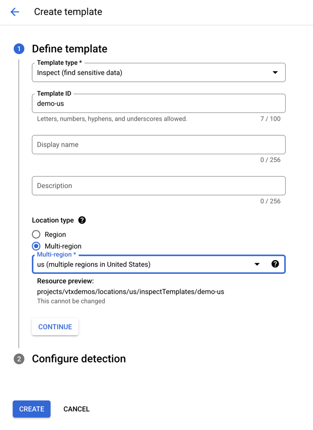
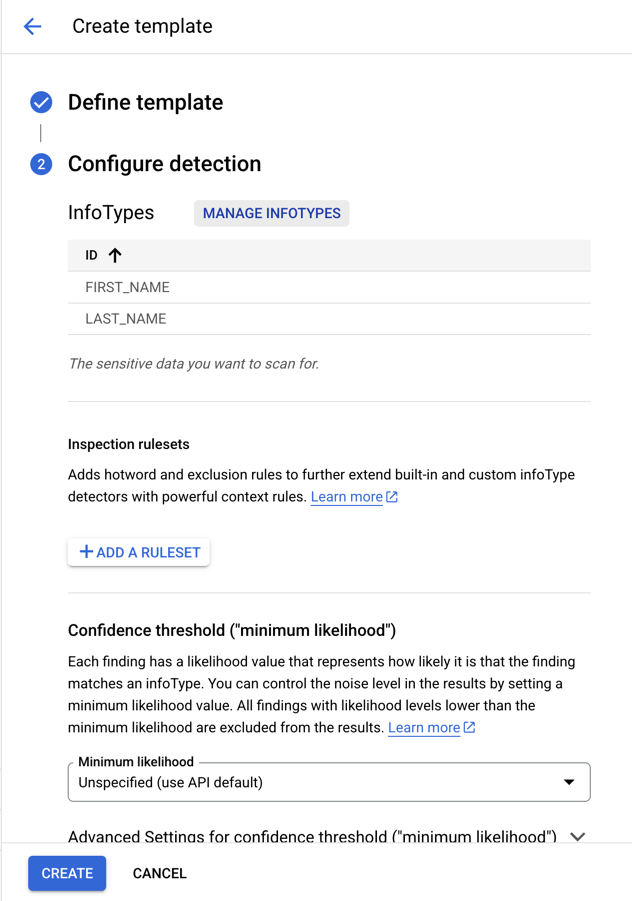
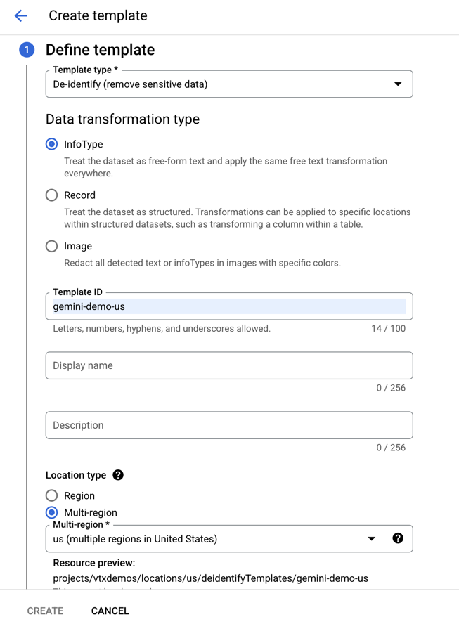
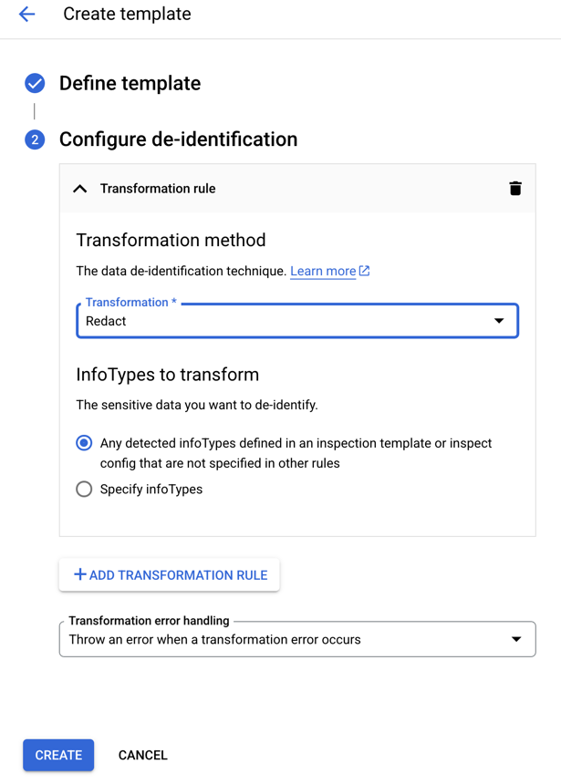
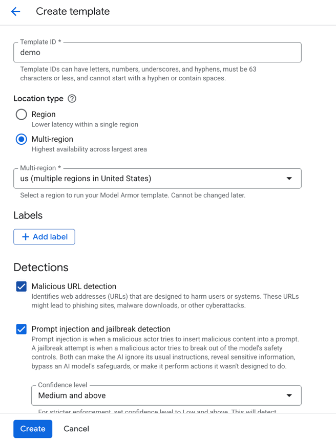
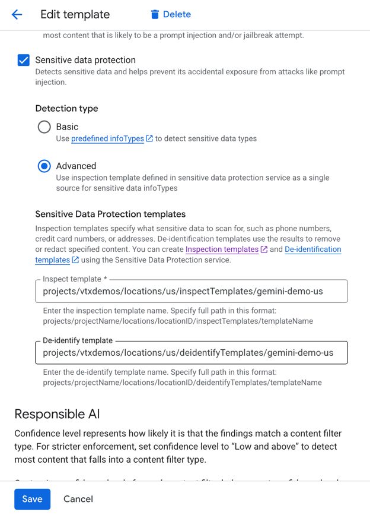

**[Deprecated]** For Curated Instructions Please Use [model_armor folder](../model_armor)

# Model Armor Guardrail Implementations for GenAI Agents

This project demonstrates two distinct approaches for integrating "Model Armor" as a safety guardrail within a Generative AI agent built using the Agent Development Kit (ADK). The primary goal is to detect and handle Personally Identifiable Information (PII) in user queries before they are processed by other tools or the core model.

The two subdirectories showcase different methods for implementing these PII guardrails.

## Prerrequisites:

Before creating the ADK Agent a Model Armor template and DLP is required.

**[Model Armor](https://cloud.google.com/security-command-center/docs/model-armor-overview)** is a Google Cloud service that enhances the security and safety of AI applications by screening LLM prompts and responses for various risks, including prompt injection, jailbreaking, harmful content, malicious URLs, and sensitive data loss. It offers centralized management, supports multi-cloud and multi-model scenarios, and integrates with Security Command Center.

- Malicious URL Detection
- Prompt Injection and Jailbreak Detection
- Sensitive Data Protection ([DLP](https://cloud.google.com/security/products/dlp?hl=en))
- Responsible AI (Hate Speech, Dangerous, Sexually Explicit, Harassment)

**[Data Loss Prevention (DLP) Helps discover](https://cloud.google.com/security/products/dlp?hl=en)**, classify, and protect sensitive data.

Steps to create a Data Loss Prevention template:
 Go to [Google Cloud Console](https://console.cloud.google.com/) > Security > [Sensitive Data Protection](https://console.cloud.google.com/security/sensitive-data-protection) > [Configuration](https://console.cloud.google.com/security/sensitive-data-protection/landing/configuration)

Create 2 Templates (Inspect and De-Identify):

**Inspect Template:**

Add infotypes like FIRST_NAME LAST_NAME:

**De-Identify**

De-Identify is a mechanism to obscure personal information detected. (For the demo I selected "Redact")

Steps to create a Model Armor:

Go to [Google Cloud Console](https://console.cloud.google.com/) > Security > [Model Armor](https://console.cloud.google.com/security/modelarmor) > Create Template
Select and fill the gaps.

Check Sensitive data protection box and paste the endpoint from dlp inspect template and de-identify template:

Save and Done.

## 1.[`as_tool_function (Soft Guardrail)`](./as_tool_function(soft_guardrail))

This directory contains an agent that implements the PII check as a standard tool that the agent can choose to call.

*   **Mechanism**: Model Armor is wrapped as a tool. Through careful prompt engineering, the agent is instructed to prioritize calling this tool first to scan for PII.
*   **User Interaction**: If the Model Armor tool detects PII, the agent's logic is designed to ask the user for confirmation before proceeding with other tools, such as Google Search. This gives the user explicit control over their data.
*   **Classification**: This is considered a **"soft guardrail"** because its execution relies on the agent's programming and ability to follow the prompt's instructions, rather than a hard-coded, pre-emptive check.

---

## 2. [`before_model_callback (Hard Guardrail)`](./before_model_callback(hard_guardrail))

This directory demonstrates a more robust, pre-emptive approach using a callback function that intercepts the query.

*   **Mechanism**: This implementation leverages the `before_model_callback` feature of the ADK. This function is guaranteed to execute and inspect the user's query *before* it is sent to the main agent model.
*   **User Interaction**: The callback function itself uses Model Armor to inspect the query. If PII is found, the callback logic interacts directly with the end-user to ask for consent to continue. The main agent is only invoked after receiving a positive confirmation.
*   **Classification**: This is considered a **"hard guardrail"** because it enforces the PII check at an infrastructure level, before the agent's core logic begins processing the request. This check cannot be bypassed by the agent's reasoning process.