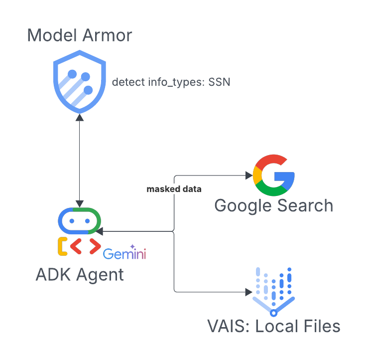

# ArmorChat: Secure & Intelligent Conversations with Gemini & Flet

**ArmorChat** is a proof-of-concept application demonstrating a chat interface powered by Google's Gemini model, built with Python, Flet for the UI, and the Google Agent Development Kit (ADK). It uniquely integrates Google Cloud Model Armor for robust PII (Personally Identifiable Information) detection, ensuring user queries are scanned for sensitive data before being processed further. If PII is detected, the agent interactively asks the user for consent to proceed.

## ✨ Overview

This project showcases how to:
1.  Build a multi-agent system using Google ADK.
2.  Integrate a PII detection guardrail using Google Cloud Model Armor.
3.  Create an interactive chat UI with Flet.
4.  Leverage Gemini for conversational AI and Google Search for information retrieval.
5.  Implement a conditional workflow based on PII detection and user consent.

## 🚀 Key Features

*   **Interactive Chat UI:** A clean and responsive chat interface built with Flet.
*   **PII Guardrail:** Uses a dedicated agent (`guardrail_agent`) and Model Armor to scan user prompts for PII.
*   **User Consent Workflow:** If PII is detected, the `root_agent` explicitly asks the user: "Your query has PII. Do you want to continue?" and awaits a 'yes' response.
*   **Google Search Integration:** Can use Google Search via the `google_search_agent` to answer queries if no PII is found or after user consent.
*   **Multi-Agent Architecture:** Demonstrates the use of `LlmAgent` and `AgentTool` from the Google ADK.
*   **Session Management:** Utilizes `InMemorySessionService` for session handling.

## 🛠️ Tech Stack

*   **Python 3.x**
*   **Flet:** For the cross-platform graphical user interface.
*   **Google Agent Development Kit (ADK):** For building and orchestrating AI agents.
    *   `LlmAgent`, `AgentTool`, `Runner`, `InMemorySessionService`
*   **Google Gemini:** The underlying Large Language Model (e.g., `gemini-2.0-flash-001`).
*   **Google Cloud Model Armor:** For PII detection (`modelarmor_v1.ModelArmorClient`).
*   **Google Search:** As a tool for the agent.

## ⚙️ Setup & Running

### Prerequisites

*   Python 3.x installed.
*   A Google Cloud Project with:
    *   Vertex AI API enabled.
    *   Model Armor API enabled and a PII detection template configured (e.g., `ai-template`).
*   Appropriate Google Cloud authentication configured for your environment.

### Installation

1.  **Clone the repository:**
    