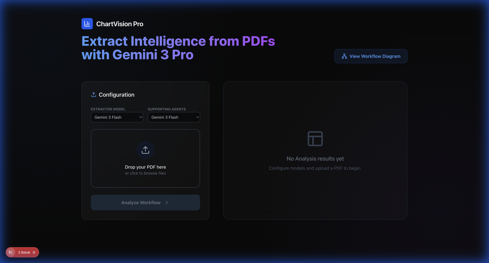
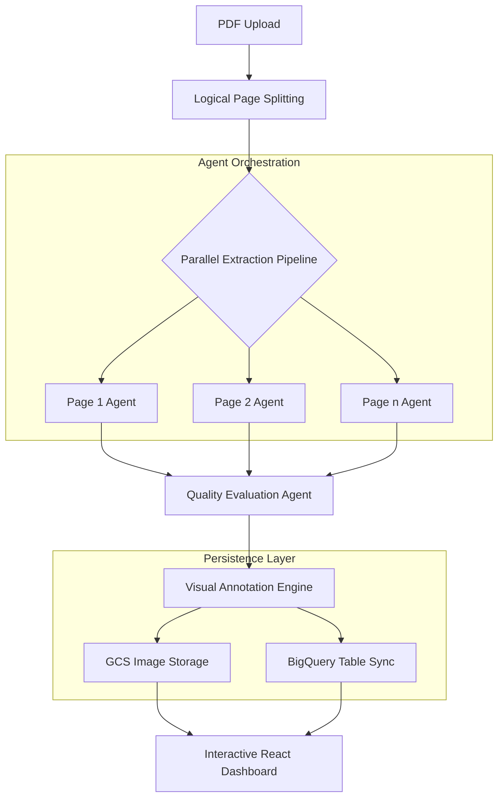

# 📊 ChartVision Pro: Advanced Agentic PDF Intelligence

[](https://cloud.google.com/)
[](https://deepmind.google/technologies/gemini/)
[](https://fastapi.tiangolo.com/)
[](https://nextjs.org/)

**ChartVision Pro** is a high-performance agentic workflow designed to transform unstructured PDF documents into structured, actionable intelligence. Leveraging **Google Gemini 3 Pro** (Global) and the **Google Agent Development Kit (ADK)**, it automates the identification, extraction, and synthesis of charts, tables, and complex diagrams with extreme precision.



---

## ✨ Key Features

- **🚀 Parallel Agentic Execution**: Spawns independent extraction agents for every PDF page.
- **🌍 Gemini 3.0 Support**: Fully configured for Gemini 3 Pro/Flash in the Global region via Vertex AI.
- **⚡ High-Throughput Engine**: Supports up to 200 concurrent page extractions for Flash models.
- **🎨 Modern Multimodal Extraction**: Utilizes Gemini's deep reasoning to identify axes, legends, and data points.
- **📍 Real-time Bounding Boxes**: Generates pixel-perfect visual annotations.
- **💎 Glassmorphism UX**: A premium Next.js dashboard.
- **🔒 Secure Enterprise Access**: Identity-Aware Proxy (IAP) ready.

---

## 🏗️ System Architecture

### 1. Logical Agentic Workflow


### 2. Cloud Infrastructure
```mermaid
graph TD
    User((User)) -->|HTTPS / Custom Domain| GLB[Global External Load Balancer]
    GLB -->|Auth Check| IAP[Identity-Aware Proxy]
    
    subgraph "Google Cloud Run"
        IAP -->|Authorized| FE[Frontend Service<br/>Next.js]
        IAP -->|Authorized| BE[Backend Service<br/>FastAPI]
    end
    
    FE -->|API Calls /extract| BE
    
    BE -->|1. Split PDF| B[Logical Page Splitting]
    B --> C{Parallel Extraction Pipeline}
    
    subgraph "Agent Orchestration"
        C --> D1[Page 1 Agent]
        C --> D2[Page 2 Agent]
        C --> Dn[Page n Agent]
        D1 & D2 & Dn -.->|Vertex AI (Global)| Gemini[Gemini 3 Pro / Flash]
    end
```

---

## 🛠️ Configuration

To use **Gemini 3.0** on Vertex AI, the following environment variables are required (and pre-configured in this repo):

```env
GOOGLE_GENAI_USE_VERTEXAI=True
GOOGLE_CLOUD_PROJECT=your-project-id
GOOGLE_CLOUD_LOCATION=global
```

**Note:** Gemini 3 Pro/Flash Preview models require the `global` location and the full resource path format:
`projects/{project}/locations/global/publishers/google/models/gemini-3-pro-preview`

---

## 🚀 Quick Start

### 1. Backend Setup
```bash
cd backend
# Install dependencies
python3 -m pip install -r requirements.txt
# Run server
python3 main.py
```
*Backend runs on `http://localhost:8000`*

### 2. Frontend Setup
```bash
cd frontend
# Install dependencies
npm install
# Start development server
npm run dev
```
*Frontend runs on `http://localhost:3000`*

---

## ☁️ Cloud Deployment

This repository is ready for Google Cloud Run.

### 1. Backend Deployment
```bash
gcloud run deploy pdf-extractor-backend \
    --source backend \
    --region us-central1 \
    --memory 4Gi \
    --cpu 2 \
    --set-env-vars="GOOGLE_CLOUD_PROJECT=your-project,GOOGLE_CLOUD_LOCATION=global,GOOGLE_GENAI_USE_VERTEXAI=True"
```

### 2. Frontend Deployment
```bash
gcloud run deploy pdf-extractor-frontend \
    --source frontend \
    --region us-central1
```

*Note: Ensure your Service Account has access to Vertex AI.*

---

*Built with ❤️ using Google Vertex AI & Gemini.*