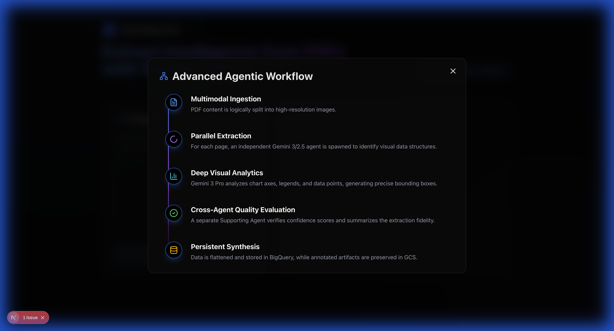
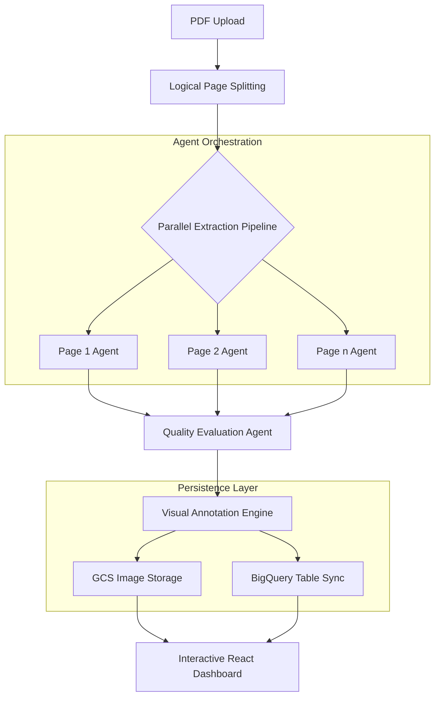
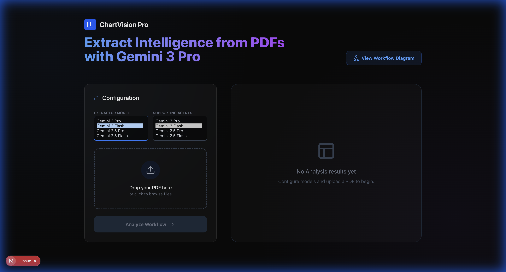

# 📊 ChartVision Pro: Advanced Agentic PDF Intelligence

[](https://cloud.google.com/)
[](https://deepmind.google/technologies/gemini/)
[](https://fastapi.tiangolo.com/)
[](https://nextjs.org/)

**ChartVision Pro** is a high-performance agentic workflow designed to transform unstructured PDF documents into structured, actionable intelligence. Leveraging **Google Gemini 3 Pro** and the **Google Agent Development Kit (ADK)**, it automates the identification, extraction, and synthesis of charts, tables, and complex diagrams with extreme precision.


---

## ✨ Key Features

- **🚀 Parallel Agentic Execution**: Spawns independent extraction agents for every PDF page, significantly reducing processing latency.
- **🎨 Modern Multimodal Extraction**: Utilizes Gemini 3's deep reasoning to identify axes, legends, and data points within visual elements.
- **📍 Real-time Bounding Boxes**: Generates pixel-perfect visual annotations with a custom "Modern Pill" UI for superior readability.
- **💾 Full-Stack Persistence**:
  - **BigQuery**: Automated "Tidy Data" flattening for instant analytics.
  - **Cloud Storage**: Secure artifact preservation in GCS buckets.
- **⏱️ Live Performance Benchmarking**: Real-time second-by-second execution timer and last-job duration metrics.
- **💎 Glassmorphism UX**: A premium Next.js dashboard featuring smooth animations, interactive model selection, and responsive data views.

---

## 🏗️ System Architecture





---

## 🛠️ Technology Stack

| Component | Technology |
| :--- | :--- |
| **Model** | Google Gemini 3 Pro (Preview) |
| **Orchestration** | Google Agent Development Kit (ADK) |
| **Backend** | Python 3.12, FastAPI, PyMuPDF |
| **Frontend** | Next.js 15+, Tailwind CSS, Framer Motion |
| **Persistence** | Google BigQuery, Google Cloud Storage |

---

## 🚀 Quick Start

### 1. Prerequisites
- Python 3.12+
- Node.js 18+
- Google Cloud Project with Vertex AI enabled

### 2. Backend Setup
```bash
cd backend
# Install dependencies
python3 -m pip install -r requirements.txt
# Run server
python3 main.py
```
*Backend runs on `http://localhost:8000`*

### 3. Frontend Setup
```bash
cd frontend
# Install dependencies
npm install
# Start development server
npm run dev
```
*Frontend runs on `http://localhost:3000`*

---

## ⚙️ Model Configuration



The application allows dynamic model switching for different stages of the workflow:
- **Project Default**: `projects/vtxdemos/locations/global/publishers/google/models/gemini-3-flash-preview`
- **Recommended for Extraction**: `gemini-3-pro-preview` for deep visual reasoning.

---

## 📜 BigQuery Schema
Data is flattened into a "Tidy" format for immediate SQL analysis:
- `page`: Integer
- `type`: CHART | TABLE
- `element_id`: Unique Identifier
- `description`: Detailed AI Summary
- `confidence`: Extraction Score
- `column_name`: Table Header
- `cell_value`: Extracted Data

---

*Built with ❤️ using Google Vertex AI & Gemini.*
