# 📂 File Manager Agent System

> A multi-agent AI system powered by **Gemini** that autonomously locates financial documents in Google Cloud Storage and generates accurate summaries.


---

## 📖 Overview

This project implements a sophisticated agentic workflow designed to handle user requests for document retrieval and summarization. It leverages the power of **Google Vertex AI** and **Gemini models** to understand queries, navigate a cloud file system, and process document content.

### ✨ Key Features

*   **Intelligent Routing:** A `Root Agent` interprets user intent and delegates tasks.
*   **Autonomous File Search:** The `File Manager Agent` can list, filter, and locate files in GCS buckets using glob patterns.
*   **Automated Summarization:** The `Document Summarizer Agent` uses `gemini-3-pro-preview` to directly digest and summarize PDF documents from GCS URIs.
*   **Sequential Orchestration:** A `Document Workflow Agent` ensures the logical flow of data from retrieval to processing.

---

## 🏗️ Architecture

The system is composed of specialized agents working in concert. Below is the high-level data flow:

```mermaid
graph TD
    User[👤 User Request] --> Root[🤖 Root Agent]
    Root --> Workflow[🔄 Document Workflow Agent]
    
    subgraph "Sequential Process"
        Workflow -->|Step 1: Find File| FileManager[📂 File Manager Agent]
        Workflow -->|Step 2: Summarize| Summarizer[📝 Document Summarizer Agent]
    end
    
    FileManager <-->|List/Find| GCS[☁️ Google Cloud Storage]
    Summarizer <-->|Read & Generate| Gemini[✨ Gemini Model]
    
    Summarizer -->|Final Summary| Root
    Root -->|Response| User
```



### 🤖 Agent Roles

| Agent | Model                  | Responsibility |
|-------|------------------------|----------------|
| **Root Agent** | `gemini-2.5-flash`     | Entry point. Delegates valid requests to the workflow. |
| **Document Workflow** | *Sequential*           | Orchestrates the hand-off between searching and summarizing. |
| **File Manager** | `gemini-2.5-flash`     | Navigates `vtxdemos-datasets-public` bucket to find specific files. |
| **Document Summarizer** | `gemini-3-pro-preview` | Uses `gemini-3-pro-preview` to generate summaries from GCS URIs. |

---

## 🚀 Getting Started

Follow this guide to set up the project environment using `uv`.

### 📋 Prerequisites

*   **Python 3.10+**
*   **[uv](https://github.com/astral-sh/uv)** (An extremely fast Python package installer and resolver)
*   **Google Cloud SDK** (`gcloud`) installed and authenticated.

### 🛠️ Installation

1.  **Clone the repository** (if applicable) or navigate to your project folder.

2.  **Initialize a virtual environment using `uv`**:
    ```bash
    uv venv
    source .venv/bin/activate  # On macOS/Linux
    # .venv\Scripts\activate   # On Windows
    ```

3.  **Install dependencies**:
    ```bash
    uv pip install google-cloud-storage google-genai
    ```

4.  **Authenticate with Google Cloud**:
    Ensure you have access to the bucket `vtxdemos-datasets-public` (or update the code to use your own).
    ```bash
    gcloud auth application-default login
    ```

---

## 🏃 Usage

### Testing the Tools
You can verify that the GCS tools are working correctly by running the included test script:

```bash
uv run test_tools.py
```

This script will attempt to:
1.  List files in the `8k-10q-files-q3-2025/` prefix.
2.  Find specific `.pdf` files.

### Running the Agents
*Note: This project is designed to be run within a Vertex AI Agent runtime or a compatible Python executor that can interpret the YAML agent definitions.*

The entry point configuration is `root_agent.yaml`.

---

## 📂 Project Structure

```text
.
├── root_agent.yaml                # Main entry point agent
├── document_workflow_agent.yaml   # Workflow orchestrator
├── file_manager_agent.yaml        # GCS search specialist
├── document_summarizer_agent.yaml # Summarization specialist
├── test_tools.py                  # Tool verification script
└── tools/                         # Python tool implementations
    ├── gcs_file_manager.py        # GCS Client wrappers
    └── document_summarizer.py     # Gemini API wrappers
```

---

## 🔧 Configuration

The agents are configured via YAML files. You can modify them to change:
*   **Models:** Update `model: gemini-2.5-flash` to use different versions.
*   **Prompts:** Edit the `instruction` fields to change agent behavior.
*   **Target Bucket:** Update the default bucket in `file_manager_agent.yaml` instruction.

---

*Built with ❤️ using Vertex AI and Gemini.*
