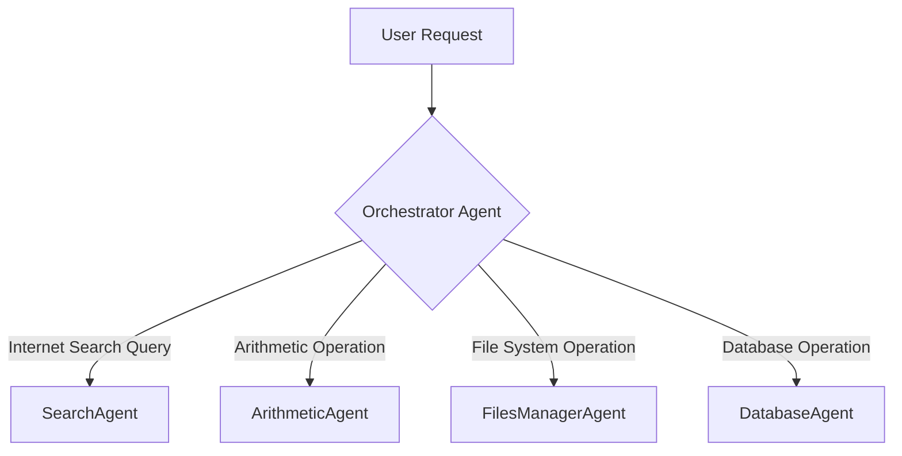

# `mcp_multiagent_ui` - Multi-Agent System Configuration

This directory contains the configuration files for various specialized agents that form part of a multi-agent system. These agents are designed to handle specific tasks and can be orchestrated by a central `Orchestrator Agent`.

## ✨ Orchestration Flow: How Agents Collaborate ✨

At the heart of this multi-agent system is the `Orchestrator Agent`, acting as the central hub that intelligently directs user requests to the most suitable specialized agent. This visual outlines the delegation process:

## 🚀 Getting Started: Launching Your Multi-Agent System 🚀

To utilize these powerful agents, you'll typically integrate them within an agent orchestration framework capable of loading and executing agents defined by these YAML configuration files.

1.  **Dependencies**: Ensure all necessary Python dependencies for the tools used by these agents are installed (e.g., `google_search`, `add_numbers`, file management utilities). Refer to the `tools/` directory for specific tool implementations and their requirements.
2.  **Configuration**: Each `.yaml` file precisely defines an agent's behavior, the underlying model it uses, its core description, and the specific tools it can leverage. Feel free to modify these files to fine-tune agent instructions or integrate new, custom tools.
3.  **Running the System**: The `root_agent.yaml` file is crucial as it defines the `orchestrator_agent`. This agent serves as the primary entry point for delegating tasks. You would typically load and run this `orchestrator_agent` within your chosen multi-agent framework to kickstart the system.

## 🧠 Agent Overview: Meet the Specialists 🧠

Here's a quick look at the specialized agents configured within this directory:

*   **`arithmetic_agent.yaml`**: Configures an agent dedicated to performing precise arithmetic calculations using the `add_numbers` tool.
*   **`database_agent.yaml`**: Configures an agent for seamless interaction with databases via the MCP Toolbox, leveraging the `mcp_database_connector` tool for efficient data operations.
*   **`file_manager_agent.yaml`**: Configures an agent for robust file management, including listing directory contents and creating new files on the local system using the `list_local_files` tool.
*   **`root_agent.yaml`**: Configures the pivotal `orchestrator_agent`, which intelligently interprets user requests and delegates them to the most appropriate specialized sub-agents (e.g., Search, Arithmetic, File Manager, Database).
*   **`search_agent.yaml`**: Configures an agent highly specialized in performing internet searches, utilizing the `google_search` tool to fetch relevant information from the web.
