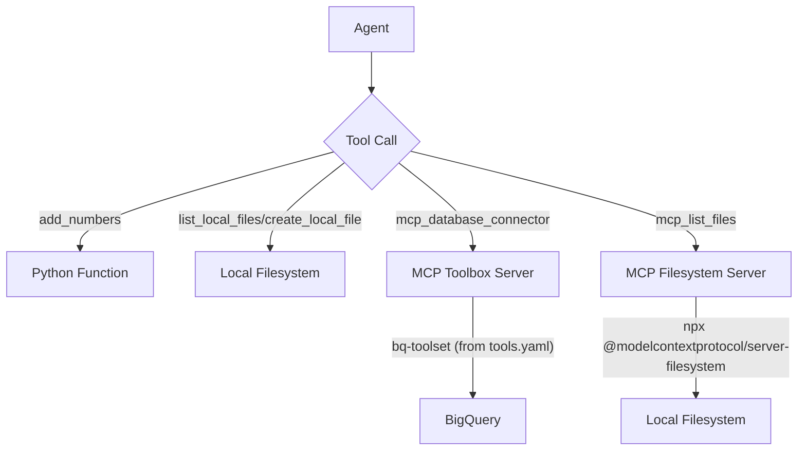

# `mcp_multiagent_ui/tools` - Agent Tool Implementations

This directory contains Python scripts and configuration files that define the essential tools used by the agents within the `mcp_multiagent_ui` system. These tools empower agents to perform specific actions such as arithmetic calculations, file management, and database interactions by abstracting complex underlying processes.

## ✨ Tool Interaction Flow: How Agents Leverage Functionality ✨

This vibrant diagram illustrates the dynamic interplay between agents and the various tools, showcasing how requests are routed and processed through their underlying services:

## 🚀 Getting Started: Integrating and Configuring Your Agent Tools 🚀

To ensure these powerful tools function seamlessly with your agents, meticulous setup and configuration are key. Follow these steps to get started:

1.  **General Python Dependencies**: Begin by ensuring all necessary Python packages required by these tools are installed in your environment.
2.  **`add_tool.py`**: This tool is a straightforward, self-contained utility for basic arithmetic. It requires no external setup beyond a standard Python installation.
3.  **`file_manager_tool.py`**: Designed for direct interaction with the local filesystem, this tool operates using Python's standard library and does not require any special external dependencies.
4.  **`mcp_database_connector.py`**:
    *   **MCP Toolbox Server**: A critical prerequisite is having the MCP Toolbox server actively running. It is typically accessible at `http://127.0.0.1:5000`.
    *   **`bq-toolset`**: The `tools.yaml` configuration file explicitly defines the `bq-toolset`, which establishes connections to BigQuery. Verify that your BigQuery project (e.g., `vtxdemos` as shown in the example) and all necessary authentication credentials are correctly configured within the MCP Toolbox server environment.
5.  **`mcp_list_files.py`**:
    *   **`npx` and `@modelcontextprotocol/server-filesystem`**: This tool leverages `npx` to execute the `@modelcontextprotocol/server-filesystem` package. Confirm that `npm` (and consequently `npx`) is installed on your system. The required package will be automatically installed by `npx -y` upon first use.
    *   **Absolute Path Configuration**: The `StdioServerParameters` within `mcp_list_files.py` mandates an **absolute path** to a directory that the `npx` process has permissions to access. **It is imperative that you update the placeholder path** (e.g., `"/Users/jesusarguelles/Downloads"`) to a valid and securely accessible directory on your specific system.

## 🛠️ Tool Overview: A Deep Dive into Functionality 🛠️

*   **`add_tool.py`**: Provides the `add_numbers` function, a fundamental utility designed for performing simple and accurate addition operations.
*   **`file_manager_tool.py`**: Encompasses `list_local_files` for comprehensively listing the contents of any specified directory and `create_local_file` for generating new files with user-defined content on the local filesystem.
*   **`mcp_database_connector.py`**: Serves as a crucial bridge for database interaction, establishing connections to an MCP Toolbox server and dynamically loading predefined toolsets (such as `bq-toolset` for BigQuery operations).
*   **`mcp_list_files.py`**: Implements an MCPToolset specifically tailored for file listing. It intelligently utilizes the `@modelcontextprotocol/server-filesystem` to interact with the local filesystem in a standardized and efficient manner.
*   **`tools.yaml`**: This vital configuration file meticulously defines various data sources (e.g., `my-bigquery-source`) and logically bundles specific tools into cohesive toolsets (e.g., `bq-toolset`, which includes `search-total-feedback-accounts`).
