# 🕵️‍♂️ The Deep Dive: AI-Powered Iterative Research Agent

> **"Why search once when you can research recursively?"**

Welcome to the **Research Agent** configuration! This isn't just a script; it's a coordinated squad of AI agents designed to take a simple topic and turn it into a comprehensive report. By looping, refining, and digging deeper, this system goes beyond surface-level results.

---

## 🧠 Meet Your Research Team

This directory configures a multi-agent system where each AI has a specialized role. Think of them as your personal research department:

### 1. The Coordinator (The Boss)
*   **Config:** `root_agent.yaml`
*   **Role:** Your primary point of contact. It takes your request ("Tell me about the history of espresso machines") and hands it off to the team. It waits for the final report and delivers it to you.

### 2. The Loop (The Engine)
*   **Config:** `research_loop.yaml`
*   **Role:** The project manager. It keeps the research cycle spinning for a set number of rounds (default: 3), ensuring the team doesn't get stuck or stop too early.

### 3. The Strategist (Query Refinement)
*   **Config:** `query_refinement_agent.yaml`
*   **Role:** The brains. It looks at what we found so far and asks, "What are we missing?" It generates better, sharper search queries for the next round or decides when we've found enough.

### 4. The Scout (Search Execution)
*   **Config:** `search_execution_agent.yaml`
*   **Role:** The legs. It takes the Strategist's queries, runs them through Google Search, and brings back the raw data and key insights.

---

## 🔄 The Workflow: How They Collaborate

Here is the flow of information in your new research department:

```mermaid
graph TD
    User([👤 You]) -->|Topic| Coord[Research Coordinator]
    Coord --> Loop{🔄 Research Loop}
    
    subgraph "The Iterative Cycle"
        Loop -->|Start/Next| Refine[🧠 Query Refinement Agent]
        Refine -->|New Query| Search[🔎 Search Execution Agent]
        Search -->|Results| Refine
    end
    
    Refine -->|'Exit Loop'| Loop
    Loop -->|Final Report| Coord
    Coord -->|Delivers| User
```

---

## 🚀 Getting Started

### Prerequisites
*   **Google Search Tool:** Your environment must have a `google_search` tool configured. This is the "eyes" of the Search Execution Agent.

### How to Run
1.  **Load the System:** Point your agent runner/framework to `root_agent.yaml`.
2.  **Give a Mission:** When prompted, provide a broad or specific topic.
    *   *Example:* "Latest advancements in solid-state batteries."
    *   *Example:* "Comparison of React vs. Vue for enterprise dashboards in 2024."
3.  **Watch it Work:** The system will:
    *   🔍 Search for initial info.
    *   🤔 Analyze the gaps.
    *   🔍 Search again with better queries.
    *   📝 Compile the final answer.

---

## 🛠️ Customization

Want to tweak the behavior?

*   **Change the Depth:** Edit `research_loop.yaml` and change `max_iterations: 3` to `5` for a deeper dive (or `1` for a quick skim).
*   **Change the Brains:** Edit `model: gemini-2.5-pro` in `query_refinement_agent.yaml` to use a different model if needed.

---

*Happy Researching!* 📚✨