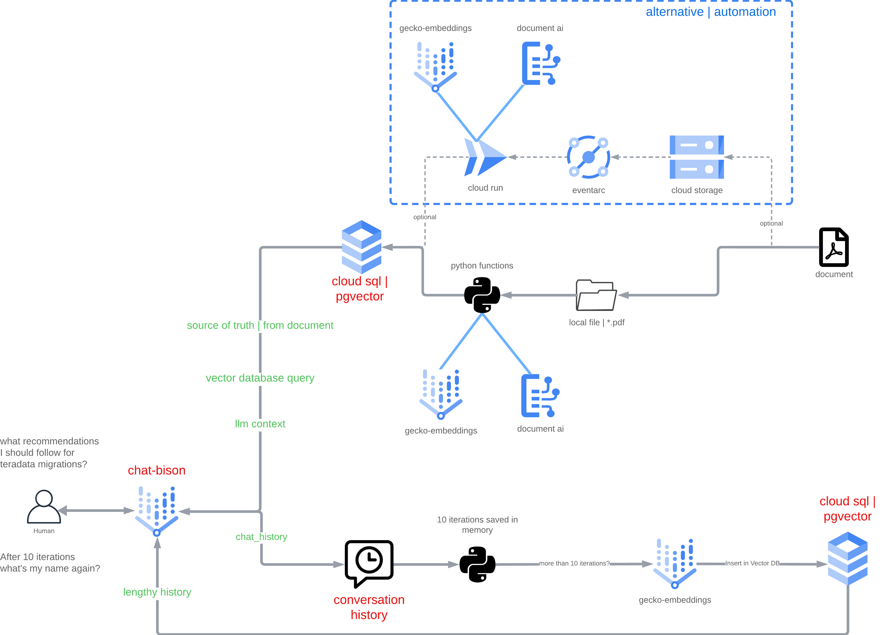

# Conversational Bot with RAG and Lengthy Chat History

Architecture Diagram



Components used:
- [chat-bison-32k](https://cloud.google.com/vertex-ai/docs/generative-ai/learn/models#foundation_models)
- [textembedding-gecko@001](https://cloud.google.com/vertex-ai/docs/generative-ai/model-reference/text-embeddings)
- [DocumentAI](https://cloud.google.com/document-ai?hl=en)
- [Google Cloud SQL](https://cloud.google.com/sql?hl=en)


Steps

1. Prepare your environment:

```bash
pip install -r requirements.txt
```

Change the variables inside of main.py and rag_preprocess.py.

2. Preprocess the File (pdf) for RAG

- file to run: [rag_preprocess.py](utils/rag_preprocess.py)

Retrieval Augmented Generation (RAG) is a technique for enhancing the accuracy and reliability of large language models (LLMs) by incorporating information from external knowledge sources. This is achieved by retrieving relevant documents from a knowledge base and using them to augment the input prompt provided to the LLM. The LLM then generates a response based on the combined information from the prompt and the retrieved documents.


3. Run Gradio:

I used gradio because streamlit refreshes the entire session during every event iteration and the code has async functions which is not compatible today with streamlit.

file to run: [main.py](main.py)

```python
python main.py
```