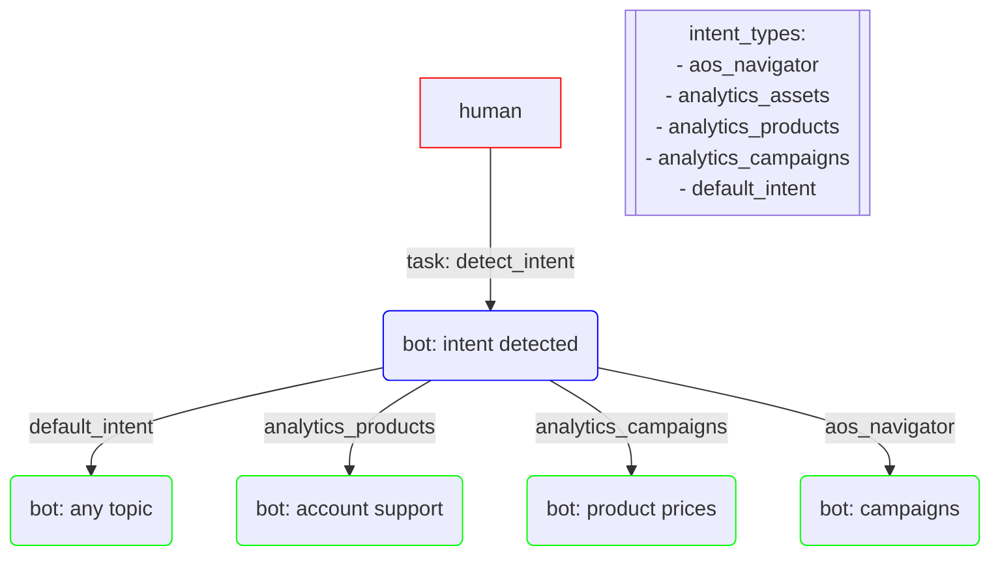

## Multi-Intent Chatbot

For intent detection temperature, top_k and top_p were lowered to raise the level of accuracy in the desired output, for chat bot based in intent detection chat-bison@latest was used.

