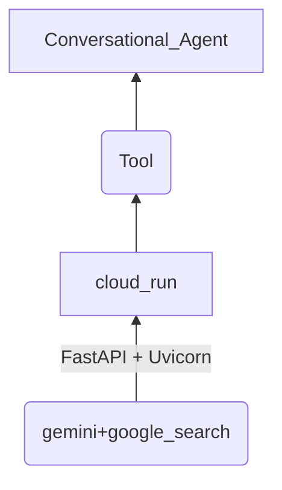
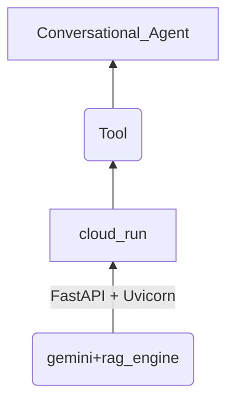

### Creating Synthetic Data

[creating_synthetic_data.py](./creating_synthetic_data.py) walk through the process of creating structured data in csv 
format to verify if can be used with Vertex AI Search DataStore Structure FAQ - CSV.

---
### Generating Google Search Grounding Logic for Cloud Run



1. Pre-requisites: Create a Docker Artifact Registry in Google Cloud.

```bash
gcloud artifacts repositories create conversational-agents-tools --repository-format=docker \
    --location=us-central1 \
    --description="Docker Repository for Tools in CA" \
    --project="jesusarguelles-sandbox"
```

[gsearch_grounding_tool](./gsearch_grounding_tool) folder contains all the elements to create a container for 
Google Cloud Run.

2. Build and Push the Image into Google Docker Artifact Registry

```bash
gcloud builds submit --project="jesusarguelles-sandbox" -t us-central1-docker.pkg.dev/jesusarguelles-sandbox/conversational-agents-tools/gsearch-grounding-tool:latest ./gsearch_grounding_tool
```

3. Deploy Image into Cloud Run

```bash
gcloud run deploy gsearch-grounding-tool \
--image=us-central1-docker.pkg.dev/jesusarguelles-sandbox/conversational-agents-tools/gsearch-grounding-tool \
--no-allow-unauthenticated \
--port=8000 \
--service-account=390227712642-compute@developer.gserviceaccount.com \
--cpu=4 \
--memory=8Gi \
--region=us-central1 \
--project=jesusarguelles-sandbox
```

---

### Generating RAG Grounding Logic for Cloud Run



[rag_engine_grounding_tool](./rag_engine_grounding_tool) folder contains all the elements to create a container for
Google Cloud Run.

1. Build and Push the Image into Google Docker Artifact Registry

```bash
gcloud builds submit --project="jesusarguelles-sandbox" -t us-central1-docker.pkg.dev/jesusarguelles-sandbox/conversational-agents-tools/rag_engine-grounding-tool:latest ./rag_engine_grounding_tool
```

2Deploy Image into Cloud Run

```bash
gcloud run deploy gsearch-grounding-tool \
--image=us-central1-docker.pkg.dev/jesusarguelles-sandbox/conversational-agents-tools/rag_engine-grounding-tool \
--no-allow-unauthenticated \
--port=8000 \
--service-account=390227712642-compute@developer.gserviceaccount.com \
--cpu=4 \
--memory=8Gi \
--region=us-central1 \
--project=jesusarguelles-sandbox
```