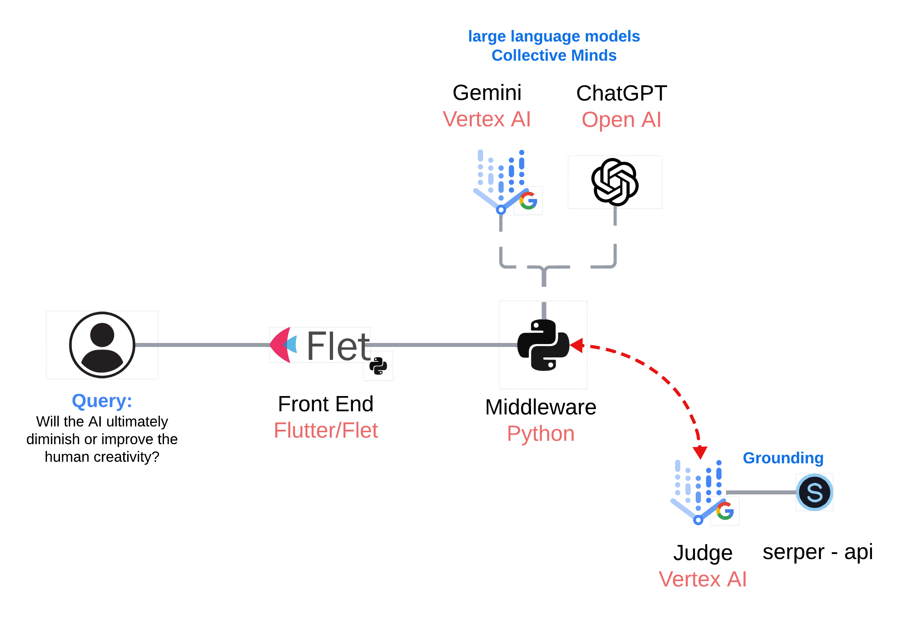

# Collective Intelligence 🤖 <-> 🤖

Imagine the possibilities when two large language models (LLMs) join forces! This project explores the exciting potential of collaborative AI, showcasing how two LLMs can work together to achieve remarkable results. Within this repository, you'll witness:


## Project Diagram


## Project Overview

The "When AI Minds Collide" aims to:

- **Synergy in action:** Observe how two distinct LLMs combine their knowledge and language processing abilities, creating a dynamic exchange that leads to insightful answers and innovative solutions.
- **The creative process amplified:** Experience the collaborative brainstorming process as these LLMs build upon each other's ideas, refine concepts, and collaboratively navigate complex problems.
- **Unveiling the future of teamwork:** This project offers a glimpse into a future where AI collaboration pushes the boundaries of what's possible, demonstrating the power of shared intelligence in tackling ambitious tasks.

## Features

- **Head-to-Head Conversation:**  ChatGPT-4 and Gemini Pro take turns responding to a user-defined topic, simulating a back-and-forth dialogue.
- **Response Timing:** The time taken by each LLM to generate its response is displayed, providing insights into their processing speeds.
- **Grounding Verification (Vertex Reasoning Engine):** Gemini Pro's responses are optionally verified using Google Search and a "grounding" mechanism to assess the accuracy and provide supporting citations.

## Technologies Used

**Frontend:**
- **Flet:** A Python framework for building interactive web UIs, chosen for its ease of use and Python integration.

**Backend:**
- **Python:** The primary programming language for backend logic, API calls, and data handling.
- **OpenAI API:** Used to interact with ChatGPT-4, enabling prompt submission and response retrieval.
- **Google Vertex AI API (Generative Models):** Used to interact with Google's Gemini Pro model, including grounding features.

**Libraries:**
- `openai`: The official OpenAI Python library for API communication. ([https://pypi.org/project/openai/](https://pypi.org/project/openai/))
- `vertexai`: The Google Cloud Vertex AI Python client library. ([https://pypi.org/project/google-cloud-aiplatform/](https://pypi.org/project/google-cloud-aiplatform/))
- `time`: Python's built-in time module for measuring response times.
- `json`: Python's built-in JSON module for handling structured data.
- `base64`:  Potentially used for data encoding/decoding (if applicable to your implementation).

## Installation and Setup

1. **Clone the Repository:**  `git clone https://github.com/jchavezar/vertex-ai-samples.git`
2. **Navigate to the Project Directory:** `cd vertex-ai-samples/gen_ai/flet
   /collective_intelligence`
3. **Create a Virtual Environment (Recommended):** `python3 -m venv .venv`
4. **Activate the Virtual Environment:**
    - Linux/macOS: `source .venv/bin/activate`
    - Windows: `.venv\Scripts\activate`
5. **Install Dependencies:** `pip install -r requirements.txt`

## Configuration

1. **API Keys:**
    - Obtain your OpenAI API key from [https://platform.openai.com/account/api-keys](https://platform.openai.com/account/api-keys)
    - Set up a Google Cloud project and enable the Vertex AI API. Get your credentials.
2. **Environment Variables:**
    - Modify `variables.py` file with your own variables like the open API key:
      ```
      organization=your-open-api-organization
      key=your-open-api-key
      serper_api_key=your-serper-api-key
      ```
    -
      [ChatGPT Reference](https://openai.com/index/chatgpt/)
    - 
      [Serper Reference](https://serper.dev/)

## Running the Application

1. **Start the Flet Application:** `flet run frond_end.py` (or the name of your main Flet file).
2. **Access in Browser:**`flet run frond_end.py --web`, Open your web browser and go to the URL provided by Flet (usually `http://localhost:8550`).

## Usage

1. **Enter a Topic:**  Type a topic or question into the input field on the right.
2. **Start the Conversation:**  Press Enter to initiate the discussion between the LLMs.
3. **Observe the Responses:**  The bots' responses, along with their response times, will be displayed in the left panel.
4. **Grounding (Gemini Pro):**  (Optional) Click the "grounding" button next to Gemini Pro's responses to see the justification, veracity score, and citations.

## Contributing

Contributions are welcome! Feel free to open issues, submit pull requests, or propose new features.

## Author
[Jesus Chavez](https://www.linkedin.com/in/jchavezar)

## License

[Choose an appropriate license for your project (e.g., MIT, Apache-2.0)](https://choosealicense.com/) 