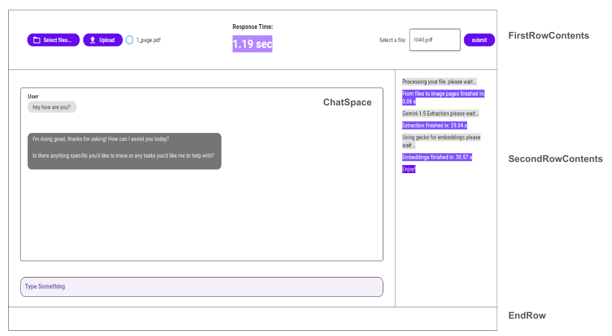

# Document Intelligence

Document intelligence is a strategy to use Google Genmini with RAG to ground responses. 
The goal is to use different Google Cloud components to extract, mantain data and use it as a context for
the large language model.

Components used during this implementation:
- [Flet](https://flet.dev/): Flet is a Python framework for building desktop applications with a simple, reactive, and declarative approach. 
It uses the Flutter engine to render beautiful UIs.
- [Cloud SQL pgvector](https://cloud.google.com/blog/products/databases/announcing-vector-support-in-postgresql-services-to-power-ai-enabled-applications),
  Cloud SQL pgvector is a PostgreSQL extension that allows you to store and query high-dimensional vectors in your Cloud SQL database. 
- [Google ScaNN](https://github.com/google-research/google-research/tree/master/scann), Google ScaNN (Scalable Nearest Neighbors) is a fast, 
accurate, and scalable approximate nearest neighbor (ANN) search library. It is designed to efficiently find the most similar items in a large dataset to a given query item.
- [Vertex AI Gemini](https://cloud.google.com/vertex-ai?hl=en), Vertex AI is a fully-managed, unified AI development platform for building and using generative AI. 
Access and utilize AI Studio, Agent Builder, and 130+ foundation models including Gemini 1.5 Pro—all from Vertex AI.

## Getting Started

### Diagram


Gemini 1.5 does the extraction of the documents, each extraction takes about 30 seconds. On the other hand Gemini 1.0
is a low latency model which response time is lless than a second which is convinient for Conversational tasks.

### Install Libraries:

```bash
pip install flet
pip install pandas
pip install asyncio
pip install asyncpg
pip install pgvector
pip install pdf2image
pip install google-cloud-aiplatform
pip install cloud-sql-python-connector # Optional
pip install langchain # Optional.
```

### Google Cloud Project

A google account project is required: [steps](https://cloud.google.com/resource-manager/docs/creating-managing-projects). 

### Flet

For the front end, flet (based on flutter) is used. I won't get into details here but here is
an image with the variables definition to help you get started.



### Gemini 1.5 for Extraction

The prompt looks like this:

```python
text1 = """You are a tax agent analyst, so your answer needs to be very accurate (100%), 
    from the document extract all the paragraphs, text, images, tables, checkboxes everything to get an 
    structured text as an output. 
    
    - consider checkboxes marked with a clear 'X' as checked (true). All other checkboxes, 
    including empty ones, ambiguous markings, or other symbols, should be treated as unchecked (false)
    - Do not miss any letter or word.
    - Do not make up any key value.
    - Do not forget any value is very important for your tax analysis.
    
    Output in python dictionary:
    """
```

And the API configuration like this:

```python
model = GenerativeModel("gemini-1.5-pro-preview-0409")
gemini_response = model.generate_content(
    [image1, text1],
    generation_config=generation_config,
    safety_settings=safety_settings,
)
re = gemini_response.text
```
The conversational bot takes the context and use it to respond.

```python
system_prompt = f"""
            You like to be natural and act like a human, keep a conversational experience with the following 
            elements:
            - Use <User Query> as user questions/asks, etc. 
            - Use <Context> as your source of truth.
            - If you get the answer from the <Context> explain which part did you find it.
            - If someone say by and close the conversation just return an empty string.
            """
```

And the configuration:

```python
conversational_generation_config = {
    "max_output_tokens": 2048,
    "temperature": 0,
    "top_p": 0.4,
    "top_k": 32,
}

conversational_safety_settings = {
    HarmCategory.HARM_CATEGORY_HATE_SPEECH: HarmBlockThreshold.BLOCK_NONE,
    HarmCategory.HARM_CATEGORY_DANGEROUS_CONTENT: HarmBlockThreshold.BLOCK_NONE,
    HarmCategory.HARM_CATEGORY_SEXUALLY_EXPLICIT: HarmBlockThreshold.BLOCK_NONE,
    HarmCategory.HARM_CATEGORY_HARASSMENT: HarmBlockThreshold.BLOCK_NONE,
}

vertexai.init(project=variables["project_id"], location=variables["region"])
conversational_model = GenerativeModel(conversational_bot_model, system_instruction=[system_prompt])
bot_chat = conversational_model.start_chat(response_validation=False)
```

This is how to use the model:

```python
llm_response = bot_chat.send_message(
        [f"Context:\n{context}\n\nUser Question:\n{q}\n\nResponse:"],
        generation_config=conversational_generation_config,
        safety_settings=conversational_safety_settings,
    ).text
```

## Vector Databases:
During the demo 2 approaches we used:
- Cloud SQL Pgvector to store documents for large storage cycles.
- ScaNN to find the most similar items using memory.

This is how the configuration of scann looks like:

```python
scann.scann_ops_pybind.builder(img, num_neighbors=3, distance_measure="squared_l2").tree(
                num_leaves=k, num_leaves_to_search=1, training_sample_size=filtered_df.shape[0]).score_ah(
                2, anisotropic_quantization_threshold=0.2).reorder(7).build()

neighbors, distances = searcher.search(query, final_num_neighbors=10)
```