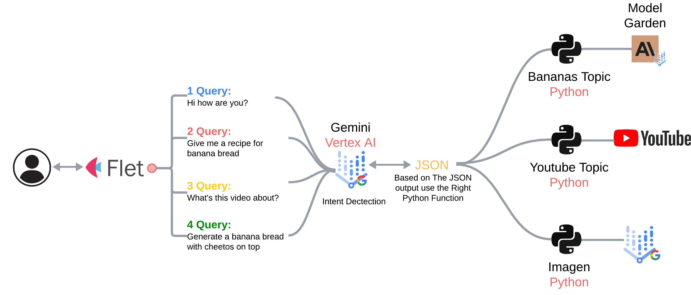

# Getting Started with a Gemini-Powered Flet Chatbot

This guide will help you set up a conversational chatbot application using:

* **Flet:** For the frontend user interface.
* **Python:** As the middleware and for backend logic.
* **Vertex Gemini:** As the conversational AI model, driving the chatbot's intelligence.
* **Anthropic from Model Garden, YouTube API, and Vertex Vision (Imagen):** As backend tools integrated with the chatbot.


## Project Overview

The chatbot is designed to understand user intent and utilize different tools based on that intent. Here's a breakdown of the key components and their functionalities:

* **Frontend (Flet):**  Provides a simple chat interface for users to interact with the chatbot.
* **Middleware (Python):** Handles communication between the frontend and backend, processing user input and chatbot responses.
* **Backend (Python & Vertex AI):**
    * **Vertex Gemini:**  The core conversational AI model. It analyzes user intent and decides which tool (if any) is needed.
    * **Anthropic (from Model Garden):** Used for banana-related queries (example: recipes).
    * **YouTube API:** Used to fetch and transcribe YouTube videos.
    * **Vertex Vision (Imagen):** Used for generating images based on user prompts.

## Diagram



## Prerequisites

Before you begin, make sure you have the following:

* **Google Cloud Project:** With the Vertex AI API enabled.
* **Python 3.7 or higher:** Installed on your system.
* **Required Libraries:** Install the necessary libraries using `pip install -r requirements.txt`.
    * **requirements.txt:**
      ```
      flet
      anthropic[vertex]
      google-cloud-aiplatform
      youtube-transcript-api
      ```
* **API Keys and Credentials:**  Set up your API keys for the respective services and store them securely in the `variables.py` file (more on this below).
* **Go to Model Garden (Claude Sonnet 3.5 Sonnet) and follow the getting started guide, [shortcut](https://console.cloud.google.com/vertex-ai/publishers/anthropic/model-garden/claude-3-5-sonnet).

## Project Setup

1. **Clone the Repository:**
   ```bash
   git clone https://github.com/jchavezar/vertex-ai-samples.git 
   ```

2. **Install Dependencies:**
   ```bash
   pip install -r requirements.txt
   ```

3. **Configure Variables:**
    * Create a `variables.py` file in the project root.
    * Add your Google Cloud Project ID, region, model IDs, and API keys:
      ```python
      project_id = "your-project-id"
      region = "your-region"  # e.g., "us-central1"
      model_id = "gemini-1.5-flash-001"
      anthropic_region = "europe-west1"  # or "us-east5"
      imagen_model_id = "imagen-3.0-fast-generate-001"
      ```

## Running the Application

1. **Start the Flet application:**
   ```bash
   python front_end.py
   ```

## Code Explanation

### `front_end.py`

* **`main(page: Page)`:**
    * Sets up the Flet UI, including the chat window, input box, and buttons.
    * Calls the `chatbot` function in `back_end.py` to process user input.
    * Updates the UI with the chatbot's response.

### `back_end.py`

* **`chatbot(prompt: str)`:**
    * Sends the user's prompt to the Vertex Gemini model.
    * Parses the JSON response from Gemini to determine the user's intent.
    * Calls the appropriate tool function based on the intent:
        * **`youtube(prompt, youtube_url)`:** Fetches and transcribes a YouTube video.
        * **`send_recipe(prompt)`:**  Gets a recipe from Anthropic.
        * **`image_gen(prompt)`:** Generates an image using Vertex Vision (Imagen).
    * Sends the context (if any) back to Gemini for a final answer.
    * Returns the final response to the frontend.

## Key Concepts

* **Intent Detection:** Vertex Gemini is used to analyze the user's intent and determine the appropriate action.
* **Tool Usage:**  The chatbot uses specific tools based on the detected intent.
* **Contextual Understanding:** The chatbot can use the output from tools (e.g., YouTube transcript) to provide more informed answers.


## Further Development

* **Expand Toolset:**  Integrate more tools and APIs to enhance the chatbot's capabilities.
* **Improve Intent Recognition:** Fine-tune the intent detection logic for better accuracy.
* **Customize the UI:** Enhance the Flet UI to provide a more engaging user experience.

This guide provides a foundation for building a powerful and versatile chatbot application. You can adapt and extend this framework to create chatbots tailored to specific use cases and domains. Remember to explore the documentation for Vertex Gemini, Anthropic, YouTube API, and Vertex Vision to unlock their full potential!
