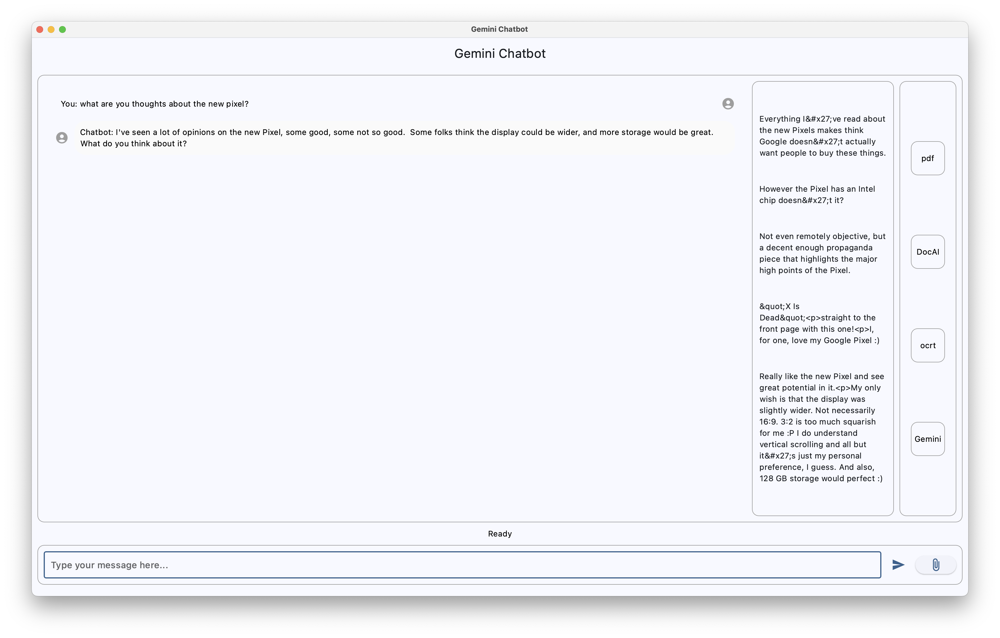
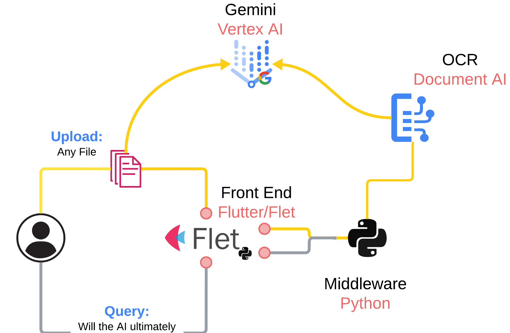
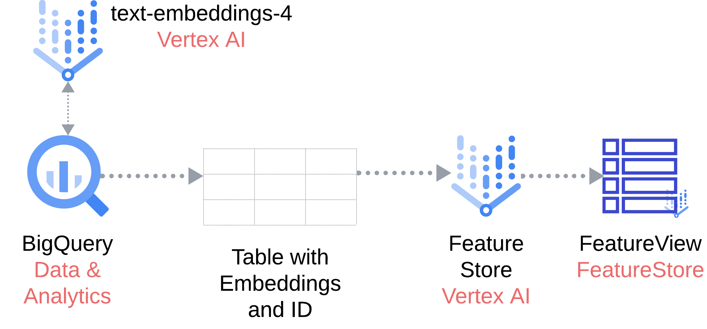

# Gemini Chatbot with RAG and Vertex AI Feature Store

This repository contains a simple chatbot application that leverages Google's Gemini family of models for conversation and Vertex AI's Feature Store for Retrieval Augmented Generation (RAG). It showcases how to build a chatbot that can:

- Ingest and process document data using Document AI.
- Generate intelligent summaries and refactor documents using Gemini Pro.
- Store and retrieve text embeddings using Vertex AI Feature Store for context-aware responses.
- Engage in conversations with users, leveraging both offline and online context using Gemini Flash.

The following demo has 2 components: 
- Upload a Document Online:

- Offline RAG:

## Architecture Overview

The chatbot application consists of the following components:

1. **Front-end ([Flet](https://flet.dev/)):** A user-friendly chat interface built using Flet.
2. **Back-end ([Python](https://www.python.org/)):** The core logic for document processing, RAG, and conversation handling.
3. **[Document AI](https://cloud.google.com/document-ai/docs):** Extracts text from uploaded PDF documents.
4. **[Vertex AI Embeddings](https://cloud.google.com/vertex-ai/generative-ai/docs/embeddings/get-text-embeddings):** Generates embeddings for text data.
5. **[Vertex AI Feature Store](https://cloud.google.com/vertex-ai/docs/featurestore/latest/overview):** Stores text embeddings and associated metadata for efficient retrieval.
6. **[Gemini Pro](https://cloud.google.com/vertex-ai?hl=en):** Generates intelligent summaries and refactors documents.
7. **[Gemini Flash](https://cloud.google.com/vertex-ai?hl=en):** Powers the conversational aspect of the chatbot.

## Setup and Installation

1. **Prerequisites:**

    - **Google Cloud Platform Project:** Create a project on GCP and enable the following APIs:
        - Document AI API
        - Vertex AI API
        - BigQuery API
    - **Service Account:** Create a service account with the necessary permissions to access the APIs and resources.
    - **Environment Setup:**
        - Install Python 3.9 or later.
        - Set up a virtual environment and activate it.
        - Install the required packages: `pip install -r requirements.txt`.
    - **[BigQuery](https://cloud.google.com/bigquery?hl=en):**
        - Follow this: [feature_store_embeddings.ipynb](feature_store_embeddings.ipynb)
        - Create a BigQuery dataset to store the HackerNews data.
        - Import the HackerNews dataset into the created BigQuery dataset.
    - **Vertex AI Feature Store:**
        - Follow this: [feature_store_embeddings.ipynb](feature_store_embeddings.ipynb) 
        - Create a Feature Store instance.
        - Create a Feature View for storing the text embeddings and associated data.

2. **Configuration:**

    - Update the `variables.py` file with your project ID, region, processor ID, document path, and Feature View name.
    - Ensure that your service account credentials are set up correctly.

3. **Running the Application:**

    - **Prepare the Embedding Data:**
        - Run the `feature_store_embeddings.ipynb` notebook to generate embeddings for the HackerNews data and load them into the Feature Store.
    - **Start the Front-end:**
        - Navigate to the `front_end.py` directory.
        - Run the command: `flet run front_end.py`.
    - **Start the Back-end:**
        - Open a new terminal window.
        - Navigate to the `back_end.py` directory.
        - Run the command: `python back_end.py`.

## Usage

1. **Launch the Chatbot:** Open a web browser and go to the URL where the Flet application is running.
2. **Upload a Document (Optional):** Click the "Attach File" button to upload a PDF document. The chatbot will extract text, generate an intelligent summary, and use it as context.
3. **Start Chatting:** Type your message in the input field and press Enter. The chatbot will respond based on the available context.

## Code Structure

- `feature_store_embeddings.ipynb`: Notebook for creating and storing embeddings in Vertex AI Feature Store.
- `front_end.py`: Flet code for the user interface.
- `back_end.py`: Python code for document processing, RAG, and conversation handling.
- `process_doc.py`: Functions for interacting with Document AI.
- `variables.py`: Configuration variables.

## Contributing

Contributions are welcome! Please open an issue or pull request if you have any suggestions or improvements.

## License

This project is licensed under the MIT License.