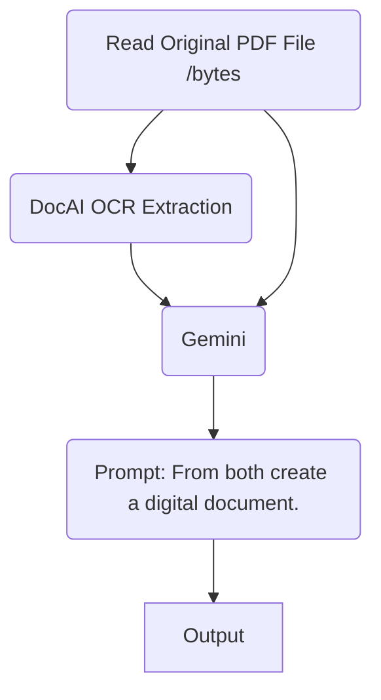

# Gemini Chatbot for Old Scanned Documents

This web application allows you to upload a scanned document, extract its information using Google Document AI and Gemini, and then ask questions about the document's content using a conversational chatbot powered by Gemini. This tool is particularly useful for understanding and querying information from old and potentially difficult-to-read scanned documents.

## Diagram


## Features

* **Document Upload:** Upload scanned documents in various formats (e.g., PDF).
* **Document AI Integration:** Leverages Google Document AI for accurate OCR and text extraction.
* **Gemini-Powered Information Extraction:** Uses Gemini to intelligently refactor the extracted text into a more structured and readable format.
* **Conversational Chatbot:** Interact with the extracted information using a Gemini-powered chatbot to ask questions and get answers.
* **User-Friendly Interface:** Simple and intuitive web interface built with Flet.

## Requirements

* Python 3.7 or later
* Google Cloud Project with Document AI API enabled
* Vertex AI API enabled
* Required Python packages:
    * `vertexai`
    * `flet`
    * `google-cloud-documentai`

## Installation

1. Clone the repository:

   ```bash
   git clone https://github.com/your-username/your-repository-name.git
   ```

2. Install the required packages:

   ```bash
   pip install -r requirements.txt
   ```

3. Set up your Google Cloud credentials:

    * Create a service account and download its JSON key file.
    * Set the `GOOGLE_APPLICATION_CREDENTIALS` environment variable to the path of your key file.

4. Update the `variables.py` file with your project ID, region, processor ID, and other relevant details.

## Usage

1. Run the application:

   ```bash
   python front_end.py
   ```

2. The web application will open in your browser.
3. Click the "Attach File" button to upload your scanned document.
4. The application will process the document and display the extracted information.
5. Use the chat interface to ask questions about the document's content.

## File Structure

* **`front_end.py`:** Contains the Flet code for the user interface.
* **`back_end.py`:** Handles document processing and interaction with Document AI and Gemini.
* **`process_doc.py`:** Provides functions for interacting with the Document AI API.
* **`variables.py`:** Stores configuration variables such as project ID, region, etc. (Create this file yourself and populate with your specific values)

## Limitations

* Currently supports only single-page document processing.
* Accuracy of information extraction may vary depending on the quality of the scanned document.

## Contributing

Contributions are welcome! Please open an issue or submit a pull request if you have any suggestions or improvements.

## License

This project is licensed under the MIT License.