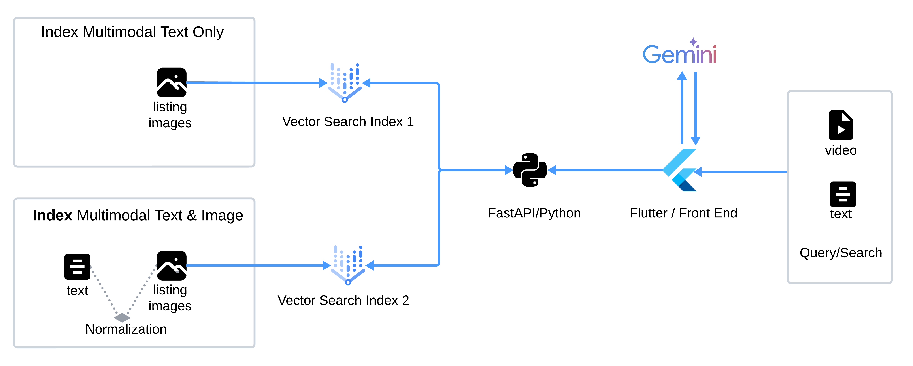

# Home Listings

This Flutter application showcases a powerful semantic search experience using multimodal embeddings. It leverages Google Vector Search, a robust vector database, to store and retrieve text and image embeddings, enabling users to find relevant information based on meaning rather than just keywords. The front-end is built with Flutter, providing a smooth and intuitive user interface for searching and exploring the data. This project demonstrates the potential of combining cutting-edge technologies like multimodal embeddings and vector databases to create innovative search solutions.

## Diagram


## Getting Started

This project is a starting point for a Flutter application.

A few resources to get you started if this is your first Flutter project:

- [Lab: Write your first Flutter app](https://docs.flutter.dev/get-started/codelab)
- [Cookbook: Useful Flutter samples](https://docs.flutter.dev/cookbook)

For help getting started with Flutter development, view the
[online documentation](https://docs.flutter.dev/), which offers tutorials,
samples, guidance on mobile development, and a full API reference.

## Pre-requisites

Run the following notebook to create Synthetic Data & build Vector Search Indexes:

1. [syntheticdata_gen_vsearch.ipynb](./syntheticdata_gen_vsearch.ipynb)

***Important: "Save the following values from the previous notebook:"***
- **combined_index_endpoint:** *e.g. projects/254356041555/locations/us-central1/indexEndpoints/2114453219189981184*
- **combined_index_id:** *e.g. vs_abnb_deployed_image_text*
- **text_index_endpoint** *e.g. projects/254356041555/locations/us-central1/indexEndpoints/8572615084839272448*
- **text_index_id** *e.g. vs_abnb_deployed_text*
- **datastore_bucket** *e.g. vtxdemos-abnb-images* In the notebook is the value of the variable "OUTPUT_IMAGE_PATH"

Because Flutter needs CORS to be enable at the back and where the images are stored,
we need to enable it in the bucket.

```bash
cat << EOF > cors.json
[
  {
    "origin": ["*"],
    "method": ["GET"],
    "maxAgeSeconds": 3600
  }
]
EOF
```

```bash
gcloud storage buckets update gs://{YOUR_BUCKET_ID} --cors-file=cors.json
```

## Step 1

After cloning this repo build the middleware in your Google Cloud Project.

Create the Repository

```bash
gcloud artifacts repositories create cloud-run-source-deploy --repository-format=docker \
    --location=us-central1 --description="Docker repository"
```

### Build and Deploy the middleware in Cloud Run

```bash
cd middleware
export PROJECT_ID={YOUR_PROJECT_ID}
gcloud build submit -- substitutions _TEXT_INDEX_ENDPOINT={YOUR_ENDPOINT},_TEXT_INDEX_ID={YOUR_VALUE},_COMBINED_INDEX_ENDPOINT={YOUR_VALUE},_COMBINED_INDEX_ID={YOUR_VALUE},_DATASET_BUCKET={YOUR_VALUE}
```

***Important: "Save the cloud run middleware endpoint name"***
- Go to Cloud Console > [Cloud Run](https://console.cloud.google.com/run), and look for the crun id (in this case home-listing-middleware), the endpoint should look like this: https://home-listing-middleware-oyntfgdwsq-uc.a.run.app

## Step 2

Build and Deploy the frontend in Cloud Run. 

- The build file definition [cloudbuild.yaml](https://github.com/jchavezar/vertex-ai-samples/blob/main/gen_ai/flutter/home_listings/cloudbuild.yaml) is in the repository. 

- *Change API_KEY generated from [aistudio.google.com](aistudio.google.com) or google cloud project API Keys.*
- *Change _MIDDLEWARE_ENDPOINT with the value saved from the previous step*

*e.g: gcloud builds submit --substitutions _API_KEY='adsdfdsfda3dsf-ddsf3',_MIDDLEWARE_ENDPOINT='https://home-listing-middleware-oyntfgdwsq-uc.a.run.app'*

```bash
gcloud builds submit --substitutions _API_KEY='{YOUR_API_KEY}',_MIDDLEWARE_ENDPOINT='{YOUR_MIDDLEWARE_ENDPOINT}'
```

