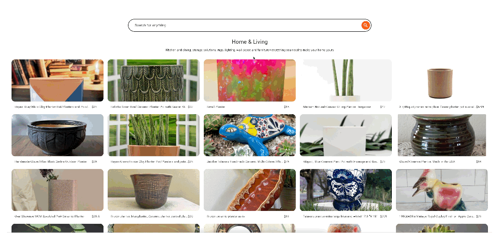
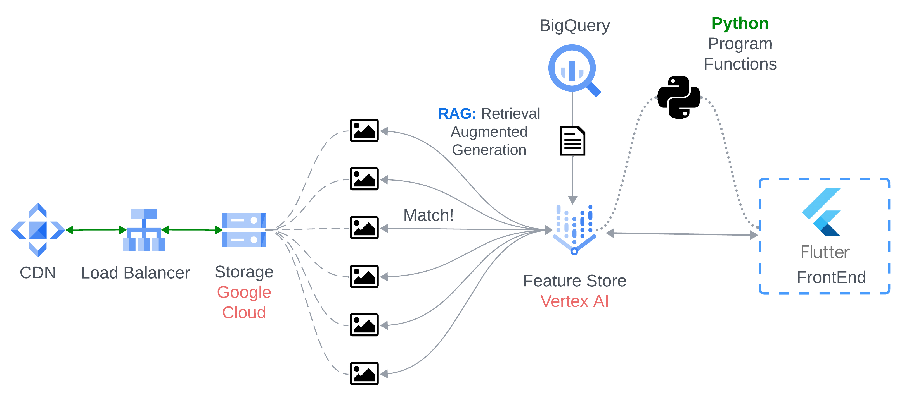
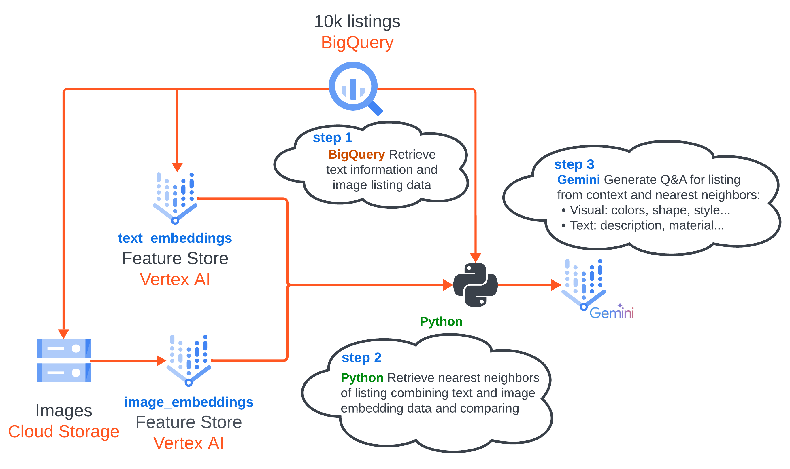

# Marketplace AI - Semantic Search with Gemini and Vertex AI

This application demonstrates a marketplace platform with an intelligent semantic search powered by Google Cloud's Vertex AI and Gemini. It leverages multiple Google Cloud services to provide a scalable and efficient solution for retrieving and displaying relevant product listings.

**Features:**

* **Semantic Search:** Utilizes Vertex AI's Search to understand user intent and retrieve the most relevant listings based on meaning, not just keywords.
* **Gemini-Enhanced Listings:** Employs Gemini to:
    * Clean and refine product descriptions.
    * Generate concise and informative titles.
    * Categorize listings for easy browsing.
    * Create three types of questions for each listing:
        * **Category 1:** Contextual questions based on listing details.
        * **Category 2:** General questions users might ask (answerable via Google Search).
        * **Category 3:**  Questions about similar or complementary products.
* **Scalable Infrastructure:** Deployed on Google Kubernetes Engine (GKE) for robust performance and scalability.
* **Global Reach:** Leverages Google Cloud CDN and Global Load Balancer to ensure fast and reliable content delivery worldwide.
* **Efficient Storage:** Uses Cloud Storage to store product images and other media assets.
* **Modern Frontend:** Built with Flutter for a cross-platform, user-friendly interface.
* **Powerful Backend:** Python-based backend interacts with Vertex AI Search and Gemini APIs.

**Architecture:**

CDN:

Version 1 for Category 3 Retrieval (optional):
- There were more than 1 version about this e2e solution, and this was the first trial that was most accurate retrieving similar listings by understanding graphics and metadata
altogether, it was inspired by using FeatureStore Embeddings for Retrieval and Gemini to generate category 3 questions. **Because Similarity** and **Complementary** are 2 different monsters
that needs more iterations and graph we decided to keep it simple for Demo purposes and just use Gemini to generate te questions on category 3 and retrieve from Vertex Search the most relevant listings.

1. **Frontend (Flutter):**
    - Provides a user interface for browsing and searching listings.
    - Sends search queries to the backend.
    - Displays search results and product details.

2. **Backend (Python):**
    - Receives search queries from the frontend.
    - Uses Vertex AI Search to perform semantic search on the product catalog.
    - Retrieves relevant listings from Cloud Storage.
    - Utilizes Gemini to generate descriptions, titles, categories, and questions for each listing.
    - Sends enriched listing data to the frontend.

3. **Google Cloud Platform:**
    - **Vertex AI Search:**  Powers the semantic search functionality.
    - **Gemini:**  Provides advanced language processing for listing enhancement.
    - **GKE:** Hosts the application for scalability and reliability.
    - **Cloud CDN:**  Caches static content (images, etc.) for faster delivery.
    - **Global Load Balancer:** Distributes traffic across multiple regions for global availability.
    - **Cloud Storage:** Stores product images and other media assets.

**Getting Started:**

1. **Prerequisites:**
    - Google Cloud Project with billing enabled.
    - Familiarity with Python and Flutter.
    - Install required libraries: `google-cloud-aiplatform`, `google-cloud-storage`, `flutter`.

2. **Deployment:**
    - Configure GKE cluster.
    - Deploy frontend and backend applications to GKE.
    - Set up Cloud CDN and Global Load Balancer.
    - Configure Cloud Storage buckets for media assets.

3. **Running the Application:**
    - Access the frontend application through the Global Load Balancer.
    - Perform searches and explore product listings.

**Future Enhancements:**

* **Personalized Recommendations:** Utilize user data and browsing history to suggest relevant products.
* **Advanced Filtering and Faceting:** Allow users to refine search results based on various criteria.
* **Integration with other Google Cloud services:** Explore integrating with services like Vision API for image analysis and Recommendations AI for personalized suggestions.