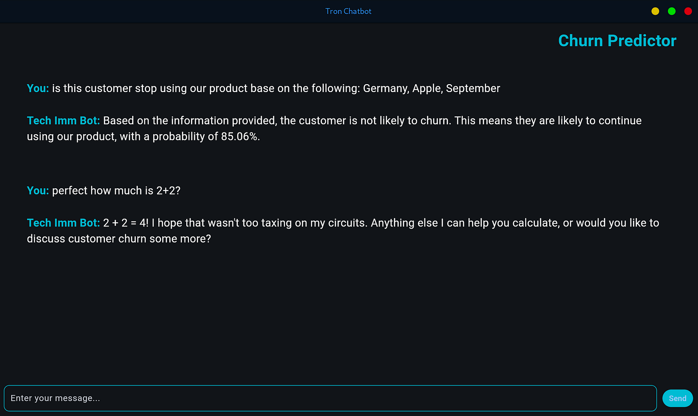

# AI Agentic Exploration and Churn Prediction Chatbot

This repository contains the code and information related to exploring simpler approaches to AI interaction and a practical customer churn prediction chatbot.



## Overview

This project demonstrates a shift away from overly complex AI agent frameworks towards more direct model interaction and targeted solutions [1, 2]. It features a customer churn prediction chatbot built using Google Cloud's Vertex AI and Gemini 2.0 [3, 4], along with examples of basic arithmetic function calls [5-7]. The aim is to showcase the power of simplicity and practical application in AI development [8].

## Setup Instructions

To run this project locally, follow these steps:

1.  **Install Python:** Ensure you have Python version **3.13 or higher** installed [20, in `pyproject.toml`].

2.  **Install `uv`:** It is recommended to use `uv`, a next-generation package manager, for faster and more efficient dependency management. You can install `uv` using `pip` as outlined in the official documentation [non-source]:
    ```bash
    pip install uv
    ```
    For more detailed installation options, please refer to the official `uv` documentation: [https://docs.astral.sh/uv/getting-started/installation/](https://docs.astral.sh/uv/getting-started/installation/) [non-source].

3.  **Install Dependencies using `uv`:** Navigate to the project directory (where the `requirements.txt` or `pyproject.toml` file is located) and run:
    ```bash
    uv pip install -r requirements.txt
    ```
    If you have a `pyproject.toml` file defining your dependencies (as hinted at in the excerpt from "New story – Medium.pdf" [9]), you can also use `uv` to install them:
    ```bash
    uv pip install .
    ```
    This command will install the dependencies listed in your project's configuration [8]. The required dependencies, as mentioned previously [the `dependencies` section in `pyproject.toml`]:
    *   `flet>=0.27.6` [8]
    *   `google-cloud-aiplatform>=1.84.0` [8, 10]
    *   `google-cloud-bigquery>=3.30.0` [8]
    *   `google-genai>=1.5.0` [8, 11]
    *   `ipython>=9.0.2` [8]
    *   `pandas>=2.2.3` [8]
    *   `pip>=25.0.1` [8]
    *   `pyarrow>=19.0.1` [8]

4.  **Configure Google Cloud Credentials:** Ensure you have the necessary Google Cloud credentials configured to access Vertex AI and BigQuery. This typically involves setting up authentication using a service account or your user account.

5.  **Vertex AI Endpoint:** The churn prediction functionality relies on a deployed Vertex AI Endpoint. The `middleware.py` file references a specific endpoint: `projects/254356041555/locations/us-central1/endpoints/3019457941477523456` [12]. **You will likely need to deploy your own model to Vertex AI and update this endpoint in the `middleware.py` file to match your deployment**. The `Preprocessing` section in "medium - Google Docs.pdf" [10, 13, 14] shows an example of training and deploying a churn prediction model using BigQuery ML and Vertex AI. You can use the Vertex AI Model Registry and Endpoints within the Google Cloud Console [15].

6.  **Run the Chatbot:** Execute the `main.py` script to start the Flet-based chatbot interface [2, 16, 17].
    ```bash
    python main.py
    ```

## Code Structure

The project consists of the following key files:

*   **`main.py`**: This file contains the code for the **Flet-based graphical user interface (GUI) of the chatbot** [11, 16-20]. It handles user input and displays the chatbot's responses [16, 18, 19]. It initializes a `genai.Client` for interacting with Gemini [11]. The UI is created using the Flet library (Dart) [4, 9].
*   **`middleware.py`**: This file contains the **core logic of the chatbot** [7, 12, 21-31], including the connection to the Vertex AI Endpoint for churn prediction [12] and the definitions for basic arithmetic functions (`add`, `subtract`, `multiply`, `divide`) [26, 27]. It defines the `system_instruction` that guides the chatbot's behavior for both answering general questions and handling churn prediction and calculations [7, 12, 21-26]. It also defines the `ml_prediction` function that makes the actual call to the deployed Vertex AI model [28-30]. It uses the `google-cloud-aiplatform` library to interact with the Vertex AI Endpoint [10, 12].
*   **`requirements.txt`** (or inferred from `pyproject.toml` [8, 9]): This file lists the Python packages required to run the project.
*   **`pyproject.toml`**: This file defines the project's metadata and dependencies [8].

## Churn Prediction Functionality

The chatbot is designed to predict customer churn based on several input features [28-30, 32, 33]. When asked about customer churn, it follows these steps as defined in the `system_instruction` in `middleware.py` [7, 12, 21-26]:

1.  **Month Conversion:** If the month is provided as a name (e.g., "December"), it is immediately converted to its numerical representation (e.g., 12) [21, 34].
2.  **Required Fields Check:** It ensures that the **'country', 'operating\_system', and 'month' (as a number)** are provided [7, 22, 35]. If any of these are missing, the chatbot will ask for the missing information [22, 35].
3.  **Optional Information:** Default values are used for other optional features if not provided [22, 23, 35-37]. These include `user_pseudo_id`, `language`, engagement counts, level progression, spending, and date-related features [22, 23, 32, 33, 35-37].
4.  **Prediction Call:** Once all necessary information is gathered, the `ml_prediction` function is called, which sends a request to the deployed Vertex AI Endpoint with the provided data [23, 28-30, 37]. This uses the Vertex AI Model Registry and Endpoints [15, 33, 38].
5.  **Result Interpretation:** The response from the Vertex AI model (specifically the **'churned\_probs'**) is interpreted to determine the likelihood of churn [24, 37]. A probability greater than **0.5** indicates a high likelihood of churn [24, 37].
6.  **Human-Readable Output:** The chatbot returns a clear and concise message indicating whether the customer is likely to churn and explains what churn means [6, 7, 25].

**To use the churn prediction feature, provide the country, operating system, and month (as a name or number) when asking the chatbot.** For example: "predict the churn of a customer in Mexico with Android in December" [39].

## Function Calling for Calculations

The chatbot is also capable of performing basic arithmetic calculations using function calling [6, 7, 30]. You can ask the chatbot to perform **addition** (`add`), **subtraction** (`subtract`), **multiplication** (`multiply`), or **division** (`divide`), and it will use the corresponding Python functions defined in `middleware.py` [26, 27] to compute the result [6, 7].

**To perform a calculation, simply ask a question like:** "What is 5 + 3?", "What is 10 - 2?", "What is 6 * 7?", or "What is 20 / 4?" [39].

## Simpler AI and "Bonsai Tree" Approach

This project aligns with the idea of focusing on enhancing core model capabilities and simplifying interactions rather than building overly complex "Rube Goldberg" agent frameworks [1, 2, 40]. The direct use of Gemini 2.0 [3, 4] and Vertex AI [10, 15, 38], along with targeted function calls [4, 5], exemplifies the **"bonsai tree" approach** – nurturing focused and effective AI solutions [2, 41]. The author suggests that simple instructions can be powerful [40] and that focusing on small wins and smart tweaks to models can be more effective than building overly complex systems [41].

## Running the Code

After installing the dependencies and configuring your Google Cloud environment, you can run the chatbot by executing the `main.py` script [2]:

```bash
python main.py
This will open a new window with the Tron Chatbot interface. You can then interact with the chatbot by typing messages and pressing the "Send" button.
Repository Structure (Suggested)
.
├── main.py
├── middleware.py
├── requirements.txt
└── README.md
└── pyproject.toml  # Recommended for better dependency management [8, 9]
Contributing
Contributions to this project are welcome. If you have suggestions for improvements or find any issues, please feel free to open an issue or submit a pull request.