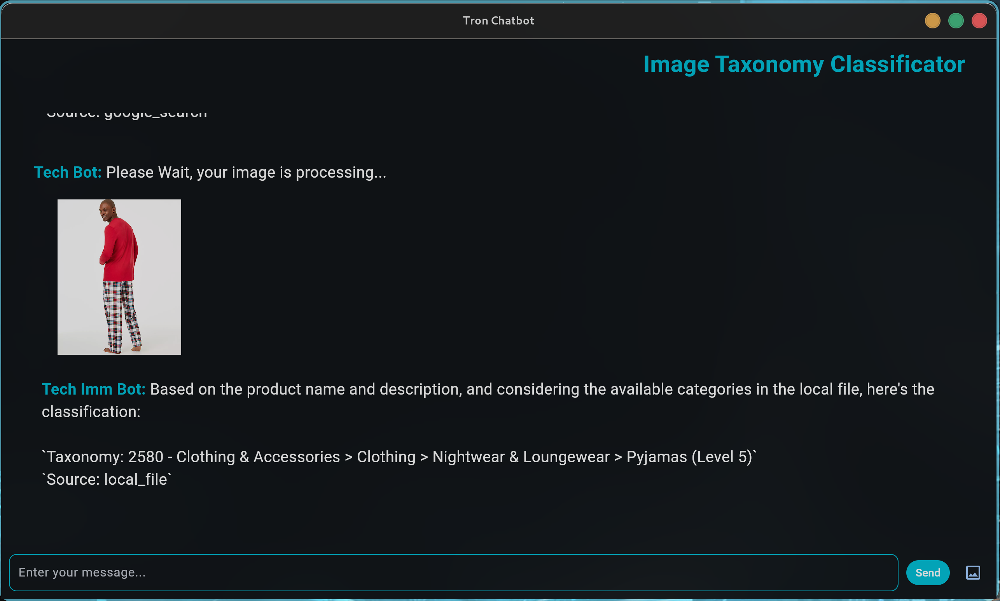

# 🤖 Image Taxonomy Classificator - Tron Edition ⚡



Dive into the neon-lit world of product classification with this unique chatbot! This project combines the power of Google's Gemini API with a sleek Flet UI, all wrapped in a retro Tron aesthetic.

## 🚀 Features

* **Dual Classification Power:**
    * Uses a local Google Product Taxonomy file for precise matching.
    * Falls back to Google Search for broader classification.
    * Relies on general knowledge as a last resort.
* **Image and Text Input:**
    * Upload images and provide text descriptions for classification.
    * Images are base64 encoded and sent to the bot.
* **Tron-Inspired UI:**
    * Built with Flet for a cross-platform experience.
    * Dark theme with vibrant cyan accents for that retro-futuristic vibe.
    * Chat history display for conversation tracking.
* **Clear Response Format:**
    * Returns classification results with category number, full path, hierarchy level, and source.
    * Displays uploaded images within the chat.

## 🛠️ Setup

1.  **Clone the Repository:**

    ```bash
    git clone [repository URL]
    cd [repository directory]
    ```

2.  **Install Dependencies:**

    ```bash
    pip install --upgrade google-genai flet
    ```

3.  **Google Gemini API Setup:**
    * Ensure you have a Google Cloud project with the Vertex AI API enabled.
    * Set up your Google Cloud credentials.
    * Configure your project and region variables within `front.py`:

    ```python
    project = "your-project-id"
    region = "your-region"
    ```

4.  **Run the Application:**

    ```bash
    python back.py
    ```

## 📂 File Structure

* `front.py`: Contains the Gemini API interaction logic and classification functions.
* `back.py`: Houses the Flet UI and application logic.
* `google_product_taxonomy.txt`: The local Google Product Taxonomy file used for classification.

## ⚙️ How It Works

1.  **Input:** Users can input text or upload images via the Flet UI.
2.  **Classification:**
    * The `front.py` script receives the input and attempts to match it against the local `google_product_taxonomy.txt` file.
    * If no exact match is found, it queries Google Search.
    * If both fail, it uses general knowledge.
3.  **Response:** The classification result is returned to the `back.py` script, which displays it in the chat interface.
4.  **Display:** Uploaded images are displayed within the chat, along with the classification response.

## 📝 Example Usage

1.  **Text Input:**
    * Enter a product description in the text field.
    * Click "Send."
2.  **Image Input:**
    * Click the image upload icon.
    * Select an image file.
    * You may add additional text in the text field to give context to the image.
    * The Image and the text are then sent to the Gemini API.
3.  **View Results:** The chatbot's response, including the classification and source, will appear in the chat history.

## 💡 Customization

* **Update Taxonomy:** Replace `google_product_taxonomy.txt` with your own taxonomy file.
* **Modify UI:** Customize the Flet UI by editing the `back.py` script.
* **Enhance Logic:** Improve the classification logic in `front.py` to handle more complex scenarios.

## 🖼️ Screenshots

(Add screenshots of your application here)

## 🤝 Contributing

Feel free to contribute to this project by submitting pull requests or opening issues.

## 📜 License

[Your License]