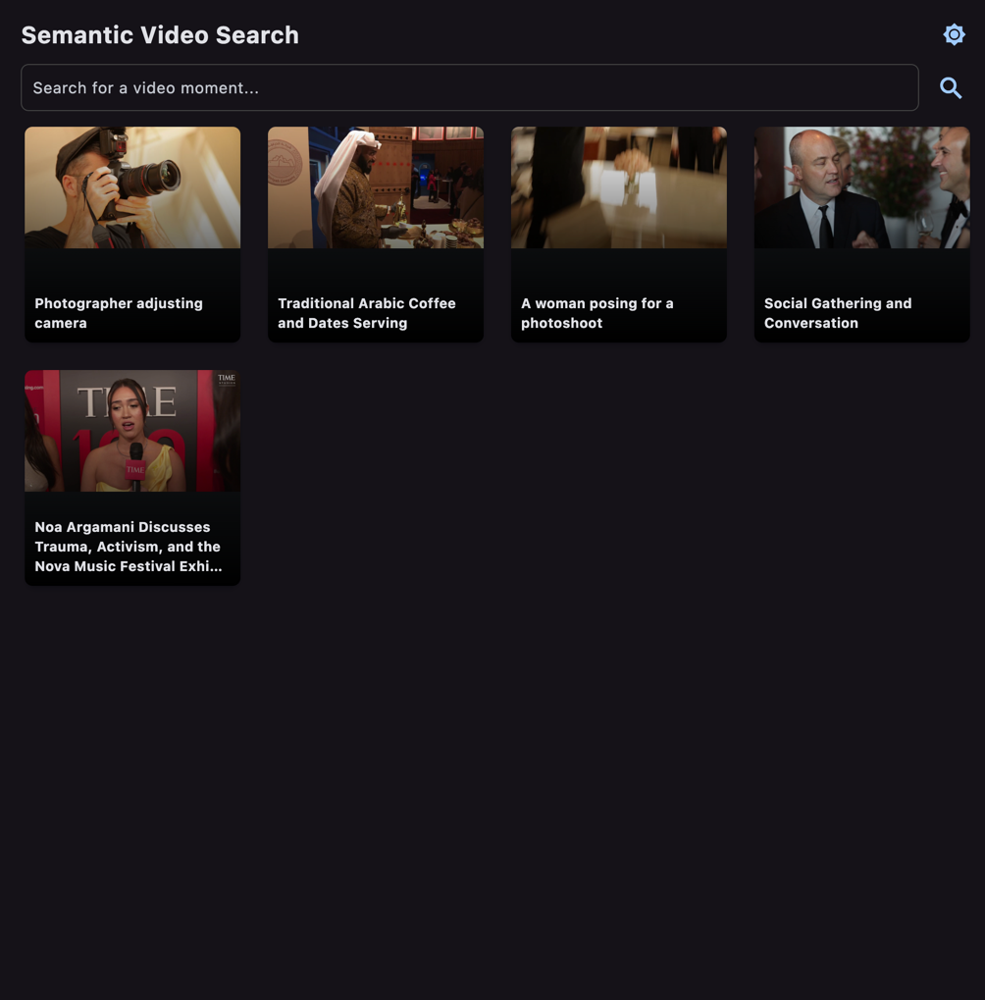

# Video Search App

This application allows you to perform semantic search on a collection of videos. You can search for specific moments in the videos using natural language queries. The app uses multimodal embeddings to understand the content of the videos and find the most relevant segments.



## How it Works

The application is divided into three main components:

1.  **Preprocessing**: The `preprocessing.py` script is the first step in the workflow. It takes a directory of MP4 videos from a Google Cloud Storage (GCS) bucket, processes them, and generates a data file (`video_gen_dataset.pkl`). This file contains the video segments, summaries, and multimodal embeddings for each video.

2.  **Backend**: The `backend.py` script loads the `video_gen_dataset.pkl` file and provides a function to find the most similar video segments based on a text query. It uses a multimodal embedding model to compare the query with the video segments and returns the most relevant results.

3.  **Frontend**: The `front.py` script is a Flet application that provides a user interface for the video search app. It allows users to enter a search query, view the results, and watch the video segments. The main page displays a few random video recommendations for the user to explore.

## Setup and Usage

To use the video search app, you need to have a Google Cloud project with the Vertex AI API enabled. You also need to have a GCS bucket with the videos you want to search.

### Prerequisites

*   **Google Cloud Project**: You need a Google Cloud project with the Vertex AI API enabled.
*   **GCS Bucket**: You need a GCS bucket with your MP4 videos.

### Preprocessing

1.  **Configure `preprocessing.py`**: Open the `preprocessing.py` file and update the `project_id` and `bucket_name` variables with your Google Cloud project ID and GCS bucket name.

2.  **Run the script**: Execute the `preprocessing.py` script to process the videos and generate the `video_gen_dataset.pkl` file.

### Running the App

Once the `video_gen_dataset.pkl` file is generated, you can run the Flet application:

```bash
python front.py
```

This will open a window with the video search app, where you can enter a query to search for specific moments in your videos. You can also click on the video recommendations to watch a random video.
