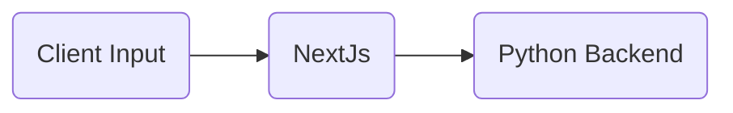
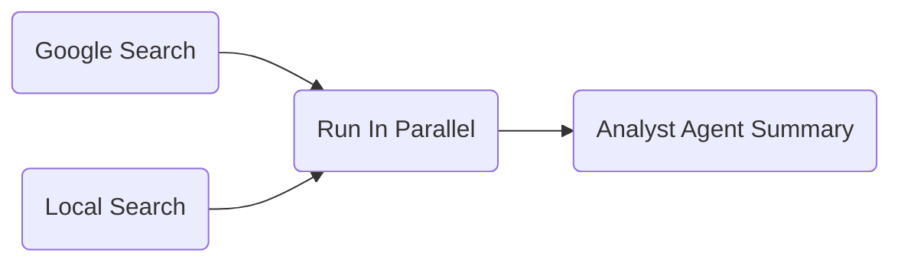

### General Diagram

```mermaid
flowchart LR
    A(Client Input) --> B(NextJs) --> C(Python Backend)
```

### Low Level Diagram ADK

```mermaid
flowchart LR
    A(Google Search) --> C(Run In Parallel)
    B(Local Search) --> C
    C --> D(Analyst Agent Summary)
```