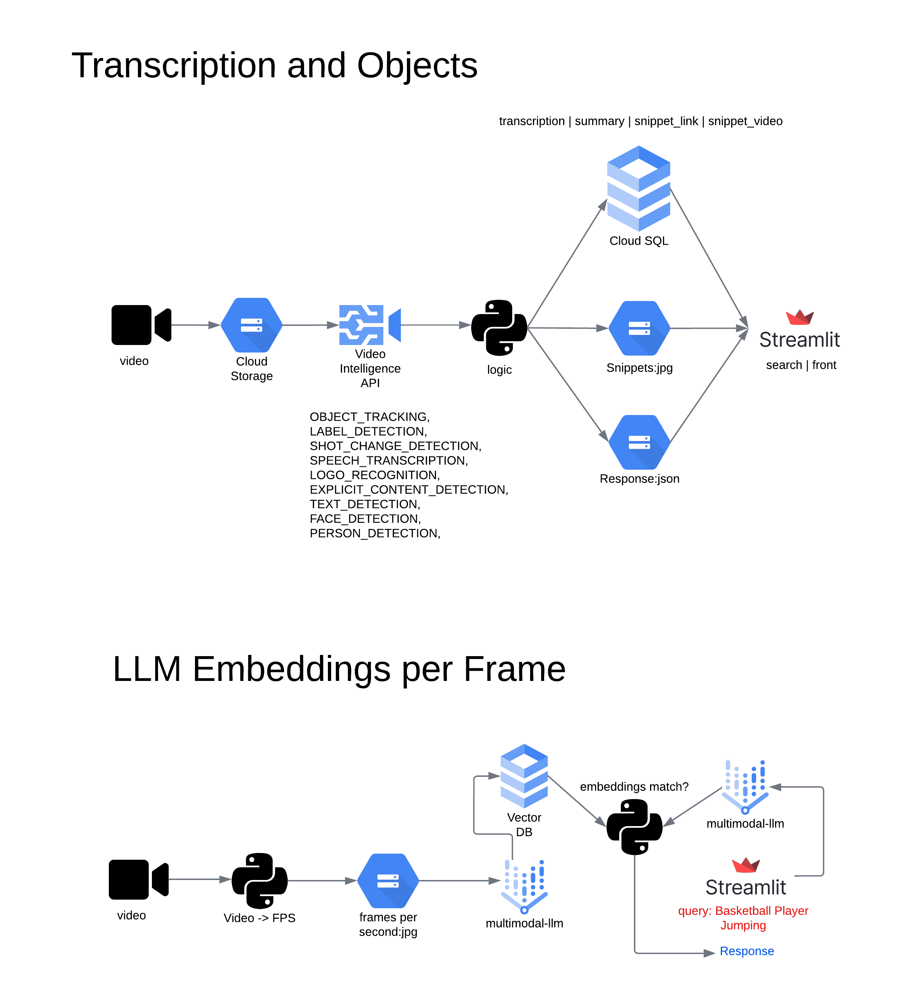

# Overview:

There are 2 important components: the **preprocessing** component that is in charge of creating fps (frames per second), transcription, embeddings and indexing, and the **front end** which is a streamlit webserve that does queries to the vector database in cloud sql.

# Steps:

# Prerequisites

Cloud SDK installed: information [here](https://cloud.google.com/sdk/docs/install).

Change the variables on these files:

- [database credentials | credentials.py](utils/credentials.py)
- [variables.py](utils/variables.py)

## Component 1: Preprocess
### Create Google Cloud Storage Buckets:

Create 4 buckets: video_gcs_uri, video_transcript_annotations_gcs, fps_gcs_uri, snippets_gcs_uri)*: 

```bash 
gsutil mb {video_gcs_uri_unique_name}
gsutil mb {video_transcript_annotations_gcs_unique_name}
gsutil mb {fps_gcs_uri_unique_name}
gsutil mb {snippets_gcs_uri_unique_name}
```

### Create a cloud sql database instance in Google Cloud.

```bash

gcloud sql instances create {instance_name} --database-version=POSTGRES_15 \
    --region={region} --cpu=1 --memory=4GB --root-password={database_password}
```

### Create a table database

```bash
gcloud sql databases create {database_name} --instance={instance_name}

```

### Create and Deploy preprocessing job.

On this section I create a container using [packbuilds](https://buildpacks.io/docs/tools/pack/cli/pack_build/) and deploy it in a serverless function [Cloud Run](https://cloud.google.com/run?hl=en).

*Do not forget to change your variables enclosed by curly brackets.*

```bash
cd preprocessing
```

```bash
gcloud builds submit --pack ^--^image=gcr.io/{vtxdemos}/preprocess--env=GOOGLE_PYTHON_VERSION="3.10.0"
```

```bash
gcloud run deploy {video-pre-job} --cpu 8 --memory 32Gi --timeout 900 --image  {gcr.io/vtxdemos/preprocess} --allow-unauthenticated
```

### Create a Trigger Functin and Workflow

The desitnation-run-service name "videoprep-job" needs to match with cloud run name. 

```bash
gcloud eventarc triggers create {video-preprocess}   --destination-run-service={video-pre-job} --destination-run-region={us-central1} --event-filters="type=google.cloud.storage.object.v1.finalized" --event-filters="bucket={vtxdemos-videos}"   --service-account={254356041555-compute@developer.gserviceaccount.com}
```
[Google Cloud Workflows Documentation](https://cloud.google.com/workflows/docs)

Change the value in the following file to add cloud run https endpoint which can be found during the gcloud run deploy or in [google cloud run console](https://console.cloud.google.com/run).

[event_workflow.yaml](event_workflow.yaml):

```bash
gcloud workflows deploy ${MY_WORKFLOW} --source=event_workflow.yaml
```

In the following snippet the name of the cloud run endpoint is https://vid-pre-job-oyntfgdwsq-uc.a.run.app

Example:
```yaml
main:
  params: [event]
  steps:
    - log_event:
        call: sys.log
        args:
          text: ${event}
          severity: INFO
    - extract_bucket_object:
        assign:
        - bucket: ${event.data.bucket}
        - object: ${event.data.name}
    - video_preprocess:
        call: http.post
        args:
          url: https://vid-pre-job-oyntfgdwsq-uc.a.run.app
          body:
            data: ${event.data}
        result: video_preprocess_result
```

## Component 2: Front End

```bash
cd ../front-end
```

```bash
gcloud builds submit --pack ^--^image=gcr.io/{vtxdemos}/frontend--env=GOOGLE_PYTHON_VERSION="3.10.0"
```

```bash
gcloud run deploy {video-front} --image  {gcr.io/vtxdemos/frontend} --allow-unauthenticated
```