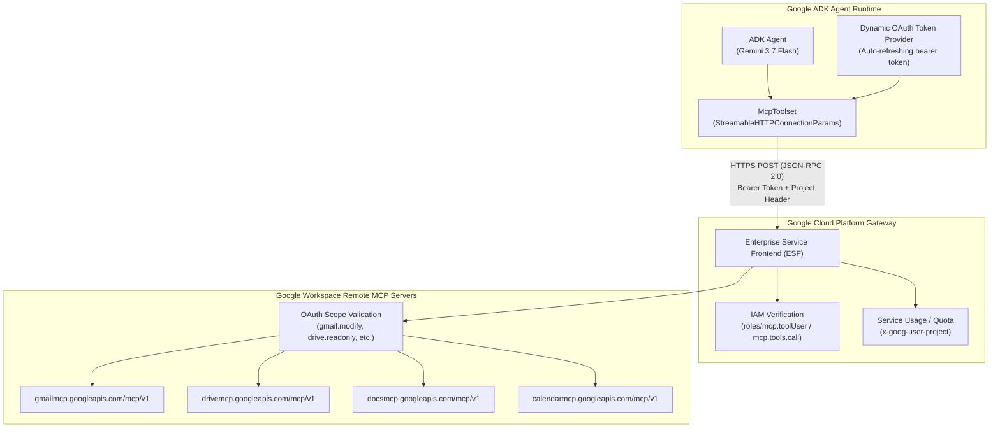

# Integrating Google Workspace Remote MCP Servers with Google ADK
## Field Notes, Undocumented Prerequisites & Enterprise Architecture Guide

---

### Executive Summary

Google recently published documentation for configuring remote Model Context Protocol (MCP) servers for Google Workspace products (Gmail, Drive, Docs, Sheets, Calendar, Chat, etc.) under [Google Workspace Guides](https://developers.google.com/workspace/guides/configure-mcp-servers#others). However, customers trying to connect **Google ADK (Agent Development Kit)** to these endpoints will notice that no dedicated Google ADK documentation exists on the Workspace documentation pages, and no Workspace-specific guides exist on the official ADK site (`https://adk.dev`).

This guide bridges that gap. It details the **undocumented requirements, transport mechanics, dual-layer security model, and production token lifecycle strategies** required to successfully deploy Workspace MCP tools inside Google ADK agents.

---



---

### 1. The Documentation Gap: Why It's Missing

* **Organizational Division**: The **Workspace Developer Platform** documents server endpoints and OAuth scopes for consumer clients (like Claude Desktop or Gemini CLI). Meanwhile, the **Google Cloud / Agent Platform team** maintains Google ADK (`adk.dev`), focusing on generic MCP integrations (Cloud Run, Google Maps, or custom FastMCP). Neither team has published a cross-product tutorial yet.
* **Under the Hood**: Both systems are 100% interoperable because they adhere to the standard **Model Context Protocol specification (protocol version `2024-11-05`)**.

---

### 2. Undocumented Nuance #1: Transport Protocol (`Streamable HTTP`, NOT SSE)

> [!IMPORTANT]
> The Workspace documentation lists `Transport: HTTP`. In MCP terms, this is specifically **Streamable HTTP (JSON-RPC 2.0 over HTTP POST)**, **NOT** Server-Sent Events (`/sse`).

* **HTTP Method**: All requests (including `initialize`, `tools/list`, and `tools/call`) are HTTP `POST`. Sending an HTTP `GET` to `https://gmailmcp.googleapis.com/mcp/v1` immediately returns `405 Method Not Allowed`.
* **ADK Class Selection**:
  *  **Correct**: `google.adk.tools.mcp_tool.mcp_session_manager.StreamableHTTPConnectionParams`
  * ❌ **Incorrect**: `SseConnectionParams` (will fail to connect because Workspace does not expose `/sse` event-streams).

---

### 3. Undocumented Nuance #2: The Dual-Layer Security Requirement

Connecting to a Workspace MCP server requires satisfying **two distinct permission layers**:

```
Request ──► [ Layer 1: Google Cloud Infrastructure ] ──► [ Layer 2: Workspace User Data ]
```

#### Layer 1: Google Cloud Platform (Gateway / Quota Layer)
1. **API Activation**: The target MCP service API must be enabled on your GCP project (e.g. `gcloud services enable gmailmcp.googleapis.com drivemcp.googleapis.com docsmcp.googleapis.com`).
2. **Project Header**: You must pass the header `x-goog-user-project: <YOUR_GCP_PROJECT_ID>`.
3. **Mandatory IAM Role (`roles/mcp.toolUser`)**:
   * The calling identity (user or service account) **must** have `roles/mcp.toolUser` bound on the GCP project.
   * This role grants the permission `mcp.tools.call`.
   * **Symptom if missing**: Google ESF returns HTTP `403 Forbidden` on `tools/list` or `tools/call` even if the OAuth token is valid.

#### Layer 2: Google Workspace (Data Access & Scope Layer)
* Workspace MCP servers execute operations against user mailboxes, drives, and documents.
* A standard GCP access token with only `https://www.googleapis.com/auth/cloud-platform` is **insufficient**.
* The Bearer token **must** contain the specific Workspace scopes (e.g., `https://www.googleapis.com/auth/gmail.modify`).

---

### 4. Undocumented Nuance #3: Token Expiration in Production Agents

* In basic tutorials, developers often pass a static token string:
  ```python
  StreamableHTTPConnectionParams(
      url="https://gmailmcp.googleapis.com/mcp/v1",
      headers={"Authorization": f"Bearer {token}"}
  )
  ```
* **Production Failure**: Google OAuth access tokens expire after **1 hour** (3600 seconds). If your ADK agent runs as a long-lived service, all tool calls after 60 minutes will fail with `401 Unauthorized`.
* **The Solution**: Use ADK's `header_provider` callback or an auto-refreshing credential adapter:

```python
import google.auth
from google.auth.transport.requests import Request
from google.adk.tools.mcp_tool import McpToolset
from google.adk.tools.mcp_tool.mcp_session_manager import StreamableHTTPConnectionParams

def dynamic_header_provider(context=None) -> dict:
    """Generates fresh headers with an auto-refreshed OAuth token for every MCP call."""
    creds, project_id = google.auth.default(scopes=[
        "https://www.googleapis.com/auth/gmail.modify",
        "https://www.googleapis.com/auth/cloud-platform"
    ])
    if not creds.valid:
        creds.refresh(Request())
    return {
        "Authorization": f"Bearer {creds.token}",
        "Content-Type": "application/json",
        "Accept": "application/json, text/event-stream",
        "x-goog-user-project": project_id,
    }

toolset = McpToolset(
    connection_params=StreamableHTTPConnectionParams(
        url="https://gmailmcp.googleapis.com/mcp/v1"
    ),
    header_provider=dynamic_header_provider
)
```

---

### 5. Undocumented Nuance #4: Context Bloat & Tool Filtering

* The Workspace MCP servers expose a comprehensive set of operations:
  * `gmailmcp.googleapis.com`: **23 distinct tools** (labels, threads, drafts, spam, trash, etc.)
  * `calendarmcp.googleapis.com`: **9 tools**
  * `drivemcp.googleapis.com`: **8 tools**
* If a customer attaches Gmail, Calendar, and Drive MCP servers without filtering, **40+ tools** are pushed into the model prompt on every turn.
* **Best Practice**: Always use `tool_filter` in ADK:
  ```python
  toolset = McpToolset(
      connection_params=...,
      tool_filter=["create_draft", "get_thread", "search_threads"]
  )
  ```

---

### 6. Summary Matrix: Workspace Endpoints & Required Scopes

| Product | Remote MCP Server Endpoint | Minimum Recommended OAuth Scope |
| :--- | :--- | :--- |
| **Gmail** | `https://gmailmcp.googleapis.com/mcp/v1` | `https://www.googleapis.com/auth/gmail.modify` |
| **Google Drive** | `https://drivemcp.googleapis.com/mcp/v1` | `https://www.googleapis.com/auth/drive.readonly` (or `drive.file`) |
| **Google Docs** | `https://docsmcp.googleapis.com/mcp/v1` | `https://www.googleapis.com/auth/documents.readonly` |
| **Google Sheets** | `https://sheetsmcp.googleapis.com/mcp/v1` | `https://www.googleapis.com/auth/spreadsheets.readonly` |
| **Google Slides** | `https://slidesmcp.googleapis.com/mcp/v1` | `https://www.googleapis.com/auth/presentations.readonly` |
| **Google Calendar**| `https://calendarmcp.googleapis.com/mcp/v1` | `https://www.googleapis.com/auth/calendar.events.readonly` |
| **Google Chat** | `https://chatmcp.googleapis.com/mcp/v1` | `https://www.googleapis.com/auth/chat.messages` |
| **People API** | `https://people.googleapis.com/mcp/v1` | `https://www.googleapis.com/auth/contacts.readonly` |

---

### 7. Customer Readiness Checklist

Before going to production with ADK and Google Workspace MCP:

1. [ ] **GCP APIs Enabled**: Confirm `*mcp.googleapis.com` is enabled for each desired product.
2. [ ] **IAM Permission Bound**: Ensure caller identity has `roles/mcp.toolUser` on the GCP project.
3. [ ] **OAuth Consent & Scopes**: Confirm the client has user consent for the specific Workspace scopes.
4. [ ] **Transport Class**: Verify that `StreamableHTTPConnectionParams` is used, not `SseConnectionParams`.
5. [ ] **Dynamic Token Strategy**: Implement `header_provider` to prevent failures after the 1-hour OAuth token expiry.
6. [ ] **Context Optimization**: Apply `tool_filter` on each `McpToolset` to prevent LLM prompt saturation.
