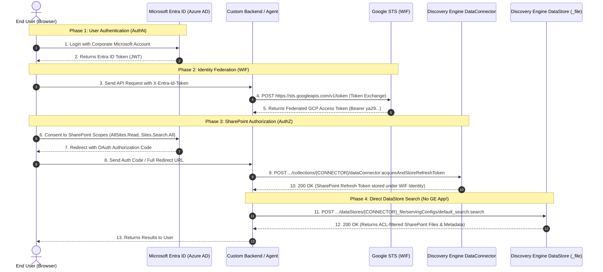

# Federated Connector DataStore Search & Security Flow Architecture

This document provides a deep architectural walkthrough, visual sequence diagrams, and runnable code snippets for querying **Discovery Engine / Vertex AI Search Data Stores** directly without requiring a Gemini Enterprise (GE) App (`engines/{ENGINE_ID}`), alongside the complete **Workforce Identity Federation (WIF) & OAuth 2.0 AuthN / AuthZ security pipeline**.

---

## 1. Visual Architecture Diagrams

### 1.1 End-to-End Security & Search Flow (Mermaid Sequence)



---

### 1.2 Trust Boundaries & Security Architecture (ASCII Diagram)

```
========================================================================================================================
                                      TRUST BOUNDARIES & SECURITY ARCHITECTURE
========================================================================================================================

  [ CLIENT / USER BOUNDARY ]
  +------------------------------------------------------------------------------------------------------------------+
  |  Browser / Client Application (React / Vanilla JS / Mobile)                                                      |
  |  - Authenticates against Microsoft Entra ID (OIDC)                                                               |
  |  - Holds temporary Entra ID JWT in memory (never persists client secrets)                                        |
  +---------------------------------------------------------+--------------------------------------------------------+
                                                            |
                                      X-Entra-Id-Token Header (HTTPS/TLS 1.3)
                                                            |
                                                            v
  [ APPLICATION BACKEND BOUNDARY ]
  +------------------------------------------------------------------------------------------------------------------+
  |  Custom Backend Service (FastAPI / Node / Python)                                                                |
  |  - Stateless identity bridge (no database needed for user credentials)                                          |
  |  - Translates Entra JWT -> GCP WIF token in real-time via Google STS                                             |
  +--------------------+------------------------------------+------------------------------------+-------------------+
                       |                                    |                                    |
          1. Token Exchange (STS)              2. Store SP Token                    3. Direct DataStore Query
                       |                                    |                                    |
                       v                                    v                                    v
  [ GOOGLE CLOUD INFRASTRUCTURE BOUNDARY ]
  +--------------------+---------------+  +-----------------+------------------+  +----------------+-----------------+
  | Google STS / IAM                   |  | Discovery Engine Connector Vault   |  | Discovery Engine DataStore       |
  | (sts.googleapis.com)               |  | (collections/{CONNECTOR}/          |  | (dataStores/{CONNECTOR}_{entity}/|
  |                                    |  |  dataConnector:*)                  |  |  servingConfigs/default_search)  |
  | - Validates Entra OIDC Signature   |  | - Encrypts SP Refresh Token in     |  | - Direct indexed search          |
  | - Maps Entra claims to WIF Pool    |  |   Google KMS vault under user WIF  |  | - Enforces per-user SharePoint   |
  | - Issues GCP Federated Access Token|  | - Refreshes Microsoft Graph tokens |  |   ACLs dynamically               |
  +------------------------------------+  +------------------------------------+  +----------------------------------+
========================================================================================================================
```

---

## 2. Step-by-Step Security Flow Walkthrough with Code Snippets

### Phase 1: User Authentication via Microsoft Entra ID (AuthN)
The user authenticates with Microsoft Entra ID in the frontend using MSAL (Microsoft Authentication Library), producing an ID Token (`id_token`).

```typescript
// Frontend: MSAL Login (TypeScript / React)
import { PublicClientApplication } from "@azure/msal-browser";

const msalConfig = {
  auth: {
    clientId: "7868d053-cf9c-4848-be5a-f9bbf8279234",
    authority: "https://login.microsoftonline.com/de46a3fd-0d68-4b25-8343-6eb5d71afce9",
  }
};

const msalInstance = new PublicClientApplication(msalConfig);
await msalInstance.initialize();

const loginResponse = await msalInstance.loginPopup({
  scopes: ["openid", "profile", "email"]
});

// The JWT ID Token identifies the user
const entraIdToken = loginResponse.idToken;
```

---

### Phase 2: Google STS Token Exchange (Workforce Identity Federation)
The backend exchanges the user's Microsoft Entra JWT for a short-lived Google Cloud Access Token using Google Security Token Service (STS).

```python
# Backend: Exchange Entra JWT for GCP Federated Access Token
import requests

def exchange_entra_jwt_for_gcp_token(entra_jwt: str, wif_pool: str, wif_provider: str) -> str:
    sts_url = "https://sts.googleapis.com/v1/token"
    payload = {
        "audience": f"//iam.googleapis.com/locations/global/workforcePools/{wif_pool}/providers/{wif_provider}",
        "grantType": "urn:ietf:params:oauth:grant-type:token-exchange",
        "requestedTokenType": "urn:ietf:params:oauth:token-type:access_token",
        "scope": "https://www.googleapis.com/auth/cloud-platform",
        "subjectToken": entra_jwt,
        "subjectTokenType": "urn:ietf:params:oauth:token-type:id_token",
    }
    
    resp = requests.post(sts_url, json=payload, timeout=10)
    resp.raise_for_status()
    # Returns short-lived federated GCP token: "ya29.d.AbC123..."
    return resp.json()["access_token"]
```

---

### Phase 3: SharePoint Authorization & Refresh Token Vault Storage (AuthZ)
When the user grants consent to SharePoint access, the OAuth authorization code is passed to Discovery Engine's `acquireAndStoreRefreshToken` API. Discovery Engine securely stores the token mapped to the user's federated WIF principal.

```python
# Backend: Store SharePoint Refresh Token in Google Cloud Connector Vault
import requests

def store_sharepoint_refresh_token(project_number: str, connector_id: str, gcp_token: str, full_redirect_uri: str):
    url = f"https://discoveryengine.googleapis.com/v1alpha/projects/{project_number}/locations/global/collections/{connector_id}/dataConnector:acquireAndStoreRefreshToken"
    
    headers = {
        "Authorization": f"Bearer {gcp_token}",
        "Content-Type": "application/json",
        "X-Goog-User-Project": project_number,
    }
    payload = {
        "fullRedirectUri": full_redirect_uri
    }
    
    resp = requests.post(url, headers=headers, json=payload, timeout=30)
    resp.raise_for_status()
    return resp.ok  # True = Token stored securely in connector KMS vault
```

---

### Phase 4: Token Validation & Connection Check
Before executing queries, the application can verify whether the user has an active token in the vault:

```python
# Backend: Verify active SharePoint access token
import requests

def verify_user_connection(project_number: str, connector_id: str, gcp_token: str) -> bool:
    url = f"https://discoveryengine.googleapis.com/v1alpha/projects/{project_number}/locations/global/collections/{connector_id}/dataConnector:acquireAccessToken"
    
    headers = {
        "Authorization": f"Bearer {gcp_token}",
        "Content-Type": "application/json",
        "X-Goog-User-Project": project_number,
    }
    
    resp = requests.post(url, headers=headers, json={}, timeout=15)
    return resp.ok and bool(resp.json().get("accessToken"))
```

---

### Phase 5: Direct DataStore Search Query (No GE App Required)
With the authenticated federated token, the application executes search queries directly against the entity Data Store (`_file`, `_page`, etc.):

```python
# Backend: Direct Search on SharePoint DataStore
import requests

def search_sharepoint_files_direct(project_number: str, connector_id: str, gcp_token: str, query: str, page_size: int = 5):
    datastore_id = f"{connector_id}_file"
    url = (
        f"https://discoveryengine.googleapis.com/v1alpha/projects/{project_number}/"
        f"locations/global/collections/default_collection/dataStores/{datastore_id}/"
        f"servingConfigs/default_search:search"
    )
    
    headers = {
        "Authorization": f"Bearer {gcp_token}",
        "Content-Type": "application/json",
        "X-Goog-User-Project": project_number,
    }
    payload = {
        "query": query,
        "pageSize": page_size
    }
    
    response = requests.post(url, headers=headers, json=payload, timeout=30)
    response.raise_for_status()
    return response.json().get("results", [])
```

---

## 3. Raw Empirical Test Proofs

### Query: Search for `"jennifer"` on `sharepoint-data-def-connector_file`

```bash
TOKEN=$(gcloud auth print-access-token)
curl -s -X POST \
  -H "Authorization: Bearer $TOKEN" \
  -H "Content-Type: application/json" \
  -H "X-Goog-User-Project: 545964020693" \
  "https://discoveryengine.googleapis.com/v1alpha/projects/545964020693/locations/global/collections/default_collection/dataStores/sharepoint-data-def-connector_file/servingConfigs/default_search:search" \
  -d '{"query": "jennifer", "pageSize": 3}'
```

#### Actual JSON Response Received:
```json
{
  "results": [
    {
      "id": "1132300655934632666",
      "document": {
        "name": "projects/545964020693/locations/global/collections/default_collection/dataStores/sharepoint-data-def-connector_file/branches/0/documents/1132300655934632666",
        "id": "1132300655934632666",
        "structData": {
          "title": "03_Client_Contract_Apex_Financial",
          "author": "Jesus Chavez;tester",
          "entity_type": "file",
          "file_type": "pdf",
          "url": "https://sockcop.sharepoint.com/sites/FinancialDocument/Shared%20Documents/03_Client_Contract_Apex_Financial.pdf?web=1",
          "description": "Indexed for search - updated April 2026",
          "content": "MASTER SERVICES AGREEMENT\nBetween Meridian Technologies Corporation and Apex Financial Services, Inc.\nPrimary Contact: Jennifer Walsh, CFO\nEmail: jwalsh@meridiantech.com\nPhone: (415) 555-8200\n\nSignature: /s/ Jennifer Walsh\nTitle: Chief Financial Officer\nDate: December 20, 2024..."
        }
      }
    },
    {
      "id": "9802524132902347023",
      "document": {
        "name": "projects/545964020693/locations/global/collections/default_collection/dataStores/sharepoint-data-def-connector_file/branches/0/documents/9802524132902347023",
        "id": "9802524132902347023",
        "structData": {
          "title": "05_MA_Due_Diligence_Project_Starlight",
          "author": "Jesus Chavez;tester",
          "entity_type": "file",
          "file_type": "pdf",
          "url": "https://sockcop.sharepoint.com/sites/FinancialDocument/Shared%20Documents/05_MA_Due_Diligence_Project_Starlight.pdf?web=1",
          "content": "DUE DILIGENCE REPORT: Project Starlight\nTarget: NovaTech Solutions, Inc.\nBoard Members: ...Jennifer Liu (Andreessen Horowitz)..."
        }
      }
    },
    {
      "id": "8852519738959929927",
      "document": {
        "name": "projects/545964020693/locations/global/collections/default_collection/dataStores/sharepoint-data-def-connector_file/branches/0/documents/8852519738959929927",
        "id": "8852519738959929927",
        "structData": {
          "title": "02_HR_Employee_Records_2025",
          "author": "Jesus Chavez",
          "entity_type": "file",
          "file_type": "pdf",
          "url": "https://sockcop.sharepoint.com/sites/FinancialDocument/Shared%20Documents/Restricted%20Vault/02_HR_Employee_Records_2025.pdf?web=1",
          "content": "EMPLOYEE RECORDS - Confidential\n1.2 Chief Financial Officer\nName: Jennifer Anne Walsh\nEmployee ID: MTC-0012\nBase Salary: $625,000\nDepartment: Finance..."
        }
      }
    }
  ]
}
```

---

## 4. API Layer Comparison: DataStore vs Gemini Enterprise App

| Operation | Direct DataStore API | Gemini Enterprise App / Engine |
| :--- | :--- | :--- |
| **Endpoint Format** | `dataStores/{DATASTORE_ID}/servingConfigs/default_search:search` | `engines/{ENGINE_ID}/assistants/...:streamAssist` |
| **Requires Engine/App Entity?** | ❌ **No** (Direct DataStore call) | ✅ **Yes** (`engines/{ENGINE_ID}`) |
| **AuthN / WIF Support** | ✅ Standard WIF federated tokens (`Bearer ya29...`) | ✅ Standard WIF federated tokens (`Bearer ya29...`) |
| **SharePoint ACL Enforcement** | ✅ Full per-user ACL filtering | ✅ Full per-user ACL filtering |
| **Data Scope** | 1 Data Store per request (`_file` OR `_page` etc.) | Multiple Data Stores in 1 request (`toolsSpec`) |
| **Response Style** | Structured JSON with rank, URL, snippet, author | Streaming conversational generative answer + citation pills |

---

## 5. Security & Governance Guarantees

1. **Zero Secret Storage in Frontend**: The frontend only handles the user's ephemeral Entra ID login session; no client secrets, database credentials, or GCP service account keys ever exist in client-side code.
2. **KMS-Backed Connector Vault**: User refresh tokens are stored securely in Google Cloud's connector key management system and are referenced solely by WIF identity mapping.
3. **Least-Privilege Per-User ACLs**: Query results respect the calling user's SharePoint permissions. If a user does not have permission to view a file in SharePoint, Discovery Engine suppresses it from search results.
