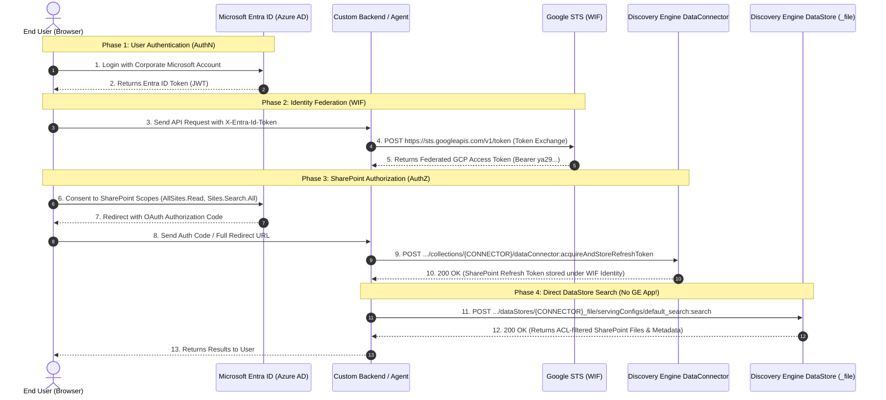

# SharePoint Federated DataStore Direct Search & AuthN / AuthZ Guide

This folder contains a complete reference and single test script demonstrating that **Discovery Engine / Vertex AI Search Data Stores for Federated Connectors (e.g., SharePoint, ServiceNow, Outlook)** can be queried and secured **directly at the Data Store level without requiring a Gemini Enterprise (GE) App / Engine (`engines/{ENGINE_ID}`)**.

---

## 1. Key Findings

1. **Direct DataStore Search is GA & Fully Supported**: Calling `dataStores/{DATASTORE_ID}/servingConfigs/default_search:search` retrieves indexed documents directly. It is an official GA (`v1`) API and is **not deprecated**.
2. **AuthN & AuthZ are Completely Independent of GE App**: All identity federation (Microsoft Entra ID login, Google STS/WIF token exchange) and token vault storage (`dataConnector:acquireAndStoreRefreshToken`) operate exclusively at the **GCP IAM** and **Discovery Engine Collection** levels.
3. **No Engine Required**: You only need an Engine entity (`engines/{ENGINE_ID}`) if you want multi-datastore LLM synthesis (`:streamAssist`) or multi-turn conversational memory.

---

## 2. Visual Architecture & Security Flow

### 2.1 End-to-End Sequence Diagram (Mermaid)



---

### 2.2 Trust Boundaries & Security Layout (ASCII)

```
========================================================================================================================
                                      TRUST BOUNDARIES & SECURITY ARCHITECTURE
========================================================================================================================

  [ CLIENT / USER BOUNDARY ]
  +------------------------------------------------------------------------------------------------------------------+
  |  Browser / Client Application (React / Vanilla JS / Mobile)                                                      |
  |  - Authenticates against Microsoft Entra ID (OIDC)                                                               |
  |  - Holds temporary Entra ID JWT in memory (never persists client secrets)                                        |
  +---------------------------------------------------------+--------------------------------------------------------+
                                                            |
                                      X-Entra-Id-Token Header (HTTPS/TLS 1.3)
                                                            |
                                                            v
  [ APPLICATION BACKEND BOUNDARY ]
  +------------------------------------------------------------------------------------------------------------------+
  |  Custom Backend Service (FastAPI / Node / Python)                                                                |
  |  - Stateless identity bridge (no database needed for user credentials)                                          |
  |  - Translates Entra JWT -> GCP WIF token in real-time via Google STS                                             |
  +--------------------+------------------------------------+------------------------------------+-------------------+
                       |                                    |                                    |
          1. Token Exchange (STS)              2. Store SP Token                    3. Direct DataStore Query
                       |                                    |                                    |
                       v                                    v                                    v
  [ GOOGLE CLOUD INFRASTRUCTURE BOUNDARY ]
  +--------------------+---------------+  +-----------------+------------------+  +----------------+-----------------+
  | Google STS / IAM                   |  | Discovery Engine Connector Vault   |  | Discovery Engine DataStore       |
  | (sts.googleapis.com)               |  | (collections/{CONNECTOR}/          |  | (dataStores/{CONNECTOR}_{entity}/|
  |                                    |  |  dataConnector:*)                  |  |  servingConfigs/default_search)  |
  | - Validates Entra OIDC Signature   |  | - Encrypts SP Refresh Token in     |  | - Direct indexed search          |
  | - Maps Entra claims to WIF Pool    |  |   Google KMS vault under user WIF  |  | - Enforces per-user SharePoint   |
  | - Issues GCP Federated Access Token|  | - Refreshes Microsoft Graph tokens |  |   ACLs dynamically               |
  +------------------------------------+  +------------------------------------+  +----------------------------------+
========================================================================================================================
```

---

## 3. Code Walkthrough: The 5-Phase Security Flow

### Phase 1: User Login via Microsoft Entra ID (AuthN)
```typescript
// Frontend (MSAL): Authenticate corporate user & obtain ID token
const loginResponse = await msalInstance.loginPopup({
  scopes: ["openid", "profile", "email"]
});
const entraIdToken = loginResponse.idToken;
```

### Phase 2: Google STS Token Exchange (Workforce Identity Federation)
```python
# Backend: Exchange Entra JWT for GCP Federated Access Token
import requests

def exchange_entra_jwt(entra_jwt: str, wif_pool: str, wif_provider: str) -> str:
    url = "https://sts.googleapis.com/v1/token"
    payload = {
        "audience": f"//iam.googleapis.com/locations/global/workforcePools/{wif_pool}/providers/{wif_provider}",
        "grantType": "urn:ietf:params:oauth:grant-type:token-exchange",
        "requestedTokenType": "urn:ietf:params:oauth:token-type:access_token",
        "scope": "https://www.googleapis.com/auth/cloud-platform",
        "subjectToken": entra_jwt,
        "subjectTokenType": "urn:ietf:params:oauth:token-type:id_token",
    }
    resp = requests.post(url, json=payload, timeout=10)
    return resp.json()["access_token"]  # Returns: "ya29.d.AbC123..."
```

### Phase 3: SharePoint Consent & Refresh Token Vault Storage (AuthZ)
```python
# Backend: Store SharePoint OAuth token in Google Cloud Connector Vault
def store_sharepoint_token(project_number: str, connector_id: str, gcp_token: str, full_redirect_uri: str):
    url = f"https://discoveryengine.googleapis.com/v1alpha/projects/{project_number}/locations/global/collections/{connector_id}/dataConnector:acquireAndStoreRefreshToken"
    headers = {"Authorization": f"Bearer {gcp_token}", "Content-Type": "application/json", "X-Goog-User-Project": project_number}
    return requests.post(url, headers=headers, json={"fullRedirectUri": full_redirect_uri}, timeout=30).ok
```

### Phase 4: Validate Active Session
```python
# Backend: Verify active SharePoint access token
def check_connection(project_number: str, connector_id: str, gcp_token: str) -> bool:
    url = f"https://discoveryengine.googleapis.com/v1alpha/projects/{project_number}/locations/global/collections/{connector_id}/dataConnector:acquireAccessToken"
    headers = {"Authorization": f"Bearer {gcp_token}", "Content-Type": "application/json", "X-Goog-User-Project": project_number}
    resp = requests.post(url, headers=headers, json={}, timeout=15)
    return resp.ok and bool(resp.json().get("accessToken"))
```

### Phase 5: Direct DataStore Search Query (No GE App Required)
```python
# Backend: Direct Search against DataStore serving config
def search_datastore_direct(project_number: str, connector_id: str, query: str, gcp_token: str):
    datastore_id = f"{connector_id}_file"
    url = f"https://discoveryengine.googleapis.com/v1alpha/projects/{project_number}/locations/global/collections/default_collection/dataStores/{datastore_id}/servingConfigs/default_search:search"
    headers = {"Authorization": f"Bearer {gcp_token}", "Content-Type": "application/json", "X-Goog-User-Project": project_number}
    return requests.post(url, headers=headers, json={"query": query, "pageSize": 5}, timeout=30).json().get("results", [])
```

---

## 4. Raw Empirical Test Proofs

Live search query for `"jennifer"` executed against `projects/545964020693/.../dataStores/sharepoint-data-def-connector_file/servingConfigs/default_search:search`:

```json
{
  "results": [
    {
      "id": "1132300655934632666",
      "document": {
        "structData": {
          "title": "03_Client_Contract_Apex_Financial",
          "author": "Jesus Chavez;tester",
          "entity_type": "file",
          "file_type": "pdf",
          "url": "https://sockcop.sharepoint.com/sites/FinancialDocument/Shared%20Documents/03_Client_Contract_Apex_Financial.pdf?web=1",
          "content": "MASTER SERVICES AGREEMENT\nBetween Meridian Technologies Corporation and Apex Financial Services, Inc.\nPrimary Contact: Jennifer Walsh, CFO\nEmail: jwalsh@meridiantech.com\nPhone: (415) 555-8200..."
        }
      }
    },
    {
      "id": "9802524132902347023",
      "document": {
        "structData": {
          "title": "05_MA_Due_Diligence_Project_Starlight",
          "author": "Jesus Chavez;tester",
          "entity_type": "file",
          "file_type": "pdf",
          "url": "https://sockcop.sharepoint.com/sites/FinancialDocument/Shared%20Documents/05_MA_Due_Diligence_Project_Starlight.pdf?web=1",
          "content": "DUE DILIGENCE REPORT: Project Starlight\nTarget: NovaTech Solutions, Inc.\nBoard Members: ...Jennifer Liu (Andreessen Horowitz)..."
        }
      }
    },
    {
      "id": "8852519738959929927",
      "document": {
        "structData": {
          "title": "02_HR_Employee_Records_2025",
          "author": "Jesus Chavez",
          "entity_type": "file",
          "file_type": "pdf",
          "url": "https://sockcop.sharepoint.com/sites/FinancialDocument/Shared%20Documents/Restricted%20Vault/02_HR_Employee_Records_2025.pdf?web=1",
          "content": "EMPLOYEE RECORDS - Confidential\n1.2 Chief Financial Officer\nName: Jennifer Anne Walsh (MTC-0012)\nBase Salary: $625,000\nDepartment: Finance..."
        }
      }
    }
  ]
}
```

---

## 5. API Comparison Table

| API Endpoint | Method | Scope / Owning Level | Needs GE App? |
| :--- | :--- | :--- | :---: |
| `https://sts.googleapis.com/v1/token` | `POST` | **Google STS / IAM** | ❌ **No** |
| `https://login.microsoftonline.com/.../authorize` | `POST` | **Microsoft Entra ID** | ❌ **No** |
| `.../collections/{CONNECTOR}/dataConnector:acquireAndStoreRefreshToken` | `POST` | **Discovery Engine** (Collection Level) | ❌ **No** |
| `.../collections/{CONNECTOR}/dataConnector:acquireAccessToken` | `POST` | **Discovery Engine** (Collection Level) | ❌ **No** |
| `.../dataStores/{DATASTORE}/servingConfigs/default_search:search` | `POST` | **Discovery Engine** (DataStore Level) | ❌ **No** |
| `.../engines/{ENGINE}/assistants/...:streamAssist` | `POST` | **Gemini Enterprise** (Engine Level) | ✅ **Yes** |

---

## 6. How to Run the Single Test Script

### Installation
```bash
pip install -r requirements.txt
```

### Search SharePoint Files for "Jennifer"
```bash
python3 main.py --query="jennifer" --entity=file
```

### Search Across All SharePoint Entity Stores (`file`, `page`, `comment`, etc.)
```bash
python3 main.py --query="document" --entity=all
```

### Verify Connector Token Vault Status
```bash
python3 main.py --auth-check
```
