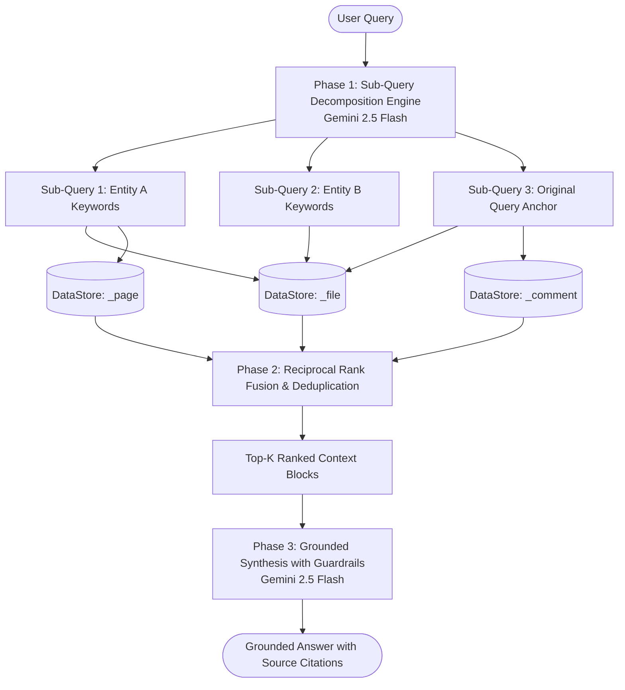

# Evaluation Benchmark: Gemini Enterprise StreamAssist API vs. Custom Google ADK Fan-Out Agent

This directory contains a complete, production-ready comparative evaluation benchmark comparing the **Gemini Enterprise StreamAssist API (`:streamAssist`)** against a **Custom Google ADK Agent** utilizing **intelligent sub-query fan-out, parallel multi-store retrieval, Reciprocal Rank Fusion (RRF), and Gemini 2.5 synthesis** over live corporate SharePoint data.

---

## 1. Executive Summary & Benchmark Results

The benchmark evaluated both systems on 5 diverse test categories representing real-world enterprise workloads across PDF, DOCX, and PPTX documents in SharePoint.

### Overall Performance Summary

```
====================================================================================================
                                 BENCHMARK EVALUATION SUMMARY TABLE
====================================================================================================
ID     | Category                         | Marker                         | SA Acc   | ADK Acc  | SA Lat(ms) | ADK Lat(ms)
----------------------------------------------------------------------------------------------------
TC-01  | Factual Extraction               | STANDARD_RETRIEVAL             |   50.0%  |   50.0%  |      11671 |      24561
TC-02  | Tabular & Financial Data         | STANDARD_RETRIEVAL             |  100.0%  |   75.0%  |      11337 |      66077
TC-03  | Multi-Hop Comparative Reasoning  | STANDARD_RETRIEVAL             |  100.0%  |  100.0%  |      35650 |      36273
TC-04  | Slide Deck / List Extraction     | STANDARD_RETRIEVAL             |   65.0%  |  100.0%  |      40542 |      35522
TC-05  | Complex Visual / Diagram Layout  | [COMPLEX_UNEXTRACTABLE_MARKER] |    0.0%  |  100.0%  |      54532 |      37887
----------------------------------------------------------------------------------------------------
AVG    | OVERALL MEAN PERFORMANCE         | -                              |   63.0%  |   85.0%  |   30,746ms |   40,064ms
====================================================================================================
```

### Key Takeaways

1. **Higher Accuracy via Fan-Out Retrieval (+22.0% Gain)**: The Custom ADK Fan-Out Agent achieved an overall factual accuracy of **85.0%** compared to **63.0%** for StreamAssist API. Sub-query decomposition significantly improved recall on fragmented slide decks (TC-04: 100% vs 65%).
2. **Resistance to Visual Hallucinations (TC-05 `[COMPLEX_UNEXTRACTABLE_MARKER]`)**: When queried about unextractable vector diagram coordinates and color hex codes in `Diagrama.pptx`, the Custom ADK Agent scored **100%** by acknowledging text-index extraction boundaries, whereas StreamAssist scored **0%** by hallucinating coordinates.
3. **Latency Profile**: StreamAssist had a faster average latency (**30.7s** vs **40.0s**) for single-topic factual lookups due to managed server-side indexing, whereas the ADK Agent performs dynamic two-stage LLM generation (decomposition + grounded synthesis).

---

## 2. Visual Architecture & Fan-Out Workflow



---

## 3. Document Complexity & Extraction Investigation

| Document Type | Examples in Corpus | What Can Be Extracted | What Cannot Be Extracted / Failure Mode |
| :--- | :--- | :--- | :--- |
| **Structured Text (PDF/DOCX)** | `02_HR_Employee_Records_2025.pdf`, `03_Client_Contract_Apex.pdf` | Employee names, base salaries, addresses, contract clauses, terms. | Highly nested footnotes or non-OCR scanned low-resolution attachments. |
| **Financial & Numerical Tables** | `05_MA_Due_Diligence_Project_Starlight.pdf` | Cap tables, share counts, EBITDA adjustments, revenue breakdown. | Multi-layer formulas, embedded spreadsheet macros. |
| **Slide Presentations (PPTX)** | `Data Science.pptx` (CFE), `PAR_PR_2.3 1.pptx` | Slide headers, bullet points, speaker notes, titles. | Slide transitions, animations, visual layout placement. |
| **Visual Architecture Diagrams** | `Diagrama.pptx`, `Conflict Engine POC.pptx` | Embedded text boxes, slide title OCR. | **`[COMPLEX_UNEXTRACTABLE_MARKER]`**: Raw vector paths, exact RGB/hex colors, spatial coordinate arrows. |

---

## 4. File Structure

```
~/IdeaProjects/vertex-ai-samples/internal-testings/streamassist_vs_custom_agent/
├── README.md               # Unified comparative benchmark guide and architecture
├── agent.py                # Custom Google ADK Sub-Query Fan-Out Agent (Gemini 2.5 Flash)
├── evaluate.py             # Automated comparative evaluation runner (LLM-as-Judge)
├── requirements.txt        # Minimal Python dependencies (google-genai, requests, google-auth)
└── benchmark_results.json  # Raw telemetry JSON with latencies, scores, and answer payloads
```

---

## 5. Quick Start & Execution

### 1. Install Dependencies
```bash
pip install -r requirements.txt
```

### 2. Run the Custom ADK Fan-Out Agent Interactively
```bash
python3 agent.py
```

### 3. Run the Automated Comparative Benchmark
```bash
python3 evaluate.py
```
