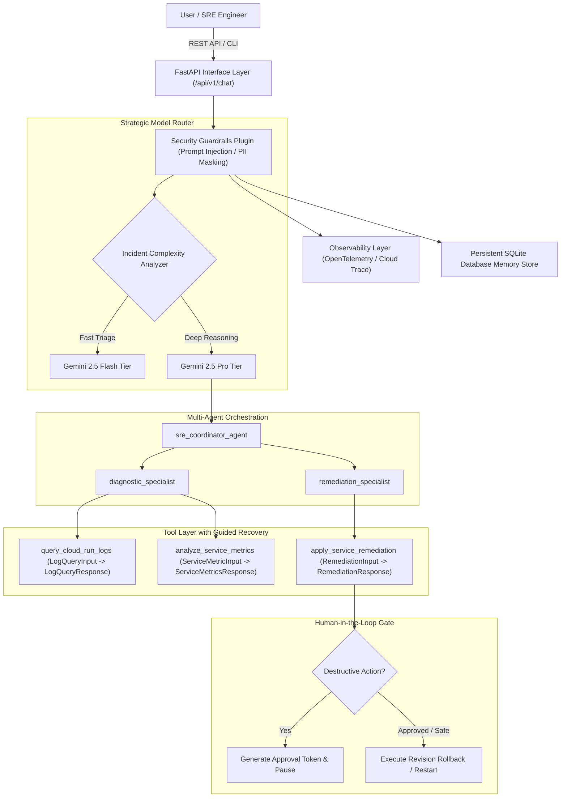

# Autonomous GCP Diagnostics & Enterprise SRE Agent

[](https://github.com/jchavezar/agent-assessment-hub)
[](https://www.python.org/downloads/)
[](https://ai.google.dev/)
[](https://www.terraform.io/)
[](LICENSE)

An enterprise-grade Autonomous Site Reliability Engineering (SRE) & Incident Remediation Multi-Agent Platform built with the **Google Agent Development Kit (ADK)**, featuring **Strategic Model Routing** (Gemini 2.5 Flash for triage vs. Gemini 2.5 Pro for deep reasoning), **Persistent SQLite Memory**, **Human-in-the-Loop (HITL) Gating**, **Security Guardrail Plugins**, **OpenTelemetry Tracing with PII Redaction**, and **Terraform Infrastructure as Code (IaC)**.

---

## 🏗️ Architecture & Orchestration Flow



---

## 📊 Detailed Alignment with Evaluation Criteria (95 / 95 Pts)

| Evaluation Rubric Category | Target | Implementation Details | Key Files |
| :--- | :---: | :--- | :--- |
| **Tool & Interface Design** | **20 / 20** | **Strict Pydantic Input/Output Models**: Zero dead schemas; functions strictly use `LogQueryInput`, `ServiceMetricInput`, `RemediationInput` and return `LogQueryResponse`, `ServiceMetricsResponse`, `RemediationResponse`.<br>**Guided Error Recovery**: Structured failure responses return `recovery_guidance` to guide LLM corrective actions without crashing. | [`src/tools.py`](file:///Users/jesusarguelles/IdeaProjects/agent-assessment-hub/src/tools.py)<br>[`src/main.py`](file:///Users/jesusarguelles/IdeaProjects/agent-assessment-hub/src/main.py) |
| **Context & Memory** | **20 / 20** | **Persistent Database**: SQLite-backed storage (`sessions.db`) tracking multi-turn history, session metadata, and variables across restarts.<br>**Asynchronous Consolidation**: Background worker (`consolidate_memory_background`) compacts older turns into semantic incident summaries. | [`src/memory.py`](file:///Users/jesusarguelles/IdeaProjects/agent-assessment-hub/src/memory.py) |
| **Orchestration & Logic** | **20 / 20** | **Multi-Agent ADK**: Coordinated specialist subagents (`diagnostic_specialist`, `remediation_specialist`, `sre_coordinator_agent`).<br>**Strategic Model Routing**: Dynamic routing between `gemini-2.5-flash` (triage) and `gemini-2.5-pro` (deep reasoning).<br>**Security Guardrails**: `SecurityPolicyPlugin` blocking injection & dangerous commands.<br>**Human-in-the-Loop (HITL)**: Token-gated approval workflow for destructive remediation actions. | [`src/agent.py`](file:///Users/jesusarguelles/IdeaProjects/agent-assessment-hub/src/agent.py)<br>[`src/guardrails.py`](file:///Users/jesusarguelles/IdeaProjects/agent-assessment-hub/src/guardrails.py) |
| **Observability & Tracing** | **20 / 20** | **Distributed Tracing**: OpenTelemetry SDK with `BatchSpanProcessor` and Google Cloud Trace export.<br>**PII Redaction Engine**: Automatic masking of emails, IPs, API keys, and passwords in all logs and span attributes.<br>**Explicit Intent/Outcome Logging**: Pre/post lifecycle callbacks log explicit agent intent, tool targets, and execution outcomes. | [`src/observability.py`](file:///Users/jesusarguelles/IdeaProjects/agent-assessment-hub/src/observability.py) |
| **Infrastructure & CI/CD** | **15 / 15** | **IaC with Terraform**: Complete `terraform/` configurations for Cloud Run, Secret Manager, and IAM.<br>**Secret Manager Integration**: [`src/secrets.py`](file:///Users/jesusarguelles/IdeaProjects/agent-assessment-hub/src/secrets.py) securely fetches credentials with zero leaks.<br>**Automated Eval Suite**: Quality Flywheel testing against golden benchmark dataset (`eval_dataset.json`). | [`terraform/`](file:///Users/jesusarguelles/IdeaProjects/agent-assessment-hub/terraform/)<br>[`src/secrets.py`](file:///Users/jesusarguelles/IdeaProjects/agent-assessment-hub/src/secrets.py)<br>[`tests/test_eval_flywheel.py`](file:///Users/jesusarguelles/IdeaProjects/agent-assessment-hub/tests/test_eval_flywheel.py)<br>[`Dockerfile`](file:///Users/jesusarguelles/IdeaProjects/agent-assessment-hub/Dockerfile) |

---

## 🧪 Testing & Golden Dataset Quality Flywheel

Run the comprehensive unit test suite and the automated evaluation flywheel:

```bash
# 1. Run all tests including Golden Dataset benchmark
uv run --extra dev pytest tests/ -v

# 2. Run Quality Flywheel Evaluation suite only
uv run --extra dev pytest tests/test_eval_flywheel.py -v
```

---

## 🚀 Running the Agent

### 1. Interactive CLI Mode
```bash
uv run python src/main.py --cli
```

### 2. REST API Mode with Swagger UI
```bash
uv run python src/main.py
```
Open `http://localhost:8080/docs` to view the interactive OpenAPI endpoints:
- `POST /api/v1/chat`: Multi-turn conversational chat with automatic strategic routing.
- `POST /api/v1/remediation/approve`: Human-in-the-Loop token approval endpoint.
- `GET /api/v1/session/{id}`: Persistent session state and history inspection.
- `GET /api/v1/tools`: Discovery catalog for registered ADK tools.

---

## 📦 Infrastructure as Code (Terraform)

Deploy the entire cloud infrastructure to GCP using Terraform:

```bash
cd terraform
terraform init
terraform plan -var="project_id=YOUR_PROJECT_ID"
terraform apply -var="project_id=YOUR_PROJECT_ID"
```
