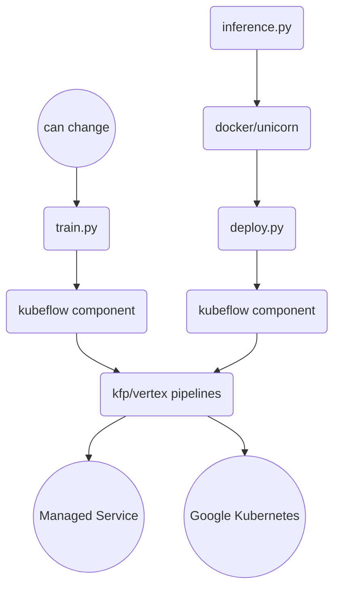

# Quick Run MLOps
The following guide explores different ways to create kubeflow components from the ground by using 
[Container Components](https://www.kubeflow.org/docs/components/pipelines/user-guides/components/container-components/#a-simple-container-component).

*Note: I'm working in an update to use jinja to modify all the variables at once.*

### Components Used
- [Kubeflow V2](https://www.kubeflow.org/docs/components/pipelines/): Pipeline Orchestration Framework.
- [Vertex AI Pipelines](https://cloud.google.com/vertex-ai/docs/pipelines/build-pipeline): Managed Infrastructure Service for Kubeflow Orchestration.
- [Docker](https://www.docker.com/): Container Images.
- [Google Cloud Build](https://cloud.google.com/build/docs): CI/CD pipelines.
- [Artifact Registry](https://cloud.google.com/artifact-registry/docs): Model Versioning.
- [Catboost](https://catboost.ai/): Machine Learning Model for tabular predictive tasks like regression, classification, etc...

### Diagram

### Instructions
Google Cloud Build will handle the docker image building and artifact registry pushing.

From your terminal run the following:
```bash
gcloud builds submit --config cloudbuild.yaml
```

Execute the pipeline definition:
```bash
python pipeline_run.py
```