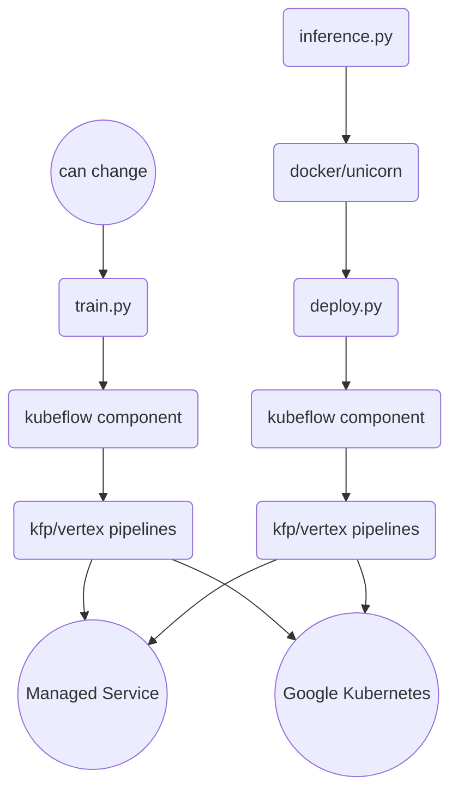

# Vertex Pipelines Custom Training
The following guide explores different ways to create kubeflow components from the ground by using 
[Container Components](https://www.kubeflow.org/docs/components/pipelines/user-guides/components/container-components/#a-simple-container-component).


### Prerequisites
Create Training Container Image



```bash
gcloud builds submit --config cloudbuild.yaml
```

Run Pipeline
```bash
python pipeline_run.py
```