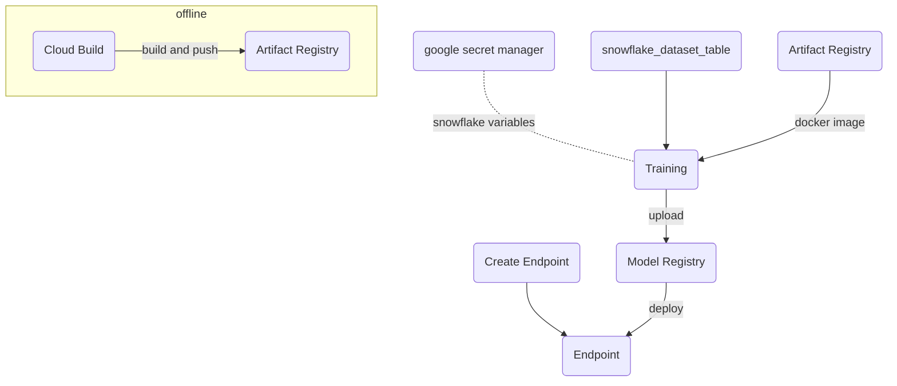
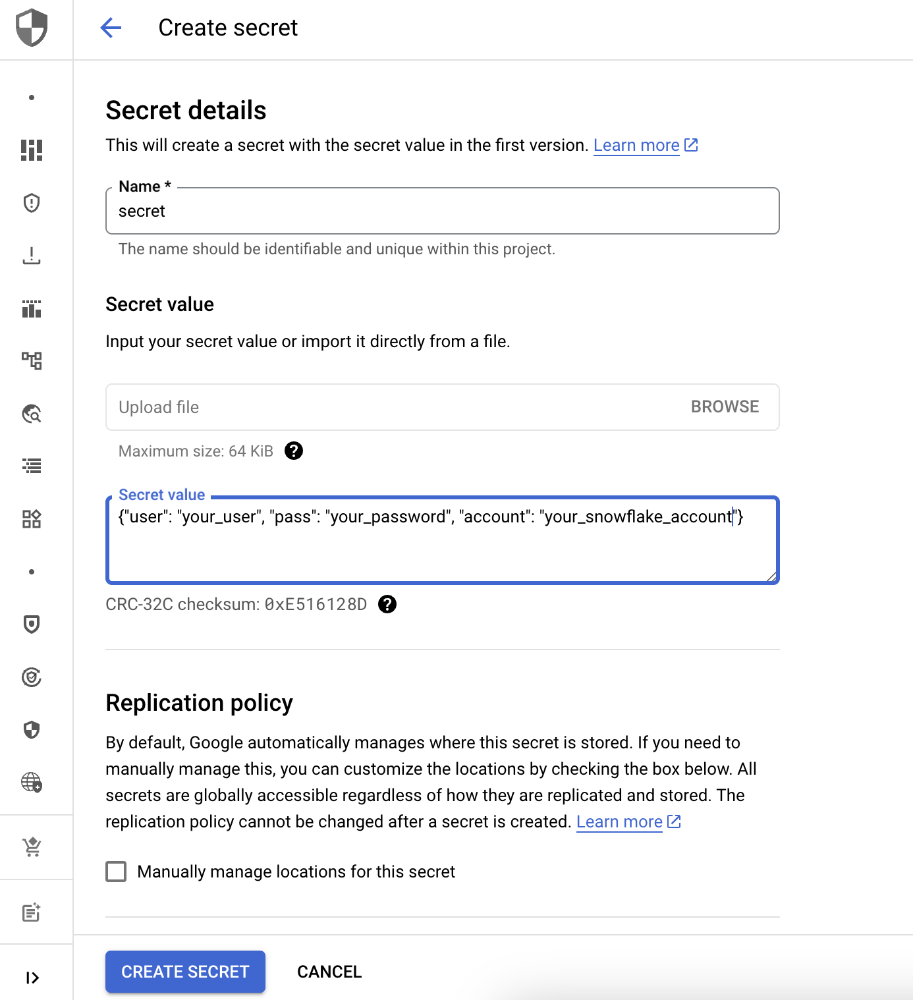

# Machine Learning Pipeline with JAX

This tutorial provides a step-by-step guide on how to seamlessly combine the power of the JAX framework with the capabilities of Vertex AI tools.


## Prerequisites

Because data is being pulled from snowflake, we need Google Cloud Secret Manager to store the credentials:



Then copy the resource name:

projects/254356041555/secrets/snow_pass and pass it to pipeline.py

## Main Steps:
- Train a Model.
- Upload Model and Artifacts to Google Cloud Storage and Model Registry.
- Create an Endpoint in parallel.
- Deploy Model from Model Registry into the Endpoint.


Use Google Cloud Build (Google CI/CD Service) to build and push a docker image into Artifacts Registry.

```bash
gcloud builds submit --config cloudbuild.yaml
```

# Train
Once the docker image has been built and pushed, we can test it locally.

*Remember change variables with yours*

```bash
docker run -e CLOUD_ML_PROJECT_ID="vtxdemos" -e BQ_DATASET=vtxdemos.demos_us.ecommerce_balanced -e GOOGLE_APPLICATION_CREDENTIALS=/tmp/1.json -v /usr/local/google/home/jesusarguelles/.config/gcloud/application_default_credentials.json:/tmp/1.json us-central1-docker.pkg.dev/vtxdemos/custom-trains/jax-train:1.0
````

# Prediction

Once the docker image has been built and pushed, we can test it locally.

*Remember change variables with yours*

I used google cloud shell but feel free to use your local machine:

```bash
docker run -p 5555:8080 -e CLOUD_ML_PROJECT_ID="vtxdemos" -e AIP_STORAGE_URI="gs://vtxdemos-models/tmp/model" -e GOOGLE_CLOUD_APPLICATION_CREDENTIALS="/tmp/i.json" -v /tmp/tmp.L5ZRhyI2DQ/application_default_credentials.json:/tmp/i.json us-central1-docker.pkg.dev/vtxdemos/custom-predictions/jax-prediction:1.0
```

Make a Rest API call:

```bash
curl -X POST -H "Content-Type: application/json" -d '{"instances": [{"latest_ecommerce_progress": 3,"bounces": 0, "time_on_site": 875, "pageviews": 11, "source": "google", "medium": "organic", "channelGrouping": "Organic Search", "deviceCategory": "desktop", "country": "United States"}]}' http://localhost:5555/predict
```

The response looks like this:
**{"predictions":{"predict_class":"1","probability":"0.8946226"}}**

# Pipeline Run

```bash
python pipeline.py
```