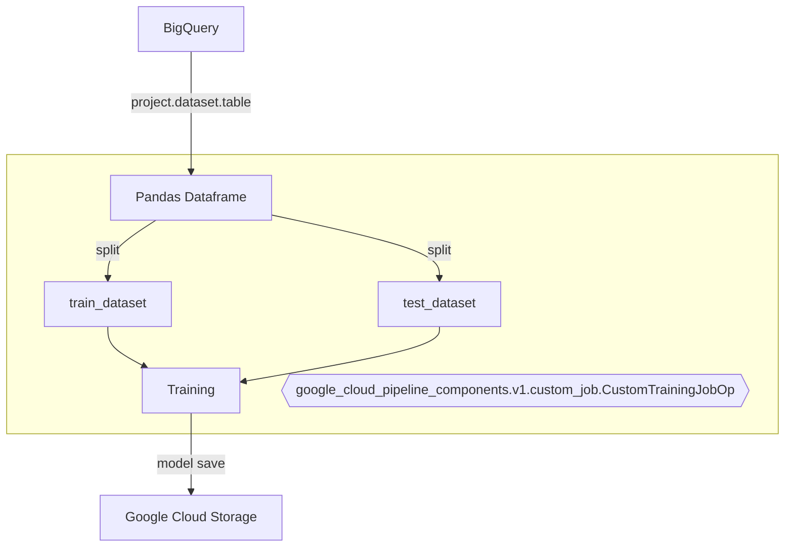
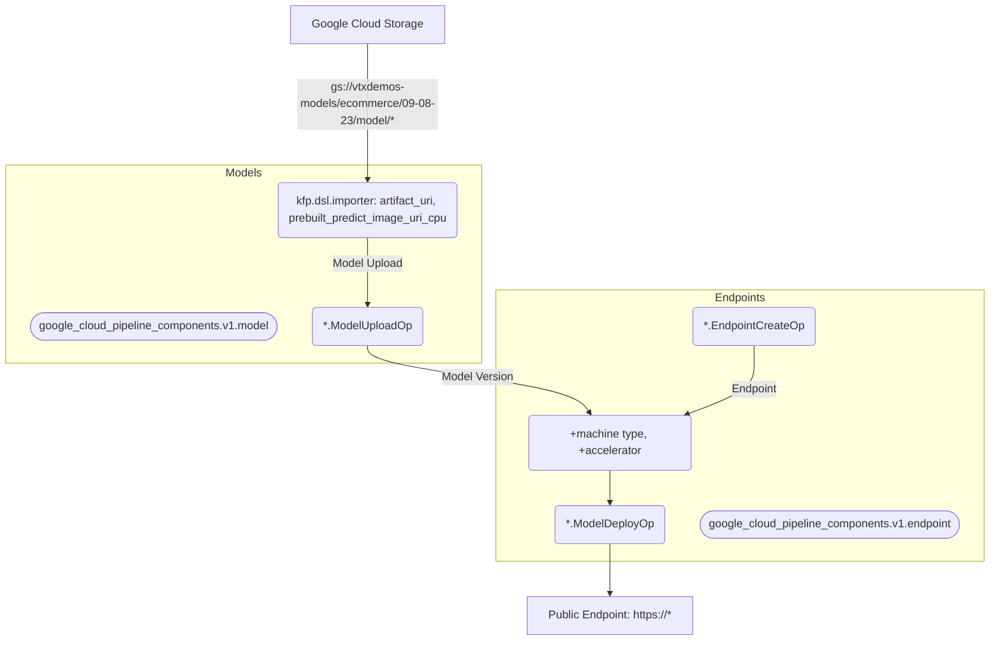

# Getting Started
For MLOps the main components to consider are **updates** through the pipelines:

Things that can change over the time:
- Data
- Code
- Pipeline components

*Marked in the image above as time icon*

## General MLOps Process

1. Any **{CHANGE}** in the **training** code has to trigger the build of the container and the run of the pipeline.
2. Any **{CHANGE}** in the **pipeline** has to trigger the re-run of the pipeline.
3. Any **{CHANGE}** in the **data distribution** has to trigger the re-run of the pipeline.

*"Deployment code part is missing because I used prebuilt containers for predictions"*

## General Components in the Pipeline for this Example 

- Data-preprocess: Feature engineering
    - Normalization
    - Categorical encoding
- Training:
    - Neural Network
- Prediction:
    - Deploy

There are a few ways for feature engineering; 
1. It can be done **before** the training using any ETL like **dataflow/dataproc as individual component**.
2. By using **custom python code**; *<ins>statistics values like the ***mean*** and standard ***deviation*** needs to remain (be stored) for inference.</ins>*
3. Run feature engineering **along the training**. [SELECTED]

*"In the code below we used the later to keep feature engineering in the code (tensorflow), so it can do the preprocessing automatically during the inference."*

## Files in this folder

1. **trainer/variables.py**: for building the tensorflow preprocessing layer (normalization and categorization).
2. **trainer/train.py**: neural network build code.
3. **Dockerfile_train_[cpu]**: image definition to run the training code.
4. **variables.py**: explains by itself, examples: project_id, region, train_image_uri, machine_type, etc...
5. **pipeline.py**: this is the file to create the pipeline the one that orchestrates everything.
6. **pipeline-deployment.yaml**: this is the file with the steps for CI (continous integration) which triggers the CT (continous training) and CD (continous deployment).

## Main pipeline components
### Training

Training code is under the folder */trainer*, this folder has 2 files: preprocess.py *"for feature engineering* and train.py *"for training"*.

## Upload & Deploy

Training process stores the model in Google Cloud Storage, the steps to upload it into [Model Registry](https://cloud.google.com/vertex-ai/docs/model-registry/introduction) and send it for deployment is as follows:

## Define Vertex Pipelines

Steps to create a [pipeline.py](https://github.com/jchavezar/vertex-ai-samples/blob/main/pipelines-flex/tensorflow/tabular/pipeline.py) is to define the chain between components and compile the steps into a file: [pipeline.yaml](https://github.com/jchavezar/vertex-ai-samples/blob/main/pipelines-flex/tensorflow/tabular/pipeline.yaml)

The entire pipeline starts runing after *.submit() method.

## Define CI/CD/CT

[Cloud Build](https://cloud.google.com/build) is a **serverless CI/CD platform**, we can use cli with argument like [this](https://cloud.google.com/sdk/gcloud/reference/builds/submit) to submit the job or create a [trigger](https://cloud.google.com/build/docs/automating-builds/create-manage-triggers) to automatically run the job.

We can configure a [pipeline-deployment.yaml](https://github.com/jchavezar/vertex-ai-samples/blob/main/pipelines-flex/tensorflow/tabular/pipeline-deployment.yaml) file to create the steps during the build process.

**Step 0**: git **clone** this repo. 
**Step 1**: **create** a docker image for training with the code from this repo. 
**Step 2**: **push** the docker image from step 1. 
**Step 3**: **create** a docker image who will run the pipeline automatically. 
**Step 4**: **push** the docker image from step 3. 
**Step 5**: **run** the pipeline job. 
