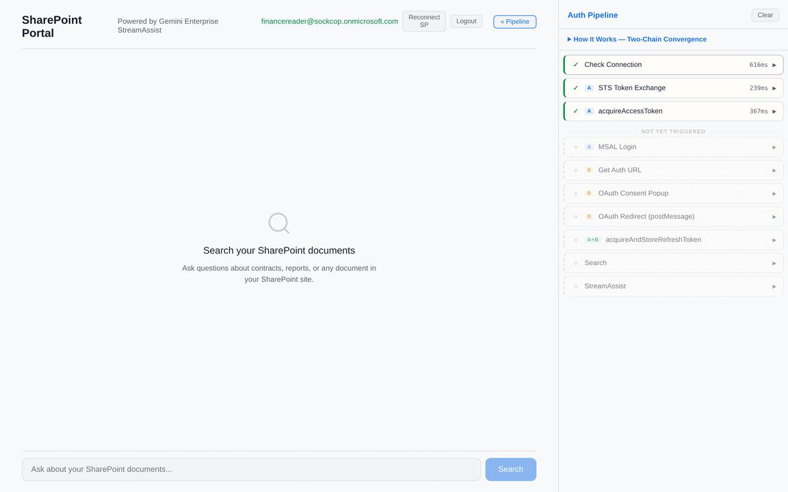
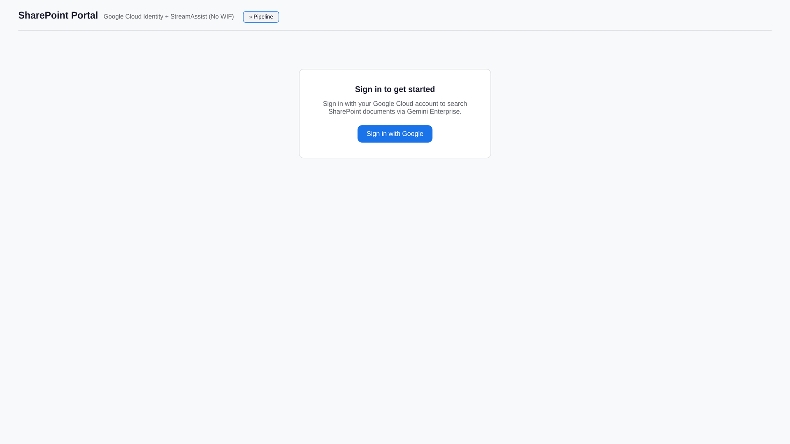
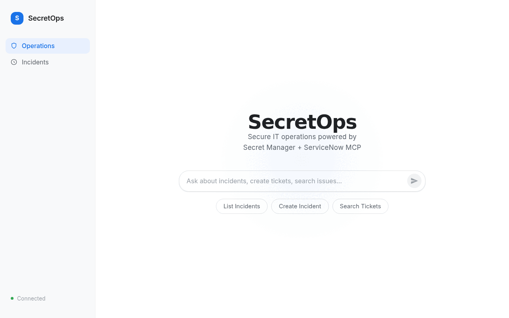
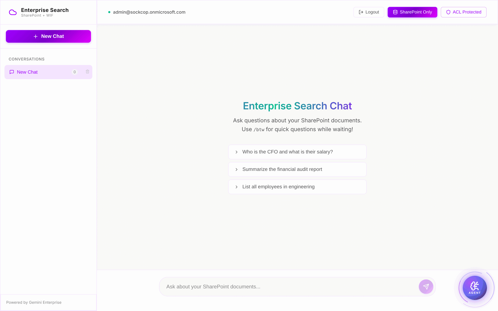
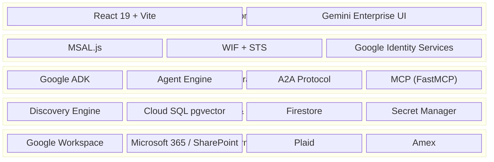

<p align="center">
  
</p>

<h1 align="center">semiautonomous-agents</h1>

<p align="center">
  <em>Production-tested agentic patterns built on Google ADK, Vertex AI, and MCP</em>
</p>

<p align="center">
  <a href="https://github.com/jchavezar/vertex-ai-samples"></a>
  <a href="#whats-here"></a>
  <a href="#-mcp-servers"></a>
  <a href="https://github.com/jchavezar/vertex-ai-samples/blob/main/LICENSE"></a>
</p>

<p align="center">
  <a href="#-enterprise-search--portals">Portals</a>&nbsp;&nbsp;·&nbsp;&nbsp;<a href="#-mcp-servers">MCP Servers</a>&nbsp;&nbsp;·&nbsp;&nbsp;<a href="#-rag--document-intelligence">RAG</a>&nbsp;&nbsp;·&nbsp;&nbsp;<a href="#-agent-platforms">Platforms</a>&nbsp;&nbsp;·&nbsp;&nbsp;<a href="#-consumer--domain-apps">Apps</a>&nbsp;&nbsp;·&nbsp;&nbsp;<a href="#-testing--utilities">Utilities</a>
</p>

---

## Featured

<table>
<tr>
<td width="50%" align="center">
<a href="./streamassist-oauth-flow/"><strong>StreamAssist OAuth Flow</strong></a><br/>
<em>WIF-powered SharePoint search with full auth trace sidebar</em><br/><br/>
<a href="./streamassist-oauth-flow/"></a>
</td>
<td width="50%" align="center">
<a href="./ge-sharepoint-cloudid/"><strong>SharePoint — Google Cloud Identity</strong></a><br/>
<em>Same power, zero WIF — native Google Identity Services</em><br/><br/>
<a href="./ge-sharepoint-cloudid/"></a>
</td>
</tr>
<tr>
<td width="50%" align="center">
<a href="./adk-secret-snow-demo/"><strong>SecretOps — ADK + Secret Manager</strong></a><br/>
<em>IT ops agent with secure credentials and ServiceNow MCP</em><br/><br/>
<a href="./adk-secret-snow-demo/"></a>
</td>
<td width="50%" align="center">
<a href="./sharepoint_wif_portal/"><strong>SharePoint WIF Portal</strong></a><br/>
<em>The reference implementation — Entra to GCP, zero credentials</em><br/><br/>
<a href="./sharepoint_wif_portal/"></a>
</td>
</tr>
</table>

---

## What's New

> [!TIP]
> **April 2026** — Multimodal-search demo lands, plus new MCP/portal scaffolds and major README upgrades.
>
> 💡 **Can't remember a codename?** See [CATALOG.md](./CATALOG.md) — every project mapped back to the customer/context that drove it.

| Date | Project | What Changed |
|:-----|:--------|:-------------|
| Apr 19 | [**shutter-vibe-engine/multimodal-search**](./shutter-vibe-engine/multimodal-search/) | **NEW** — Multimodal vibe search across photos, video, music, SFX, graphics. Gemini Embeddings 2 + Vertex Vector Search. [Live site →](https://jchavezar.github.io/vertex-ai-samples/multimodal-search/) |
| Apr 18 | [**light_mcp_cloud_portal**](./light_mcp_cloud_portal/) | **NEW** — Lightweight MCP cloud portal scaffold |
| Apr 17 | [**streamanswer-oauth-flow**](./streamanswer-oauth-flow/) | **NEW** — StreamAnswer OAuth flow variant |
| Apr 16 | [**outlook-streamassist-oauth-flow**](./outlook-streamassist-oauth-flow/) | **NEW** — StreamAssist OAuth flow for Outlook |
| Apr 16 | [**cortex-retriever**](./cortex-retriever/) | **NEW** — Agent-only ADK project for Gemini Enterprise — SharePoint + Google Search, zero UI |
| Apr 14 | [**ge-sharepoint-cloudid**](./ge-sharepoint-cloudid/) | **NEW** — SharePoint search via native Google Cloud Identity (no WIF) |
| Apr 12 | [**a2a-protocol-dojo**](./a2a-protocol-dojo/) | Interactive A2A protocol tutorial with streamed agent communication |
| Apr 10 | [**knowledge-base-mcp**](./knowledge-base-mcp/) | Session ingestion pipeline + backfill tools |
| Apr 8 | [**adk-secret-snow-demo**](./adk-secret-snow-demo/) | Switched to ADK built-in `google_search` with `AgentTool` |
| Apr 5 | [**streamassist-oauth-flow**](./streamassist-oauth-flow/) | HD demo GIF + sequence diagrams + expandable prerequisites |

---

## What's Here

33 projects across 6 categories. Every project runs on **Google Cloud** with **Vertex AI** as the backbone.

```
Google ADK ██████████████████████████████ 15    React 19   ████████████████████████  11
FastAPI    ████████████████████████       11    Vertex AI  ██████████████████████████████ 15
MCP (FastMCP) ████████████               6     Agent Engine ██████████               5
Discovery Engine ██████████████           7     pgvector   ████                      2
```

---

## 🏢 Enterprise Search & Portals

Full-stack portals bridging Microsoft identity to Google Cloud search infrastructure.

| Project | What It Does | Stack |
|:--------|:-------------|:------|
| [**sharepoint_wif_portal**](./sharepoint_wif_portal/) | Enterprise search portal — Entra ID to Google Cloud with zero credential storage. The reference implementation. |    |
| [**servicedesk-sharepoint-portal**](./servicedesk-sharepoint-portal/) | Discovery Engine (SharePoint) + ServiceNow MCP in a single agent portal |    |
| [**servicenow-mcp-portal**](./servicenow-mcp-portal/) | Agent Engine + ServiceNow via MCP with MSAL-authenticated React frontend |    |
| [**gemini-enterprise-sharepoint-agent**](./gemini-enterprise-sharepoint-agent/) | ADK Agent registered in Gemini Enterprise — searches SharePoint via Discovery Engine + WIF |    |
| [**streamassist-oauth-flow**](./streamassist-oauth-flow/) | Custom StreamAssist portal — users authorize once, then chat with SharePoint-grounded answers |    |
| [**ge-sharepoint-cloudid**](./ge-sharepoint-cloudid/) | Federated SharePoint search via Google Cloud Identity — no WIF, no STS, no MSAL |    |
| [**cortex-retriever**](./cortex-retriever/) | Agent-only — ADK agent for Gemini Enterprise, searches SharePoint + Google, zero UI |    |
| [**outlook-streamassist-oauth-flow**](./outlook-streamassist-oauth-flow/) | StreamAssist portal for Outlook — per-user OAuth, zero credential storage |    |
| [**streamanswer-oauth-flow**](./streamanswer-oauth-flow/) | StreamAnswer OAuth-flow variant of the StreamAssist portal |    |
| [**light_mcp_cloud_portal**](./light_mcp_cloud_portal/) | Lightweight portal scaffold around MCP cloud APIs |    |

## 🔌 MCP Servers

Standalone [Model Context Protocol](https://modelcontextprotocol.io/) servers that plug into any MCP-compatible agent or IDE.

| Project | APIs Exposed | Stack |
|:--------|:-------------|:------|
| [**gworkspace-mcp-server**](./gworkspace-mcp-server/) | Gmail, Drive, Calendar, Docs, Sheets, Photos |   |
| [**ms365-mcp-server**](./ms365-mcp-server/) | Outlook, SharePoint, OneDrive, Teams, Calendar |   |
| [**plaid-mcp-server**](./plaid-mcp-server/) | Bank transactions, balances, subscriptions |   |
| [**amex-mcp**](./amex-mcp/) | Financial transactions — hybrid semantic + structured search with Gemini enrichment |   |
| [**knowledge-base-mcp**](./knowledge-base-mcp/) | Semantic search over Claude Code transcripts — problem-solution pattern extraction |   |

## 📚 RAG & Document Intelligence

Retrieval-augmented generation pipelines with different chunking and embedding strategies.

| Project | Approach | Stack |
|:--------|:---------|:------|
| [**hierarchical-rag-pgvector**](./hierarchical-rag-pgvector/) | Parent-child chunking with Cloud SQL pgvector — precision retrieval without losing document context |    |
| [**multimodal-doc-search**](./multimodal-doc-search/) | Multimodal document intelligence — images, tables, and text in a unified semantic search + chat |    |

## 🤖 Agent Platforms

Multi-agent orchestration, protocol tutorials, and observability.

| Project | What It Does | Stack |
|:--------|:-------------|:------|
| [**vertex-multi-agent-workbench**](./vertex-multi-agent-workbench/) | Enterprise agent platform — multi-model support (Gemini + Claude), MCP connectivity, ADK + LangGraph |    |
| [**a2a-protocol-dojo**](./a2a-protocol-dojo/) | Interactive 7-lesson tutorial for Google's Agent-to-Agent (A2A) protocol with live agent communication |    |
| [**observability-orchestra**](./observability-orchestra/) | Multi-model Agent Engine testing with Cloud Trace and Cloud Logging instrumentation |   |
| [**cross-project-adk-agent**](./cross-project-adk-agent/) | Deploy an ADK agent in Project A, register and use it from Project B's Gemini Enterprise |   |
| [**adk-secret-snow-demo**](./adk-secret-snow-demo/) | IT ops agent — Secret Manager credentials, ServiceNow MCP, Google Search grounding |    |
| [**adk-secret-manager-demo**](./adk-secret-manager-demo/) | Semiautonomous agent with secure secret handling via Google Secret Manager + Vertex AI |   |

## 🌆 Consumer & Domain Apps

End-user applications blending agentic intelligence with polished UIs.

| Project | What It Does | Stack |
|:--------|:-------------|:------|
| [**vibes_nyc**](./vibes_nyc/) | Mood-to-venue matching — underground NYC spots with multi-source vibe fingerprinting |    |
| [**global-pulse**](./global-pulse/) | International news intelligence — 15+ sources, veracity scoring, multi-language analysis |    |
| [**nexus-tax-intelligence**](./nexus-tax-intelligence/) | AI tax advisory platform — Discovery Engine grounding + PDF report generation for executives |    |
| [**gemini-websocket-chat**](./gemini-websocket-chat/) | Terminal-aesthetic mobile PWA — real-time Gemini chat over WebSocket with Zustand state |   |
| [**shutter-vibe-engine/multimodal-search**](./shutter-vibe-engine/multimodal-search/) | Multimodal vibe search — type a vibe, get the photo + video + music + SFX + graphic that share that mood. [Live site →](https://jchavezar.github.io/vertex-ai-samples/multimodal-search/) |    |

## 🧪 Testing & Utilities

Probes, harnesses, and scaffolding for validating infrastructure and auth flows.

| Project | Purpose | Stack |
|:--------|:--------|:------|
| [**adk-script-runner**](./adk-script-runner/) | Minimal ADK smoke test — agent generates, saves, and executes bash scripts at runtime |   |
| [**discovery-engine-latency-probe**](./discovery-engine-latency-probe/) | StreamAssist latency benchmarking under real-world auth conditions |  |
| [**streamassist-wif-auth-tester**](./streamassist-wif-auth-tester/) | Interactive tester for the Entra ID → WIF/STS → Discovery Engine auth chain |   |
| [**nextjs-test-harness**](./nextjs-test-harness/) | Next.js scaffold for frontend experimentation |   |

---

## Shared Toolkit

> [!NOTE]
> Each project is **standalone** — they don't connect to each other. They draw from the same set of Google Cloud building blocks, picking what they need.



<details>
<summary><strong>Which projects use what</strong></summary>

| Component | Used By |
|:----------|:--------|
| **WIF + STS** | sharepoint_wif_portal, streamassist-oauth-flow, gemini-enterprise-sharepoint-agent, cortex-retriever |
| **Google Identity Services** | ge-sharepoint-cloudid |
| **Discovery Engine** | sharepoint_wif_portal, streamassist-oauth-flow, ge-sharepoint-cloudid, gemini-enterprise-sharepoint-agent, cortex-retriever, nexus-tax-intelligence, servicedesk-sharepoint-portal, discovery-engine-latency-probe |
| **Agent Engine** | sharepoint_wif_portal, cortex-retriever, servicenow-mcp-portal, cross-project-adk-agent, observability-orchestra, vertex-multi-agent-workbench |
| **MCP (FastMCP)** | gworkspace-mcp-server, ms365-mcp-server, plaid-mcp-server, amex-mcp, knowledge-base-mcp, adk-secret-snow-demo |
| **pgvector** | hierarchical-rag-pgvector, multimodal-doc-search |
| **A2A Protocol** | a2a-protocol-dojo |

</details>

---

## Quick Start

Most projects follow the same pattern:

```bash
# 1. Backend
cd <project>/backend
uv sync && uv run python main.py

# 2. Frontend (if applicable)
cd <project>/frontend
npm install && npm run dev
```

> [!TIP]
> All Python projects use [**uv**](https://docs.astral.sh/uv/) for dependency management. Run `uv sync` instead of `pip install`.

> [!IMPORTANT]
> Projects with auth flows (WIF, GIS, MSAL) require environment variables. Check each project's `.env.example` for the required config.

---

## License

Apache 2.0 — See [LICENSE](../LICENSE)
